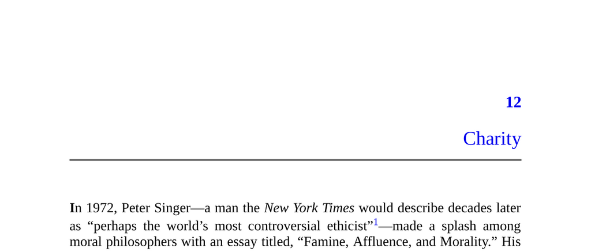

- **Charity**
  - **Introduction**
    - Peter Singer argues moral obligation extends from local rescue to helping starving children globally.  
    - The moral discomfort arises because people often prioritize personal spending over effective charity.  
    - The chapter investigates hypocrisy between ethical ideals and actual charitable behavior.  
    - Readers are encouraged to recognize this gap to better understand human motives.  
    - For background, see Singer’s essay: [Famine, Affluence, and Morality](https://www.jstor.org/stable/2265052).  
  - **Effective Altruism**
    - Effective altruism uses data-driven methods to identify the most impactful charities.  
    - GiveWell, founded by Karnofsky and Hassenfeld, evaluates charities by measurable outcome and return on donation (ROD).  
    - Top charities in 2015 included the Against Malaria Foundation, GiveDirectly, and the Schistosomiasis Control Initiative.  
    - Critics argue effective altruism focuses too narrowly on measurable impacts, ignoring broader social changes.  
    - Additional info: [GiveWell](https://www.givewell.org).  
  - **Real-World Altruism**
    - Americans donate over $359 billion annually, mostly to religious and educational institutions.  
    - Only about 13% of private donations help the global poor.  
    - Most donors do little research; only 3% compare charities for effectiveness.  
    - Scope insensitivity causes donations not to scale with the magnitude of the problem.  
    - Diversification leads to many small donations, reducing overall donation efficiency.  
    - See related study on scope neglect: [Slovic et al. (2007)](https://scholar.google.com).  
  - **Warm Glow Theory**
    - James Andreoni’s theory posits donors gain psychological pleasure ("warm glow") from giving.  
    - People give more broadly and opportunistically to maximize feelings rather than impact.  
    - Warm glow explains preference for many small donations over fewer strategic ones.  
    - This theory raises the question of deeper motives beyond personal happiness.  
    - For further reading: [Andreoni (1989)](https://www.journals.uchicago.edu/doi/10.1086/261520).  
  - **Factors Influencing Charitable Behavior**
    - **Visibility**
      - Donations increase when donors are observed or recognized publicly.  
      - Charities offer public recognition via plaques, branded items, and events.  
      - Anonymous giving is rare, indicating preference for social credit.  
      - Even subtle cues like eyespots increase generosity.  
      - See study on visibility effects: [Bateson et al. (2006)](https://royalsocietypublishing.org).  
    - **Peer Pressure**
      - Solicitation, especially by friends or close associates, strongly increases donations.  
      - Up to 95% of donations are made in response to requests.  
      - In-person, peer-based requests are more effective than anonymous ones.  
      - This contrasts sharply with how people handle investments or purchases.  
    - **Proximity**
      - Donors prefer helping local or national beneficiaries over distant foreigners.  
      - Parochialism arises from social and physical closeness biases.  
      - Only about 13% of American donations go to foreign aid.  
      - This preference aligns with our treatment of family and friends over strangers.  
    - **Relatability**
      - Identifiable victims elicit more donations than statistical victims (the identifiable victim effect).  
      - Charities use personal stories and faces to increase empathy and contributions.  
      - Statistical lives saved by organizations like the Against Malaria Foundation are less emotionally compelling.  
      - For a classic study, see Schelling’s work on identifiable victims.  
    - **Mating Motive**
      - Altruistic behavior increases when individuals are primed with mating-related thoughts.  
      - Men donate more when observed by or solicited by attractive potential mates.  
      - Conspicuous good deeds attract potential mates more than private altruistic acts.  
      - This effect suggests charitable acts function as mating displays.  
  - **Appearances Matter**
    - Charity serves as a social signal advertising wealth, prosocial orientation, and compassion.  
    - Donors seek recognition from potential mates, peers, social gatekeepers, and leaders.  
    - Publicly known charities yield more social credit than obscure ones.  
    - Spontaneous generosity signals inherent kindness and creates strong social bonds.  
    - Charity motives include demonstrating surplus resources and willingness to cooperate.  
    - More on social signaling: [Griskevicius et al. (2007)](https://journals.sagepub.com).  
  - **Missing Forms of Charity**
    - Rarely celebrated are long-term giving methods, like Methuselah trusts, due to lack of immediate recognition.  
    - Marginal charity, small personal sacrifices that yield high returns for others, is invisible and analytically driven.  
    - Both forms lack social signaling value, explaining their low popularity despite efficiency.  
    - For historical example, see Benjamin Franklin’s enduring trusts.  
  - **Wrapping Up**
    - Social incentives favor visible, local, and socially rewarded acts over most effective global aid.  
    - Donors often prioritize personal benefits like reputation and social connections over maximizing impact.  
    - Increasing successful charity requires better marketing and celebration of effective altruism qualities.  
    - Society could benefit from appreciating analytical, data-driven giving alongside empathetic giving.  
    - For a critical perspective, see [Paul Bloom’s "Against Empathy"](https://www.penguinrandomhouse.com/books/312753/against-empathy-by-paul-bloom/).
