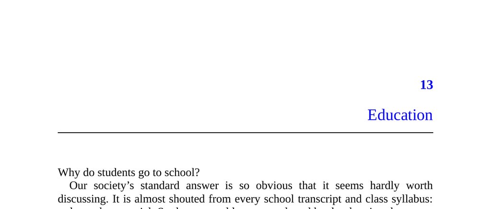

- **Education**
  - **Why do students go to school?**
    - Students supposedly attend school to learn material and improve themselves for future careers.
    - Employers pay premiums for educated workers, equating degrees with job qualification.
    - The official explanation underrepresents other motives, which are often acknowledged informally.
    - For further study, see Bryan Caplan's *The Case Against Education*.
  - **Learning puzzles**
    - Exclusive colleges admit few yet allow auditing, showing education's accessibility beyond degrees.
    - Students often prefer degrees over actual learning, as shown by the “sheepskin effect.”
    - Many school subjects have little direct job relevance, and students typically forget most learned material.
    - Nations realize less economic gain from education than individuals, indicating systemic inefficiencies.
    - For more information, consult [National Bureau of Economic Research](https://www.nber.org).
  - **A signaling explanation**
    - Education serves as a signal of worker productivity rather than solely a means to acquire skills.
    - Employers use academic performance as a proxy for qualities like diligence and conformity.
    - Diplomas verify persistence and general abilities, independent of retained knowledge.
    - Michael Spence’s Nobel-winning model formalizes this signaling theory.
    - Refer to Spence's original work on educational signaling for detailed mathematical treatment.
  - **Implications of the signaling model**
    - The model explains why credentials matter more than knowledge in hiring and pay.
    - Features perceived as flaws, such as school regimentation, facilitate separating productive workers from non-productive ones.
    - Schools emphasize credentialing over comprehensive testing of retained knowledge.
    - The limited national economic gains from schooling align with signaling rather than learning.
    - See Peter Thiel's critiques on college and competition for further perspectives.
  - **Beyond signaling**
    - Alternatives to school signaling, like apprenticeships, exist but are rare due to cultural norms.
    - Schools provide non-educational benefits: daycare for children, socialization, networking, and mate selection.
    - College can be valued as consumption and status signaling beyond educational content.
    - Private universities often serve conspicuous consumption roles.
    - For a broader sociological view, explore works on higher education and social capital.
  - **Propaganda**
    - Modern compulsory, state-sponsored education evolved from 18th-19th century Prussian military needs.
    - Schools function as tools of patriotic indoctrination and nation-building.
    - Historical and civics education often present national issues in a favorable light.
    - Government investments in schooling correlate with perceived military threats and regime control.
    - For historical context, see the history of Prussian education and nation-building.
  - **Domestication**
    - Schools accustom students to hierarchical structures and repetitive tasks analogous to modern workplaces.
    - Children learn discipline, impulse control, and conformity, often at the expense of creativity.
    - Resistance to workplace regimentation among unschooled workers has been documented globally.
    - Schooling fosters shifting attitudes toward meritocracy from childhood egalitarianism.
    - Civilization benefits include reduced violence and improved manners but come with costs to autonomy.
    - Albert Einstein’s critique warns of education stifling intellectual curiosity.
    - For more on socialization and workplace culture, consult sociological studies on industrialization and education systems.
