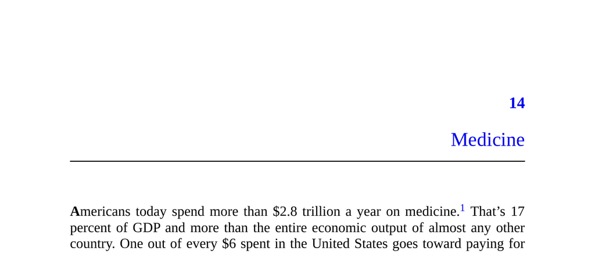

- **Medicine Overview**
  - Americans spend over $2.8 trillion annually on medicine, about 17% of GDP.
  - Medicine includes all healthcare system charges: doctor visits, drugs, surgeries, and tests.
  - Demand-side factors explain why consumers want so much medicine.
  - For further context, see [Health Spending in the United States](https://www.kff.org/health-costs/).

- **Box 15: Definition and Perspective on Medicine**
  - Medicine denotes all illness diagnosis, treatment, and prevention practices.
  - Medicine is treated as an economic good with demand by medical consumers.
  - "Marginal medicine" refers to additional medical care beyond standard access.
  - The chapter shifts focus from supply-side to demand-side analysis.

- **Ritual and Social Function of Medicine**
  - Medicine acts partly as an adult ritual of conspicuous caring, similar to a toddler seeking comfort.
  - Caregiving roles include doctors, family, friends, coworkers, and health insurance sponsors.
  - Individuals seek loyalty and social support through medical care.
  - See [The Social Functions of Ritual](https://www.jstor.org/stable/2800037) for further reading.

- **The Evolutionary Argument**
  - Ancestors lacked effective medicine but needed social support to survive illness or injury.
  - Foragers relied on allies for food, protection, and political support during incapacitation.
  - Conspicuous care signals social and political strength, influencing group standing.
  - Helping sick allies advertises an individual's value as a trustworthy friend.
  - See [Evolutionary Perspectives on Cooperation](https://royalsocietypublishing.org/doi/10.1098/rspb.2010.1215).

- **Medicine in History**
  - Across eras and cultures, people sought medical treatments even without proven efficacy.
  - Healers combined spiritual rituals and early medical practices, often ineffective or harmful.
  - Examples include leeching, bloodletting, trepanation, and counter-irritation.
  - Case study: King Charles II's elaborate but futile treatments highlighted conspicuous effort.
  - Physicians' efforts served to protect reputation and display loyalty.
  - See [Strange Medicine by Nathan Belofsky](https://www.amazon.com/Strange-Medicine-Nathan-Belofsky/dp/0226002485) for historical remedies.

- **Medicine Today: Too Much**
  - Modern medicine is effective in many areas but is also consumed excessively.
  - Marginal spending on medicine shows diminishing returns in health outcomes.
  - Regional U.S. studies reveal large variations in treatment intensity without better health.
  - High spending in final life months yields minimal health benefit and sometimes harm.
  - See [National Academies Report on Healthcare Spending](https://nap.nationalacademies.org/catalog/14615/).

- **The RAND Health Insurance Experiment**
  - The RAND study randomly assigned medical subsidy levels to study causal health effects.
  - Higher subsidies led to 45% greater consumption of medical services.
  - No significant improvement in health outcomes was found from increased consumption.
  - Marginal medicine consumed was judged appropriate by medical professionals.
  - Results suggest extra medical care generally does not improve health.
  - See [The RAND Health Insurance Experiment Summary](https://www.rand.org/health-care/projects/hie.html).

- **The Oregon Health Insurance Experiment**
  - Medicaid lottery winners consumed more medical services than non-winners.
  - Winners reported improved mental health and subjective wellbeing, partly due to placebo effect.
  - Objective physiological health measures showed no significant difference.
  - The study complements RAND in showing marginal medical care effects are limited.
  - See [Oregon Health Insurance Experiment Findings](https://www.oregon.gov/oha/HPA/ANALYTICS/Documents/oregon-health-insurance-experiment.pdf).

- **Challenges Reconciling Medical Spending and Health Gains**
  - Most health improvements stem more from nutrition, sanitation, and safer work, not medicine alone.
  - Medical advances have a modest overall impact on longevity and population health.
  - Many published medical studies are overstated and lack replication.
  - Marginal treatments have risks including side effects, surgical complications, and infections.
  - See [Why Most Published Research Findings Are False](https://journals.plos.org/plosmedicine/article?id=10.1371/journal.pmed.0020124).

- **Testing Conspicuous Care: Predictions**
  - **Prediction 1: Keeping Up with the Joneses**
    - Medical spending rises with neighbors' spending, indicating social comparison effects.
    - Patients increase consumption to avoid appearing less caring.
    - Social context influences healthcare demand beyond personal health.
    - See [Spending and Social Comparisons in Health Care](https://www.nber.org/papers/w12771).

  - **Prediction 2: Preference for Treatments Requiring Visible Effort and Sacrifice**
    - Patients prefer expensive, complex treatments perceivable as sacrificial efforts.
    - Simple remedies are often dismissed despite being effective.
    - Terminal and end-of-life care disproportionately consumes resources with minimal benefit.
    - Families fear appearing neglectful by reducing care intensity.
    - See [Placebo Effects and Treatment Cost](https://pubmed.ncbi.nlm.nih.gov/9849357/).

  - **Prediction 3: Focus on Public Rather Than Private Signs of Medical Quality**
    - Patients value visible credentials and reputation over measurable private quality indicators.
    - Patients rarely seek detailed surgeon or hospital outcome data.
    - Negative media stories impact patient choices more than publicized data.
    - See [Patient Choice and Hospital Quality Data](https://pubmed.ncbi.nlm.nih.gov/15478564/).

  - **Prediction 4: Reluctance to Openly Question Medical Quality**
    - Questioning medical care quality is socially taboo and seen as ungrateful.
    - Medical errors cause tens of thousands of deaths yearly but elicit little public demand for reform.
    - Simple reforms such as hand hygiene and autopsies are poorly implemented.
    - Public discomfort inhibits scrutiny of medical practices.
    - See [Medical Errors and Patient Safety](https://www.ncbi.nlm.nih.gov/pmc/articles/PMC1448612/).

  - **Prediction 5: A Focus on Helping during Dramatic Health Crises**
    - People prioritize heroic medical interventions over preventive lifestyle changes.
    - Lifestyle factors like diet, exercise, and environment produce larger health gains than marginal medical treatments.
    - Medical attention and spending concentrate around emergencies and visible health crises.
    - See [Lifestyle and Longevity Research](https://www.ncbi.nlm.nih.gov/pmc/articles/PMC4349073/).
