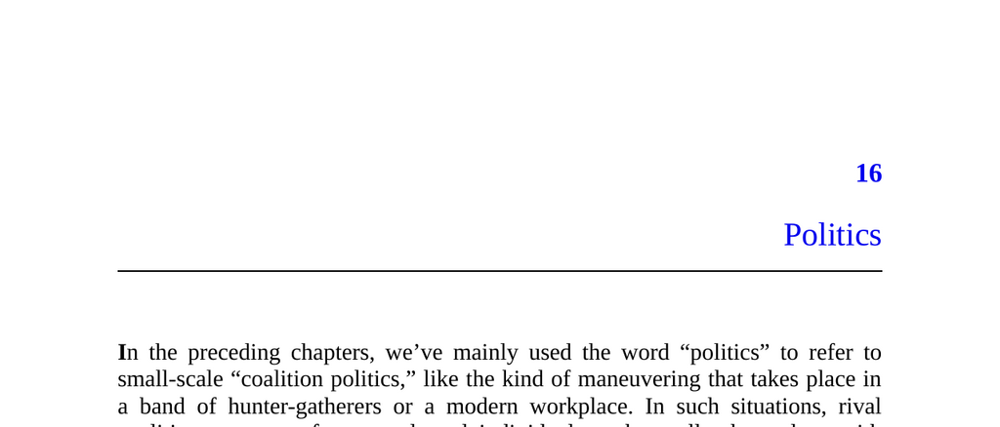

- **Politics**
  - **Introduction to Politics**
    - Politics refers to small-scale coalition politics involving competition for control and alliance formation.
    - The term also connotes formal democratic politics such as citizenship, activism, and statecraft.
    - Aristotle's *Politics* presents politics as a realm for moral virtue and the common good.
    - Modern portrayals, such as *House of Cards*, highlight the darker aspects of national politics.
    - Relevant resource: [Aristotle’s Politics Overview](https://plato.stanford.edu/entries/aristotle-politics/)
  - **The Political Do-Right**
    - Do-Rights engage in politics altruistically, aiming to improve society without seeking personal gain.
    - Evidence shows most voters do not vote purely out of self-interest and that voting is economically irrational.
    - Voting and political campaigning have costs that altruistic motives could justify despite limited individual impact.
    - Do-Rights are pragmatic yet primarily motivated by societal outcomes rather than personal credit.
  - **Puzzles**
    - **Puzzle 1: Disregard for Vote Decisiveness**
      - Voters' turnout differences between swing and safe states are minimal despite vastly different probabilities of influencing outcomes.
      - This behavior contradicts pure altruistic models suggesting practical impact influences voting decisions.
      - Some voters expend effort in non-swing states despite negligible chances of decisive impact.
    - **Puzzle 2: Uninformed Voters**
      - Voters show limited knowledge of candidates’ policies and factual political information.
      - Political interest often revolves around personalities or election drama more than substantive issues.
      - Voter ignorance affects policy preferences and contributes to inconsistent or simultaneously held contradictory views.
      - Real voters rarely abstain due to ignorance, opposing the behavior of ideal Do-Rights.
    - **Puzzle 3: Entrenched Opinions and Strong Emotions**
      - Voters tend to inhabit echo chambers, deficiently considering opposing views and evidence.
      - Political beliefs are embedded with strong emotions like pride and anger, which diverge from dispassionate decision-making.
      - Emotional attachment to political identity serves to protect beliefs from criticism.
      - Emotion-driven politics contrasts with the practical, low-emotion attitudes seen in other decision-making realms.
  - **The Apparatchik**
    - Historically, apparatchiks showed extreme loyalty in authoritarian regimes, risking severe punishment for disloyalty.
    - Modern democratic societies exhibit weaker but similar loyalty pressures among citizens toward factions or political groups.
    - Loyalty competition extends beyond politics to other affiliations, such as ethnicity, religion, and geography.
    - Political behavior is explained as signaling loyalty within social coalitions rather than purely seeking optimal outcomes.
  - **Political Incentives in Daily Life**
    - Voting and political affiliations influence social and romantic relationships, sometimes leading to preference for politically aligned partners.
    - Political bias can surpass racial bias in contexts like scholarship awards and academic hiring.
    - Political discussions frequently occur in daily conversations but can strain relationships when opinions vary.
    - Social pressures contribute to gradual alignment of individual political beliefs with their community over time.
    - Relevant resource: [Iyengar and Westwood’s Study on Political Bias](https://www.pnas.org/content/114/49/13114)
  - **The Logic of Loyalty Signaling**
    - **Self-Interest versus Group Interest**
      - Voters often prioritize group interests over personal self-interest, voting along geographical, racial, or party lines.
      - Loyalty to "our side" trumps individual benefit in political decision-making.
    - **Expressive Voting and the Appeal of Badges**
      - Expressive voting derives psychological and social benefits from signaling identity and belonging.
      - Activities surrounding voting, not just the act itself, are crucial to displaying political loyalty.
      - Political badges and slogans serve as simplified loyalty signals, akin to group identifiers in other social domains.
    - **Loyalty Demands Sacrifice**
      - Demonstrating loyalty requires sacrifices, such as investing time in voting despite minimal personal benefit.
      - Sacrifices also include social and professional costs, signaling commitment to political coalitions.
      - Voting is framed as a civic duty and is socially rewarded through visible tokens like "I Voted" stickers.
    - **Loyalty Demands (Strategic) Irrationality**
      - Loyalty incentives encourage self-deception and the adoption of beliefs that may lack factual basis.
      - Apparatchiks balance intelligence and skepticism but avoid doubting core political group tenets.
      - Emotional investment in beliefs and heated discussions stem from social loyalties rather than rational debate.
    - **Disdain for Compromise**
      - Loyalty signaling incentivizes rigidity and opposition to compromise, equating flexibility with disloyalty.
      - Voters tend to punish politicians who shift positions, valuing perceived loyalty over responsiveness.
    - **One-Dimensional Politics**
      - Political beliefs cluster along one main dimension due to coalition formation rather than fixed moral disputes.
      - Political realignments demonstrate the fluidity of these alliances and their underlying interests.
      - The dimension separation reflects social coalition boundaries more than principled coherence.
    - **Extreme Activists**
      - Highly committed political actors, such as soldiers and terrorists, act primarily out of loyalty to immediate peers.
      - Extreme activists often reject compromise and maintain engagement after achieving stated goals.
      - Rewards for activism often include social credit and positional advancement within political groups.
  - **Conclusion**
    - Citizens primarily engage in national politics to signal loyalty for local social advantages.
    - Political behavior serves as a performance with social audiences including peers and potential partners.
    - While other motives exist, the dominant pattern in political engagement resembles apparatchik loyalty signaling more than altruistic civic virtue.
    - The efficacy of democracy does not depend on citizen saintliness but on systemic strengths despite human foibles.
