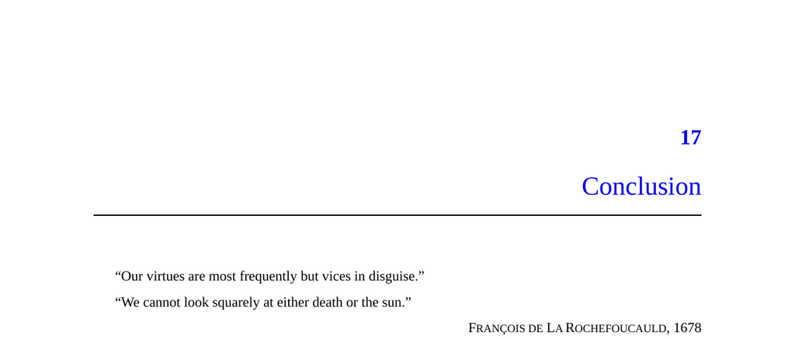

- **Conclusion**
  - **Putting the Elephant to Use**
    - **Better Situational Awareness**
      - People often present prosocial motives but harbor hidden selfish motives that influence behavior.
      - Understanding these hidden motives aids in interpreting social interactions and institutional functions.
      - Realizing these motives improves critical reception of messages in advertising, politics, and social advice.
      - External resource: [Third-Person Effect](https://en.wikipedia.org/wiki/Third-person_effect)
    - **Physician, Heal Thyself**
      - People generally have blind spots regarding their own selfish motives.
      - Recognizing self-deception in oneself promotes humility and better interpersonal understanding.
      - Conflicts often arise from mutual self-deception, and recognizing this can reveal common ground.
      - External resource: [Robert Burns - To a Louse](https://www.poetryfoundation.org/poems/43812/to-a-louse)
    - **No Direct Accusations**
      - Hidden motive explanations should be applied in first or third person, not as direct accusations.
      - Motives are complex and multifaceted; selfish and lofty motives coexist in individuals.
      - These explanations are more reliable at the species level than when applied directly to individuals.
      - External resource: [Attribution Theory](https://en.wikipedia.org/wiki/Attribution_theory)
    - **Showing Off**
      - Acknowledging uncomfortable truths about human motives can signal honesty and intellectual courage.
      - Communities vary in their valuation of candid discussions of hidden motives versus orthodoxy.
      - Such candor can be socially rewarding if delivered tactfully and without accusation.
      - External resource: [Social Signaling Theory](https://en.wikipedia.org/wiki/Signalling_theory)
    - **Choosing to Behave Better**
      - Awareness of selfish motives allows deliberate mitigation or alignment with ideal motivations.
      - Sustainable self-improvement is gradual and focused on one domain at a time rather than wholesale change.
      - Aligning incentives with ideals, such as joining communities valuing effective altruism, enhances motivation.
      - External resource: [Effective Altruism](https://www.effectivealtruism.org/)
    - **Kevin’s Alignment of Motives**
      - Positive institutional culture can align selfish and prosocial motives, reducing internal conflict.
      - Personal projects motivated by vanity illustrate tension between selfish and prosocial drives.
      - Environmental incentives shape the ease of aligning these motives.
    - **Enlightened Self-Interest**
      - Human selfishness is natural but should not be used to justify bad behavior.
      - Virtue must be defined within biological constraints, avoiding impossible nonbiological standards.
      - Ideals incentivize better behavior through reputation and social stakes, despite inevitable hypocrisy.
      - Historical and biological concepts include enlightened self-interest, indirect reciprocity, and competitive altruism.
      - External resource: [Adam Smith’s Moral Philosophy](https://plato.stanford.edu/entries/smith-moral-political/)
    - **Designing Institutions**
      - Effective institutional design must account for both overt and hidden motives of participants.
      - Failure to recognize hidden goals leads to resistance and disinterest in institutional reforms.
      - Some hidden institutional functions, like wasteful signaling, may warrant reduction or elimination.
      - Diverting status-seeking behaviors toward productive activities improves collective welfare.
      - External resource: [Friedrich Hayek on Economics](https://www.econlib.org/library/Essays/hykKnw.html)
  - **Perspective**
    - Humans’ mix of selfish and prosocial motives makes them complex and interesting rather than unlovable.
    - Self-deception and institutional accommodation reveal depth in human psychological and social life.
    - Humans cooperate remarkably well despite selfish impulses, unlike many other species.
    - Social incentives reward cooperation, service, and reputation, fostering ethical brains and societies.
    - Achievements like the moon landing demonstrate cooperative success despite selfish underlying motives.
    - External resource: [Cooperation in Evolutionary Biology](https://www.nature.com/scitable/knowledge/library/cooperation-and-the-evolution-of-complexity-13259672/)
