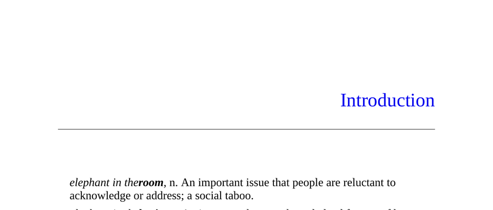

- **Introduction**
  - The "elephant in the room" refers to an important social issue people avoid discussing, while the "elephant in the brain" refers to unacknowledged mental motives.
  - The authors illustrate hidden motives using examples from medicine and social behavior in a Silicon Valley startup.
  - The main thesis states that humans act on selfish, competitive motives but consciously hide these from themselves and others.
  - Relevant reading includes [Hierarchy in the Forest by Christopher Boehm](https://press.princeton.edu/books/hardcover/9780691033618/hierarchy-in-the-forest).

- **The Core Idea**
  - Humans are designed to pursue self-interest while concealing selfish motives to maintain social appearances.
  - Self-deception is strategic, serving to hide unappealing motives both from ourselves and others.
  - The "elephant" metaphor refers broadly to selfishness, social competition, deception, and hidden motives.
  - Foundational work includes Robert Trivers’ theory on self-deception from an evolutionary perspective.
  - See also [The Self-Deception Theory of Deceptive Behavior](https://doi.org/10.1037/0003-066X.46.6.574).

- **The Basic Argument**
  - Microsociology shows that many social behaviors occur without our conscious awareness or control.
  - Cognitive and social psychology research reveals that our brains distort information to fabricate prosocial cover stories.
  - Primatology demonstrates that humans, like other apes, engage in competitive social behavior that we commonly disguise.
  - Economic puzzles show that institutions often pursue unacknowledged goals alongside their stated objectives.
  - This approach extends private self-deception to understanding large social institutions’ dual agendas.
  - Further reading includes [The Social Animal by Elliot Aronson](https://www.holtzbrinckpublishing.com/our-brands/the-social-animal/).

- **Box 1: “The Elephant”**
  - The elephant in the brain is primarily human selfishness and related concepts like social competition and deception.
  - The metaphor implies these motives are large, obvious if acknowledged, but commonly ignored due to discomfort.
  - Recognizing the elephant requires accepting that hidden motives influence most human behavior.

- **Box 2: Our Thesis in Plain English**
  - People constantly judge each other based on perceived motives to assess trustworthiness and social value.
  - Individuals emphasize socially acceptable motives and downplay selfish or unattractive ones to appear favorable.
  - Self-deception extends to thoughts and conscious reasoning, as conscious thought often rehearses what to present publicly.
  - Hidden motives are frequently overlooked collectively, especially in areas like medicine, leading to shared misunderstanding.
  - For more on impression management, see [Goffman’s The Presentation of Self in Everyday Life](https://us.macmillan.com/books/9780385094028).

- **Trajectory of the Book**
  - Part I, "Why We Hide Our Motives," examines social incentives that distort self-awareness and induce self-deception.
  - Part II, "Hidden Motives in Everyday Life," applies the framework to analyze personal behaviors and institutional roles.
  - The structure supports confronting difficult truths and applying insights to multiple domains of social life.

- **A Word of Warning**
  - Confronting our own self-deception is uncomfortable and socially challenging due to the unpalatable nature of hidden motives.
  - Positive, cooperative ideas spread easily, whereas ideas focusing on competition and selfishness often meet resistance.
  - The authors clarify their intent is not cynicism but honest examination to improve understanding and institutions.
  - Awareness of hidden motives may undermine their utility but is necessary for clearer insight into human behavior.
  - The metaphor of the "red pill" from The Matrix illustrates the irreversible commitment to facing these truths.
