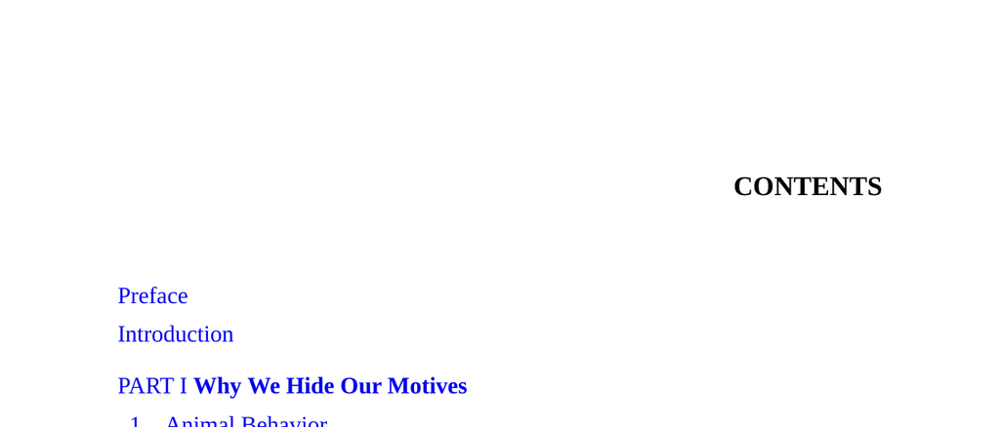

- **Preface**
  - The preface outlines the purpose and scope of the book.
  - It introduces the central theme of hidden motives in human behavior.
  - Readers are oriented to the methodology and approach used throughout the text.
  - For more on framing research contexts, see [The Craft of Research](https://www.press.uchicago.edu/ucp/books/book/chicago/C/bo3614091.html).

- **Introduction**
  - The introduction presents the fundamental premise that humans often conceal their true motivations.
  - It discusses the significance of understanding hidden motives in daily life and social interactions.
  - The section sets out the book’s structure and the rationale behind part divisions.
  - For foundational concepts on motivation, consult [Motivation: Theory and Research](https://www.psychologytoday.com/us/basics/motivation).

- **PART I Why We Hide Our Motives**
  - **1 Animal Behavior**
    - Examines parallels between human and animal behavior regarding concealment of intentions.
    - Discusses evolutionary advantages of hiding motives in survival and competition.
    - Highlights observed examples of deceptive signaling in various species.
    - Further reading: [Animal Signals and Communication](https://www.nature.com/scitable/knowledge/library/signals-and-communication-in-animals-13258676/).

  - **2 Competition**
    - Analyzes the role of hidden motives in competitive contexts among humans and animals.
    - Identifies strategic benefits gained by obscuring true goals from rivals.
    - Details mechanisms by which individuals mask their competitive drives.
    - See also [The Art of Strategy](https://www.hup.harvard.edu/catalog.php?isbn=9780393062434).

  - **3 Norms**
    - Describes how social norms influence individuals to conceal motives that conflict with accepted behaviors.
    - Explains the pressure to conform that drives motive-hiding.
    - Discusses the enforcement of norms through social sanctions.
    - For broader context, visit [Social Norms](https://www.annualreviews.org/doi/10.1146/annurev.psych.56.091103.070313).

  - **4 Cheating**
    - Explores motives behind cheating and the imperative to hide such intentions.
    - Highlights the interplay between risk, reward, and concealment tactics.
    - Reviews psychological and social factors that enable cheating behavior.
    - Recommended reading: [Cheating Lessons](https://press.princeton.edu/books/hardcover/9780691169738/cheating-lessons).

  - **5 Self-Deception**
    - Defines self-deception as a mechanism that obscures true motives even from oneself.
    - Examines cognitive biases and psychological defenses that facilitate self-deception.
    - Discusses the adaptive value of self-deception in social contexts.
    - Refer to [The Folly of Fools](https://wwnorton.com/books/the-folly-of-fools).

  - **6 Counterfeit Reasons**
    - Investigates how individuals fabricate plausible reasons to cover concealed motives.
    - Details cognitive processes behind creating and believing counterfeit justifications.
    - Emphasizes the social utility of maintaining credible facades.
    - See [Mistakes Were Made (But Not by Me)](https://www.penguinrandomhouse.com/books/18864/mistakes-were-made-but-not-by-me-by-carol-tavris-and-elliot-aronson/).

- **PART II Hidden Motives in Everyday Life**
  - **7 Body Language**
    - Describes how nonverbal cues can both reveal and mask true motives.
    - Identifies common body language signals employed consciously or unconsciously.
    - Emphasizes the complexity of interpreting hidden meanings in gestures.
    - Further resource: [What Every BODY is Saying](https://www.harpercollins.com/products/what-every-body-is-saying-joe-navarro).

  - **8 Laughter**
    - Explores the social functions of laughter in disguising or revealing motives.
    - Differentiates between genuine and social laughter types linked to underlying intentions.
    - Explains how laughter can soothe conflict or signal group membership.
    - See also [Laughter: A Scientific Investigation](https://mitpress.mit.edu/books/laughter).

  - **9 Conversation**
    - Analyzes conversational tactics used to conceal true intentions or influence others.
    - Discusses use of ambiguity, politeness, and distraction in communication.
    - Highlights the role of conversational norms in motive-hiding.
    - For elaboration, consult [The Pragmatics of Human Communication](https://www.penguinrandomhouse.com/books/45329/pragmatics-of-human-communication/).

  - **10 Consumption**
    - Examines how consumption choices can signal hidden motives beyond apparent preferences.
    - Details social and psychological drivers behind conspicuous consumption.
    - Discusses how consumers hide true motives for status or identity formation.
    - Related reading: [The Theory of the Leisure Class](https://press.uchicago.edu/ucp/books/book/chicago/T/bo3601621.html).

  - **11 Art**
    - Investigates the role of art as a medium for expressing and concealing motives.
    - Explains interpretive layers where artists project hidden intentions.
    - Reviews audience’s role in decoding or overlooking concealed messages.
    - Additional resource: [Art and Illusion](https://press.uchicago.edu/ucp/books/book/chicago/A/bo3683150.html).

  - **12 Charity**
    - Studies hidden motives behind charitable acts including reputation management.
    - Discusses social and psychological incentives for altruistic behavior.
    - Highlights discrepancies between stated and actual motivations in giving.
    - See also [The Economics of Altruism](https://www.cambridge.org/core/books/economics-of-altruism/).

  - **13 Education**
    - Explores hidden motives involved in teaching, learning, and institutional goals.
    - Identifies pressures on educators and students to present socially acceptable motives.
    - Examines hidden agendas in curricula and pedagogical approaches.
    - For further reading, visit [Education and Hidden Curriculum](https://www.jstor.org/stable/27711502).

  - **14 Medicine**
    - Describes concealed motives in patient and practitioner interactions.
    - Discusses influence of economic and social factors on healthcare decisions.
    - Highlights ethical concerns arising from undisclosed intentions.
    - Refer to [Medical Ethics and Hidden Agendas](https://www.ncbi.nlm.nih.gov/pmc/articles/PMC/).

  - **15 Religion**
    - Analyzes hidden motives within religious belief and practice.
    - Explores tension between personal faith and social conformity.
    - Addresses political and social functions of religious concealment.
    - Further reading: [Religion Explained](https://www.penguinrandomhouse.com/books/89520/religion-explained-by-daniel-c-dennett/).

  - **16 Politics**
    - Investigates the concealment of motives in political behavior and rhetoric.
    - Discusses strategies politicians use to mask true intentions from the public.
    - Highlights role of trust and deception in political systems.
    - Recommended text: [The Prince](https://www.gutenberg.org/ebooks/1232).

  - **17 Conclusion**
    - Summarizes key findings on the nature and functions of hidden motives.
    - Emphasizes the pervasive role of motive-hiding across human activities.
    - Calls for continued awareness and study of concealed intentions.
    - For summary perspectives, see [Thinking, Fast and Slow](https://www.goodreads.com/book/show/11468377-thinking-fast-and-slow).

- **Notes**
  - Provides detailed citations and explanations supporting chapter content.
  - Clarifies terminology and references used throughout the book.
  - Essential for verification and further research.

- **References**
  - Lists all scholarly sources and literature reviewed or cited.
  - Enables in-depth academic inquiry into topics covered.

- **Index**
  - Alphabetical listing of key terms and concepts with page references.
  - Facilitates quick location of specific topics within the text.
