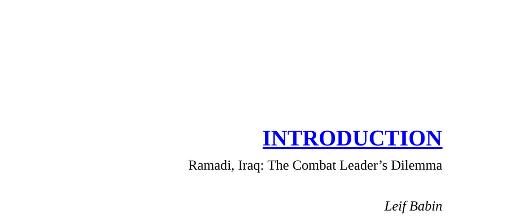

- **Introduction**
  - **Ramadi, Iraq: The Combat Leader’s Dilemma**
    - Describes a combat operation in Ramadi involving Navy SEALs and Iraqi soldiers targeting a high-level terrorist leader.
    - Highlights leadership principles applied under life-threatening conditions such as Prioritize and Execute, Cover and Move, and Decentralized Command.
    - Emphasizes the practical execution of combat tactics and real-time decision-making.
    - Demonstrates how leadership lessons extend beyond combat to broader team and organizational success.
    - Further reading: [Leadership in War](https://www.amazon.com/Leadership-War-Andrew-Roberts/dp/0143129575)
- **Leadership: The Single Most Important Factor**
  - **Purpose and Audience**
    - Defines the book’s subject as leadership applicable to any team or individual aspiring to improve.
    - Distinguishes this work from traditional war memoirs by focusing on leadership lessons.
    - States effective leadership is measured by team success.
    - Recommends leadership humility and ownership of failure as critical traits.
  - **Combat Experience and the Battle of Ramadi**
    - Details the 2006-2007 urban combat in Ramadi by SEAL Team Three, Task Unit Bruiser.
    - Explains the strategic partnership with Army and Marine units leading to liberation and stabilization of Ramadi.
    - Notes severe operational costs including wounded and fallen SEALs.
    - Identifies leadership at all team levels as the key factor for success.
    - Further reading: [Navy SEALs: Their Untold Story](https://www.nationalgeographic.com/history/article/navy-seals-origin-military)
  - **Post-Combat Leadership Training**
    - Describes the transition to leadership instructor roles to fill gaps in traditional SEAL leadership training.
    - Highlights development of rigorous training curricula emphasizing decision-making and communication.
    - Reports ongoing success of new SEAL leaders trained under these enhanced programs.
  - **Applicability Outside the Military**
    - Argues combat leadership principles apply directly to business and organizational leadership.
    - Notes combat amplifies leadership challenges but mirrors real-world team dynamics.
    - Provides examples of industries benefiting from these principles, such as finance and technology.
    - Emphasizes the necessity of earning trust and fostering innovation among team members.
    - Further reading: [Extreme Ownership: How U.S. Navy SEALs Lead and Win](https://www.amazon.com/Extreme-Ownership-U-S-Navy-SEALs/dp/1250183863)
  - **Leadership Principles: Simple but Not Easy**
    - Warns leadership concepts require disciplined, deliberate practice, not mere theoretical knowledge.
    - Encourages leaders to implement overlooked foundational behaviors critical for team success.
- **Organization and Structure**
  - **Book Structure Overview**
    - Divides the book into three parts: Winning the War Within, The Laws of Combat, and Sustaining Victory.
    - Part I covers foundational leadership mindset and Extreme Ownership.
    - Part II explains four critical combat leadership concepts for team performance.
    - Part III addresses balancing leadership to maintain sustained success.
  - **Chapter Format and Methodology**
    - Each chapter includes a combat leadership lesson, a principle explanation, and business-world application.
    - Principles have proven efficacy in combating and corporate environments.
    - The framework equips leaders to dominate their respective "battlefields."
    - Further reading: [Leaders Eat Last by Simon Sinek](https://simonsinek.com/product/leaders-eat-last/)
