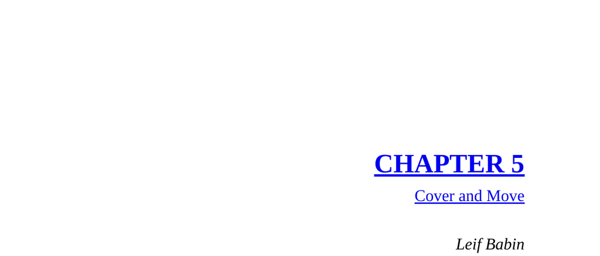

- **Cover and Move**
  - **Context of Operation in Ramadi**
    - SEAL sniper overwatch positions protected Army and Iraqi troops during dangerous cordon and search operations in Ramadi.
    - The U.S. Army’s strategy to reclaim Ramadi was Seize, Clear, Hold, Build, involving establishing combat outposts and engaging civillians.
    - Cordons and searches required clearing neighborhoods house by house, exposing troops to significant danger.
    - Further reading: [Operation Ramadi Overview](https://usacac.army.mil/sites/default/files/documents/cace/DCL/DDRL/9-Ramadi.pdf)
  - **Team Bulldog and SEAL Collaboration**
    - Team Bulldog, supported by armor units, led large cordon and search operations in enemy-held territory.
    - SEAL elements provided sniper overwatch and advised Iraqi soldiers throughout the operation.
    - Coordination and respect between Navy SEALs and Army Soldiers were crucial for mission success.
  - **Establishing OP2 Sniper Overwatch Position**
    - OP2 located about 1 kilometer southeast of COP Falcon in a heavily IED’ed area.
    - The team cleared a two-story house and attempted to secure neighboring buildings but faced tactical vulnerabilities.
    - Time constraints and hostile environment limited safe positioning.
  - **Execution of the Cordon and Search Operation**
    - Operation began at dawn with combined U.S. Army and Iraqi forces, supported by SEAL sniper overwatch teams.
    - Enemy fighters engaged from multiple directions, but SEAL snipers and armored units repelled attacks.
    - The operation concluded after clearing the area without casualties.
  - **Dilemma and Decision to Withdraw**
    - Tactical vulnerabilities and increasing enemy attacks prompted consideration of extraction methods.
    - Options included remaining in place, waiting for armored extraction, or moving on foot under fire.
    - The decision was made to withdraw on foot quickly, using Cover and Move tactics.
  - **Cover and Move Maneuver and Engagement**
    - OP2 employed the Cover and Move tactic, alternating covering fire and movement to evade enemy attacks.
    - The patrol was engaged by insurgents but successfully repulsed the attack with coordinated fire and maneuver.
    - The team returned to COP Falcon unharmed after a fierce firefight.
  - **Leadership Lesson and After Action Review**
    - Failure to coordinate withdrawal with OP1 violated the Cover and Move principle at the greater team level.
    - The oversight risked unnecessary exposure and enemy engagement due to lack of mutual support.
    - Leadership emphasized preventing silos, sustaining team integration, and supporting all elements to achieve mission success.
  - **Principle: Cover and Move**
    - Cover and Move is defined as foundational teamwork where all elements mutually support each other’s movement.
    - Teams must break down silos, communicate, and align on the strategic mission.
    - Failure to do so leads to friction, inefficiency, and increased risk.
    - Success is collective; individual success does not compensate for team failure.
    - Further reading: [Teamwork and Tactical Coordination](https://hbr.org/2016/05/the-secrets-of-great-teamwork)
  - **Application to Business**
    - Leadership challenge in a corporate setting illustrated similar breakdowns of teamwork and silos.
    - A production manager struggled with delays caused by a subsidiary company and initially blamed them.
    - The principle of Cover and Move applied: both companies share the same overall mission under one corporation.
    - Encouraging communication, relationship building, and mutual support improved collaboration and reduced downtime.
    - The shift eliminated the “us versus them” mentality, driving superior operational performance.
  - **Band of Brothers Photo Description**
    - Depicts teamwork among Iraqi soldiers, SEAL advisors, and U.S. Army Soldiers using smoke grenades to mask movement.
    - Illustrates integration of joint forces in dangerous urban environment.
    - Further reading: [Joint Operations Urban Combat](https://www.armyupress.army.mil/journals/military-review/online-exclusive/2020-ole/securing-urban-operations/)
