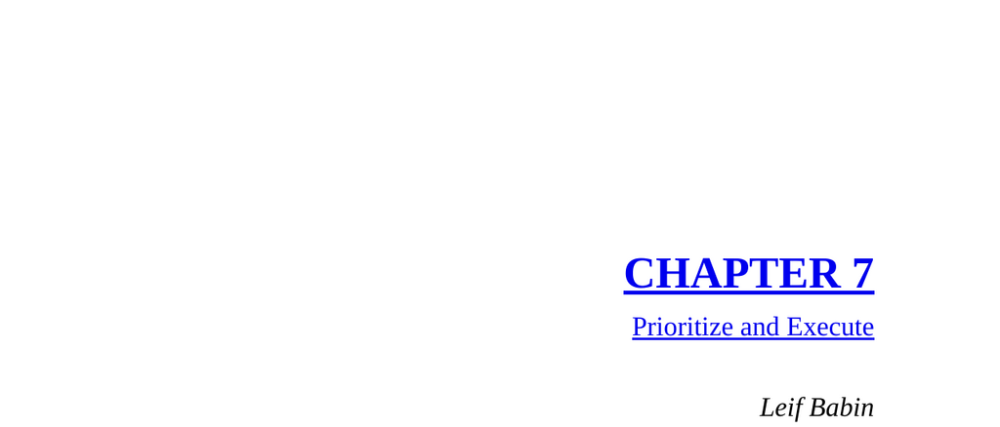

- **SOUTH-CENTRAL RAMADI, IRAQ: THE HORNET’S NEST**
  - The SEAL platoon faced accurate enemy fire including machine guns and RPG-7 rockets while holding a strategic four-story apartment building in hostile urban terrain.  
  - The platoon conducted a stealth infiltration "BTF in," moving 1.5 kilometers into enemy-held territory under cover of darkness to disrupt insurgent operations.  
  - The building provided a tactical vantage point but had one vulnerable exit prone to enemy IED emplacement, requiring EOD sweeps before departure.  
  - After intense combat, the discovery of an IED at the exit forced the platoon to create an alternate escape route by breaching the concrete wall to an adjacent rooftop.  
  - During evacuation, a SEAL fell through a rooftop tarp, necessitating rapid prioritization to set security, breach a locked gate, conduct headcount, and safely withdraw under threat of imminent explosion.  
  - For further reading, see [Urban Combat Tactics](https://www.globalsecurity.org/military/library/policy/army/fm/3-06/fm3-06.pdf).  

- **PRINCIPLE**
  - The leadership principle of "Prioritize and Execute" involves remaining calm, assessing all problems, selecting the highest priority, and directing team efforts to resolve it sequentially.  
  - Attempting to address multiple complex problems simultaneously leads to failure; instead, leaders must maintain situational awareness and communicative clarity throughout shifting priorities.  
  - Effective planning and contingency anticipation help leaders stay ahead of problems, enabling rapid decentralized command and stronger team execution.  
  - Leaders must "pull themselves off the firing line" to maintain big-picture perspective for proper prioritization and assist subordinates in focus.  
  - For more on decision-making under pressure, consult [Decision Making in High-Stress Environments](https://www.apa.org/monitor/2018/07-08/decision-making).  

- **APPLICATION TO BUSINESS**
  - A pharmaceutical CEO faced multiple initiatives but was losing money due to lack of clear prioritization and resource dilution across many projects.  
  - The CEO identified the sales force activity management as the highest priority but had not clearly communicated or focused company efforts on it.  
  - Leadership training advised prioritizing this key effort first and focusing entire company resources on empowering the frontline sales team before progressing to other initiatives.  
  - Concentrated effort yielded rapid progress and momentum, validating the principle of Prioritize and Execute in a business context.  
  - Additional insights available at [Harvard Business Review on Prioritization](https://hbr.org/2017/01/how-to-prioritize-your-work).
