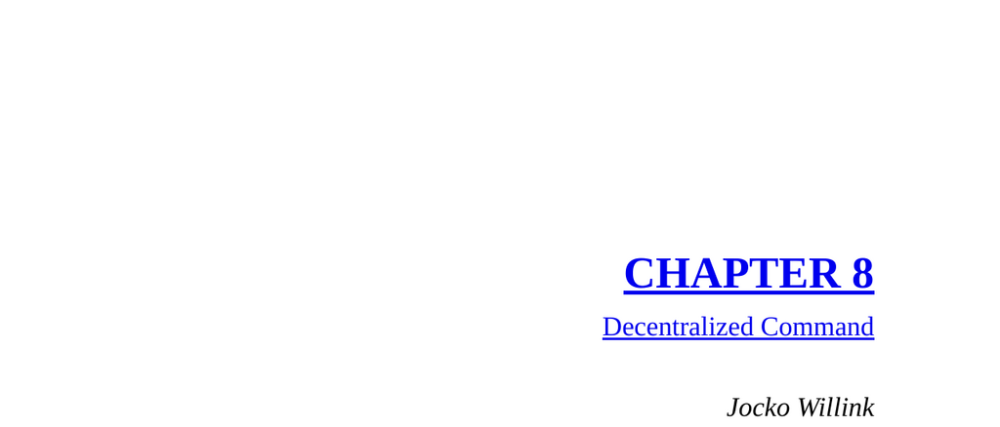

- **South-Central Ramadi, Iraq: A Reckoning**
  - The section recounts a critical combat scenario involving Task Unit Bruiser SEALs encountering enemy snipers in Ramadi, Iraq.
  - Decentralized Command enabled effective management across complex battlefield dynamics despite physical separation of leaders.
  - The story illustrates trust between senior commanders and subordinate leaders during fluid, lethal combat.
  - Further reading: [Decentralized Command Principles](https://www.jockowillink.com/decentralized-command/)
- **Decentralized Command Training at Fort Knox**
  - Task Unit Bruiser honed Decentralized Command skills during challenging Military Operations in Urban Terrain (MOUT) training.
  - Training emphasized breaking large units into manageable elements with clear leadership and delegation.
  - Role players simulated enemy tactics without rules to replicate chaotic combat environments.
  - Further reading: [Urban Combat Training Techniques](https://www.army.mil/mout/)
- **Decentralized Command in Large-Scale Ramadi Operation**
  - The largest operation involved coordination with U.S. Army and Marine units, complicating command due to size and communication networks.
  - SEAL sniper teams secured overwatch positions chosen and adjusted by platoon commanders under mission guidance.
  - Effective communication and trust prevented potential friendly fire during identification confusion.
  - Further reading: [Joint Operations and Decentralized Command](https://www.jcs.mil/Doctrine/)
- **Principle of Decentralized Command**
  - Leaders cannot manage more than six to ten individuals effectively during high-pressure situations.
  - Teams should be structured as small fire teams with clearly designated leaders understanding the Commander’s Intent.
  - Junior leaders must have defined decision-making limits and communicate both up and down the chain of command.
  - Senior leaders must build trust by backing junior leaders’ decisions and maintaining situational awareness.
  - Further reading: [Leadership and Span of Control](https://hbr.org/2016/04/what-is-the-right-span-of-control-for-your-team)
- **Leadership Positioning and Involvement**
  - Leaders must balance involvement by positioning themselves neither too far forward nor too far behind in operations.
  - Proper positioning allows maintaining situational awareness and effective command and control.
  - Movement and involvement should adapt dynamically to operational changes.
  - Further reading: [Effective Leadership Positions](https://www.militaryleader.com/command-control-and-leadership/)
- **Application to Business: Organizational Structure**
  - A disorganized org chart with uneven team sizes hinders empowered leadership and effective command.
  - Ideal team size is four to six people with a dedicated leader to maintain control and focus.
  - Decentralized Command requires simple, clear orders plus understanding of the mission’s purpose.
  - Trust built over time enables subordinates to take initiative with assurance of leadership support.
  - Further reading: [Organizational Design and Empowerment](https://www.gartner.com/en/insights/organizational-design)
