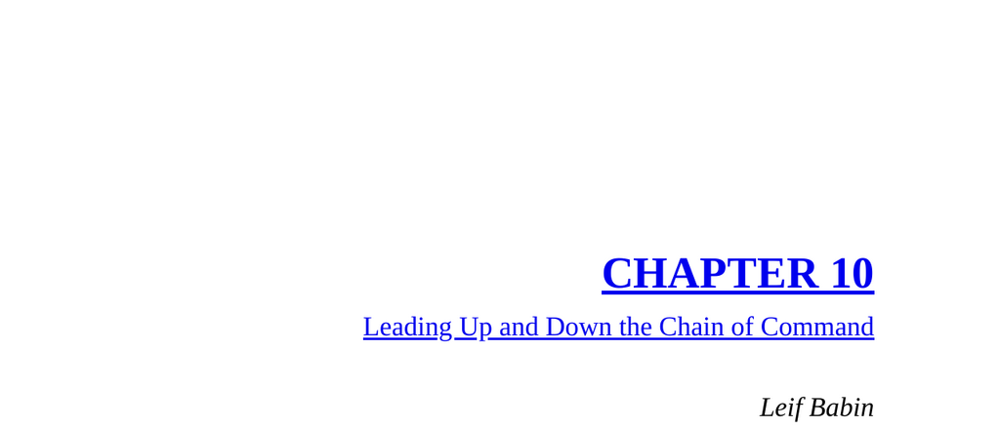

- **CAMP MARC LEE, RAMADI, IRAQ: LEADING DOWN THE CHAIN OF COMMAND**
  - The text describes a SEAL task unit’s combat operations and challenges in Ramadi during the Iraq War.
  - Task Unit Bruiser conducted numerous firefights, inflicted heavy damage on insurgents, and endured significant casualties.
  - Losses of key SEALs are recounted to underscore the cost and sacrifice of operations.
  - The unit’s efforts contributed critically to the U.S. Army Ready First Brigade's success and the Anbar Awakening.
  - [Battle of Ramadi Overview](https://www.historynet.com/battle-of-ramadi)
  
- **PRINCIPLE: LEADING DOWN THE CHAIN**
  - Leaders must communicate the bigger strategic picture clearly to subordinate troops engaged in tactical tasks.
  - Tactical operators focus on specific duties and may not intuitively understand the strategic context.
  - Regular face-to-face engagement and explanation enhance understanding and support decentralized command.
  - Leaders should self-assess their communication methods if the team lacks understanding of strategic goals.
  - [Decentralized Command Leadership](https://www.militaryleadershipmanual.com/)
  
- **CAMP MARC LEE, RAMADI, IRAQ: LEADING UP THE CHAIN OF COMMAND**
  - Frontline leaders initially express frustration at frequent, detailed queries from higher headquarters.
  - Higher command requires comprehensive information to approve operations and allocate resources.
  - Effective leadership requires understanding the perspective of superiors and providing clear, detailed information.
  - Inviting superiors to observe operations can build trust and mutual understanding.
  - [Military Command and Control](https://www.globalsecurity.org/military/agency/dod/command-control.htm)
  
- **PRINCIPLE: LEADING UP THE CHAIN**
  - Leaders must take responsibility for effectively communicating needs and situational awareness to superiors.
  - Leading up requires influence, professionalism, and clear, concise communication without relying on authority.
  - Accepting decisions from above, even if disagreeable, and supporting them is essential for unity and mission success.
  - Leaders must support their immediate superiors and help them understand operational realities.
  - [Effective Upward Communication in Leadership](https://hbr.org/2018/01/how-to-effectively-lead-up-the-chain-of-command)
  
- **APPLICATION TO BUSINESS**
  - Corporate frontline managers often feel frustrated by remote headquarters’ scrutiny and paperwork demands.
  - The military experience offers a comparable example of complex bureaucracy and operational demands under pressure.
  - Understanding that headquarters’ questions arise from a need for information rather than opposition improves communication.
  - Inviting senior executives to witness operations fosters empathy and breaks down adversarial “us vs them” mentalities.
  - Applying military leadership principles to business enhances communication between field teams and corporate leaders.
  - [Leadership Lessons from the Military](https://www.forbes.com/sites/forbescoachescouncil/2020/02/06/what-business-leaders-can-learn-from-military-training)
