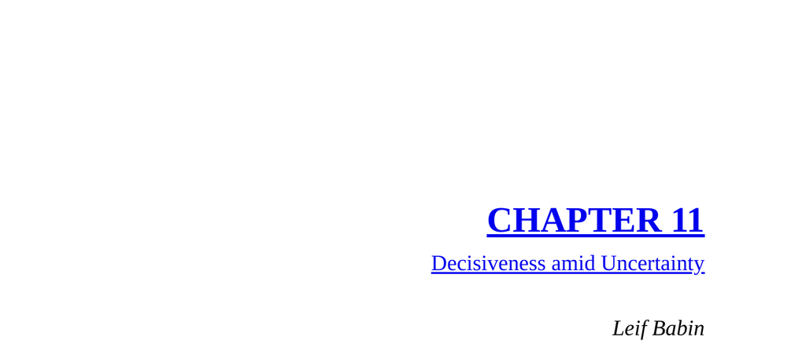

- **SNIPER OVERWATCH, RAMADI, IRAQ: TAKE THE SHOT**  
  - Describes a tense sniper overwatch scenario involving SEAL sniper Chris Kyle in Ramadi.  
  - Highlights the challenges of positive identification (PID) and risk of friendly fire.  
  - Illustrates the importance of careful judgment amid pressure from allied commanders.  
  - Explains consequences of misidentification and need to hold fire without clear target confirmation.  
  - [Extreme Ownership by Jocko Willink and Leif Babin](https://www.amazon.com/Extreme-Ownership-Leadership-Combat-Upside-Down/dp/1250067057)

- **PRINCIPLE**  
  - Explains the chaos, uncertainty, and incomplete information inherent to combat leadership.  
  - Emphasizes the necessity for leaders to act decisively despite lack of full information.  
  - Advises leaders to be prepared to adjust decisions as situations evolve and new intelligence arrives.  
  - Extends the principle of decisiveness amid uncertainty to civilian and business contexts.  
  - [Decisiveness in Leadership: Harvard Business Review](https://hbr.org/2020/03/when-to-be-decisive-and-when-to-wait)  

- **APPLICATION TO BUSINESS**  
  - Presents a case study of two conflicting senior engineers whose animosity threatens company performance.  
  - Details the CEOs' dilemma and the constraints limiting actions such as firing or retaining the engineers.  
  - Advocates for decisive action, including the controversial option to fire both toxic leaders simultaneously.  
  - Highlights the benefits of promoting frontline personnel as replacements for problematic leaders.  
  - Demonstrates how decisive leadership enhances team loyalty and prevents negative workplace culture spread.  
  - [The Five Dysfunctions of a Team by Patrick Lencioni](https://www.tablegroup.com/books/dysfunctions)
