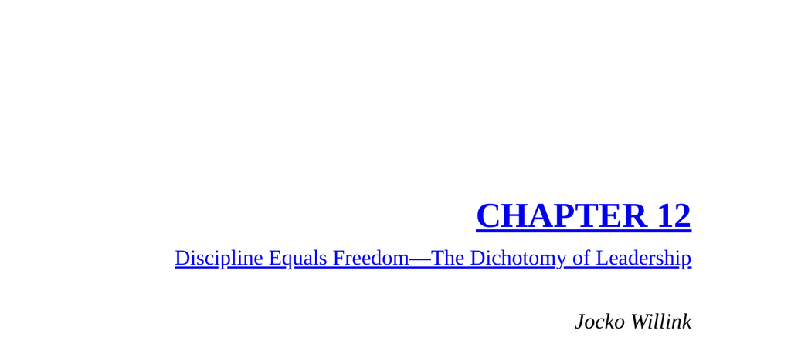

- **Baghdad, Iraq: The Discipline Transformation**  
  - The SEAL platoon conducted direct-action capture/kill missions in Iraq, primarily at night.  
  - Initial evidence searches were undisciplined, causing missed intelligence and extended time on target.  
  - A systematic, disciplined search method was developed assigning clear roles, improving efficiency and evidence quality.  
  - The new process reduced search times from 45 minutes to under 20 and allowed multiple raids per night.  
  - Evidence collection improvements aligned with stricter Iraqi court requirements; see [Military Search Procedures](https://www.globalsecurity.org/military/library/policy/navy/seal.htm).

- **Discipline Equals Freedom**  
  - Discipline starts with small daily decisions, like getting out of bed at the first alarm.  
  - Early risers in SEAL Teams demonstrated superior skills and preparedness through disciplined habits.  
  - Discipline in operational conduct enhances freedom to act effectively under combat rigors.  
  - Disciplined SOPs enable decentralized command which increases team agility and adaptability.  
  - This concept echoes themes from [Jocko Willink’s Discipline Equals Freedom](https://www.jockowillink.com/discipline-equals-freedom/).

- **The Dichotomy of Leadership**  
  - Leadership requires balancing opposing qualities, such as aggression with approachability, confidence with humility.  
  - Effective leaders must be ready to lead or follow, welcome subordinate input, and control emotions without becoming robotic.  
  - Leaders must avoid extremes like complacency or recklessness to maintain team effectiveness.  
  - A leader’s trust and respect are earned daily by demonstrating good judgment and care for the team.  
  - For further study, see [Leadership Dichotomy Overview](https://leadershipfreak.wordpress.com/2020/04/24/the-dichotomy-of-leadership/).

  - **Key Leadership Balances**  
    - Leaders must be confident but not cocky, courageous but not foolhardy, competitive but gracious in loss.  
    - Attention to detail is essential but must not overshadow strategic vision.  
    - Strong leadership combines physical and mental endurance with humility and appropriate assertiveness.  
    - Maintaining appropriate distance from subordinates preserves authority and mission focus.  
    - Exercising Extreme Ownership alongside Delegated Command optimizes team performance.

- **Application to Business**  
  - The electrical division was unprofitable, sustained by CEO loyalty to the division head.  
  - Financial strain and market risks necessitated reevaluation of the division’s viability.  
  - The CEO’s misplaced loyalty threatened company-wide stability and undermined leadership credibility.  
  - Implementing disciplined leadership required difficult decisions prioritizing the mission over personal relationships.  
  - The division shutdown freed resources and preserved company health, illustrating leadership dichotomy in practice.  
  - Related corporate leadership challenges discussed in [Harvard Business Review on Leadership Decisions](https://hbr.org/2016/03/the-hard-truth-about-leading-your-team).
