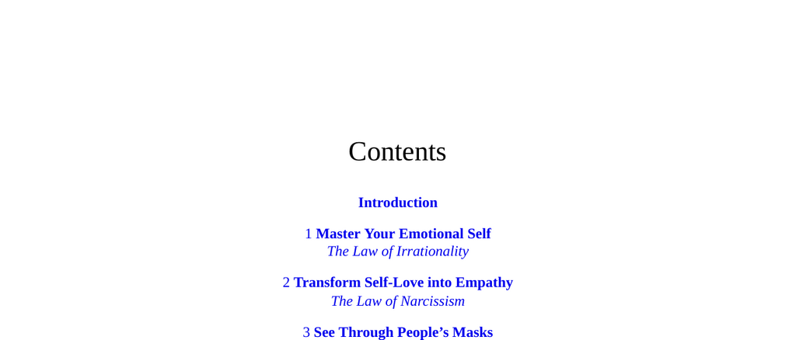

- **Introduction**
  - Provides an overview of the fundamental principles governing human behavior and relationships.
  - Establishes the framework for understanding emotional intelligence and social dynamics.
  - Recommends foundational texts such as [Emotional Intelligence by Daniel Goleman](https://en.wikipedia.org/wiki/Emotional_intelligence).

- **1 Master Your Emotional Self**
  - **The Law of Irrationality**
    - Describes how emotions can override rational thought, leading to irrational decisions.
    - Identifies common emotional triggers that compromise judgment.
    - Suggests techniques for managing emotions to restore objectivity.
    - For more, see [Thinking, Fast and Slow](https://en.wikipedia.org/wiki/Thinking,_Fast_and_Slow).

- **2 Transform Self-Love into Empathy**
  - **The Law of Narcissism**
    - Explores narcissistic tendencies as a barrier to authentic empathy.
    - Explains how genuine empathy arises from overcoming self-centeredness.
    - Offers strategies to shift focus from oneself to others for deeper connections.
    - Related reading: [The Narcissism Epidemic](https://en.wikipedia.org/wiki/The_Narcissism_Epidemic).

- **3 See Through People’s Masks**
  - **The Law of Role-playing**
    - Details how individuals adopt social masks to influence perception.
    - Describes signs to detect when people are concealing their true motives.
    - Advises critical observation of behavior to discern authenticity.
    - See also [The Presentation of Self in Everyday Life](https://en.wikipedia.org/wiki/The_Presentation_of_Self_in_Everyday_Life).

- **4 Determine the Strength of People’s Character**
  - **The Law of Compulsive Behavior**
    - Defines compulsive behaviors as indicators of character weaknesses.
    - Links repeated behavioral patterns to underlying psychological compulsion.
    - Encourages assessment of consistency and self-control as character metrics.
    - Further info: [Character Strengths and Virtues](https://en.wikipedia.org/wiki/Character_strengths_and_virtues).

- **5 Become an Elusive Object of Desire**
  - **The Law of Covetousness**
    - Explains how scarcity and unpredictability increase personal attractiveness.
    - Highlights psychological principles of desire and possessiveness.
    - Advises cultivating mystery to maintain others’ interest.
    - See [Influence: The Psychology of Persuasion](https://en.wikipedia.org/wiki/Influence:_The_Psychology_of_Persuasion).

- **6 Elevate Your Perspective**
  - **The Law of Shortsightedness**
    - Warns against focusing on immediate gains at the expense of long-term vision.
    - Emphasizes the importance of strategic thinking and delayed gratification.
    - Provides methods to broaden perspective and anticipate future consequences.
    - Related resource: [Long-Term Thinking](https://en.wikipedia.org/wiki/Farsightedness).

- **7 Soften People’s Resistance by Confirming Their Self-opinion**
  - **The Law of Defensiveness**
    - Identifies defensiveness as a natural reaction to perceived threats to self-image.
    - Shows how affirming others’ self-opinions reduces resistance and conflict.
    - Recommends communication techniques that validate rather than confront.
    - Consult [Nonviolent Communication](https://en.wikipedia.org/wiki/Nonviolent_communication) for expanded methods.

- **8 Change Your Circumstances by Changing Your Attitude**
  - **The Law of Self-sabotage**
    - Describes how negative attitudes undermine personal progress.
    - Connects self-defeating thoughts to external circumstance stagnation.
    - Suggests adopting positive mindset shifts to enact meaningful change.
    - See [Mindset: The New Psychology of Success](https://en.wikipedia.org/wiki/Mindset:_The_New_Psychology_of_Success).

- **9 Confront Your Dark Side**
  - **The Law of Repression**
    - Explains how repressed emotions and traits influence behavior unconsciously.
    - Urges acknowledgment and integration of one’s shadow aspects.
    - Outlines methods to recognize and manage hidden impulses.
    - Further reading: [Psychology of the Shadow](https://en.wikipedia.org/wiki/Shadow_(psychology)).

- **10 Beware the Fragile Ego**
  - **The Law of Envy**
    - Details how envy arises from fragile self-esteem and comparison.
    - Describes envy’s corrosive effects on relationships and mental health.
    - Recommends strategies to strengthen ego resilience and reduce envy.
    - For additional insight, see [The Envy Cure](https://en.wikipedia.org/wiki/Envy).

- **11 Know Your Limits**
  - **The Law of Grandiosity**
    - Highlights the dangers of overestimating personal capabilities.
    - Links grandiosity with unrealistic expectations and eventual failure.
    - Advises realistic self-assessment to avoid detrimental overreach.
    - Related literature: [Dunning-Kruger Effect](https://en.wikipedia.org/wiki/Dunning%E2%80%93Kruger_effect).

- **12 Reconnect to the Masculine or Feminine Within You**
  - **The Law of Gender Rigidity**
    - Examines societal pressures enforcing rigid gender roles.
    - Encourages embracing a balanced integration of masculine and feminine traits.
    - Suggests flexibility in gender expression enhances personal authenticity.
    - See [Gender Fluidity](https://en.wikipedia.org/wiki/Gender_fluidity) for context.

- **13 Advance with a Sense of Purpose**
  - **The Law of Aimlessness**
    - Identifies aimlessness as a source of stagnation and dissatisfaction.
    - Stresses clarity of purpose as essential to motivation and success.
    - Advises defining clear goals aligned with personal values.
    - Consult [Start with Why](https://en.wikipedia.org/wiki/Start_with_Why).

- **14 Resist the Downward Pull of the Group**
  - **The Law of Conformity**
    - Explores how group pressure compels individuals to suppress uniqueness.
    - Demonstrates the psychological mechanisms driving conformity.
    - Encourages independent thought to maintain personal integrity.
    - See [The Lucifer Effect](https://en.wikipedia.org/wiki/The_Lucifer_Effect).

- **15 Make Them Want to Follow You**
  - **The Law of Fickleness**
    - Describes followers’ unpredictability and desire for novelty.
    - Suggests cultivating charisma and adaptability to sustain influence.
    - Highlights the need to continually renew one’s appeal.
    - Further reading: [Leadership and Influence](https://en.wikipedia.org/wiki/Leadership).

- **16 See the Hostility Behind the Friendly Façade**
  - **The Law of Aggression**
    - Reveals underlying aggression masked by polite behavior.
    - Explains aggression as a natural but controlled human impulse.
    - Teaches detection of subtle signs indicating hostility.
    - See [Aggression (Psychology)](https://en.wikipedia.org/wiki/Aggression_(psychology)).

- **17 Seize the Historical Moment**
  - **The Law of Generational Myopia**
    - Highlights tendency to overlook broader generational and historical trends.
    - Urges awareness of the larger context to exploit timely opportunities.
    - Encourages acting decisively within historic moments for maximum impact.
    - For context, read [Generational Theory](https://en.wikipedia.org/wiki/Generational_theory).

- **18 Meditate on Our Common Mortality**
  - **The Law of Death Denial**
    - Examines society’s widespread denial of death’s inevitability.
    - Proposes reflection on mortality as a tool for clarifying priorities.
    - Suggests acceptance of death enhances presence and life appreciation.
    - Explore further at [Memento Mori](https://en.wikipedia.org/wiki/Memento_mori).
