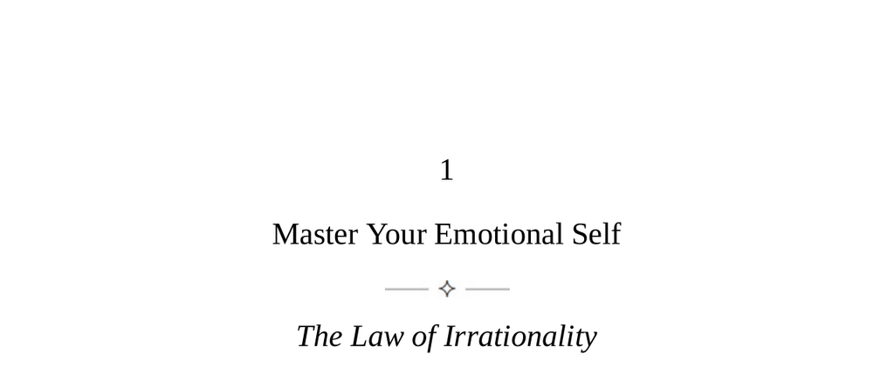

- **Master Your Emotional Self**
  - **The Law of Irrationality**
    - Emotions dominate human thought, causing biased and disconnected perceptions from reality.  
    - Rationality requires counteracting emotional effects through conscious effort and introspection.  
    - [Thinking, Fast and Slow](https://en.wikipedia.org/wiki/Thinking,_Fast_and_Slow) explores cognitive biases and rationality.  
  - **Keys to Human Nature**
    - Humans are naturally irrational due to evolutionary brain structures: reptilian (instinct), limbic (emotion), and neocortex (cognition).  
    - Emotions originated as physical arousal for survival and communication but conflict with human cognition.  
    - Emotions are difficult to translate accurately into language, leading to misinterpretations and unconscious biases.  
    - Progress and technology have altered but not eliminated irrationality; new media exacerbate emotional influences.  
    - [Emotional Intelligence](https://en.wikipedia.org/wiki/Emotional_intelligence) relates to awareness and management of emotions.  
  - **Step One: Recognize the Biases**
    - Emotions create mental biases rooted in the pleasure principle, causing selective and distorted thinking.  
    - Key biases include confirmation bias, conviction bias, appearance bias, group bias, blame bias, and superiority bias.  
    - Recognizing these biases in oneself and others aids in identifying irrational thinking patterns.  
    - [Cognitive Biases](https://en.wikipedia.org/wiki/List_of_cognitive_biases) provides a comprehensive list of biases.  
  - **Step Two: Beware the Inflaming Factors**
    - High-grade emotions arise explosively due to external triggers causing tunnel vision and reactive behavior.  
    - Five main inflaming factors are: childhood trigger points, sudden gains or losses, rising pressure, inflaming individuals, and the group effect.  
    - Awareness of these factors helps in managing emotional escalation and avoiding rash actions.  
    - Historical cycles of irrationality persist despite progress, requiring individual rational effort.  
    - [The Social Psychology of Emotion](https://www.apa.org/education/k12/social-psychology-emotion) discusses emotional triggers and group dynamics.  
  - **Step Three: Strategies Toward Bringing Out the Rational Self**
    - Rationality is achievable through self-awareness, emotional examination, and deliberate practice.  
    - Strategies include knowing oneself, analyzing emotions to their roots, increasing reaction time, accepting people as they are, and balancing thinking with emotion.  
    - The maker’s mindset—focused, practical, calm—is a natural state of rationality that can be cultivated.  
    - Embracing rationality provides deep satisfaction and self-mastery beyond transient pleasures.  
    - [The Power of Now](https://en.wikipedia.org/wiki/The_Power_of_Now) offers insights into mindfulness and emotional control.
