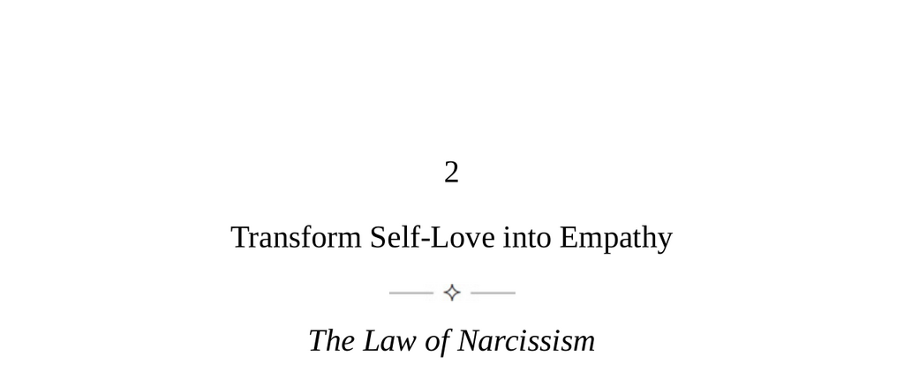

- **Transform Self-Love into Empathy**
  - **The Law of Narcissism**
    - Empathy is a natural tool for social connection and power if properly cultivated.  
    - Habitual self-absorption blunts empathy and obstructs connection with others.  
    - The goal is to turn sensitivity outward and recognize toxic narcissists to avoid their harmful influence.  
    - Further reading: [Understanding Narcissism](https://www.psychologytoday.com/us/basics/narcissism)  
  - **The Narcissistic Spectrum**
    - Humans have a fundamental need for attention for physical and psychological survival.  
    - Attention scarcity causes competition and can lead to self-absorption as a coping mechanism.  
    - A self-image or self-love serves as a thermostat to regulate self-esteem and insecurities.  
    - Deep narcissists lack this mechanism and show intense sensitivity, paranoia, and self-centered behavior.  
    - Functional narcissists maintain a coherent self and can direct attention outward at times.  
    - Recognizing and managing deep narcissists is crucial to avoid manipulation and harm.  
    - Further reading: [The Narcissistic Spectrum Explained](https://www.psychcentral.com/disorders/narcissistic-personality-disorder)  
  - **Transforming Narcissism**
    - Acceptance of one’s narcissistic nature is essential for personal growth.  
    - Healthy narcissists possess a resilient sense of self and recover quickly from wounds.  
    - Strong self-love allows for sustained outward focus toward work or empathy.  
    - Empathy is considered the highest state of narcissism, involving deep absorption in others.  
    - Further reading: [Healthy Narcissism and Self-Esteem](https://www.psychalive.org/understanding-healthy-narcissism/)  
  - **The Four Components of Empathy**
    - **The Empathic Attitude**  
      - Empathy requires an open, non-judgmental mindset assuming ignorance and overcoming biases.  
      - People wear psychological masks that must be explored rather than judged superficially.  
      - Developing empathy parallels creative thinking by increasing openness to possibilities.  
    - **Visceral Empathy**  
      - Empathy is an emotional attunement relying on perceiving others’ moods and body language.  
      - Physical cues in voice, gestures, and posture provide visceral information about emotional states.  
      - Our mood often mirrors others’ defensive or confident feelings unconsciously.  
    - **Analytic Empathy**  
      - Understanding others deeply involves accumulating knowledge of their background and values.  
      - Analytic empathy helps in overcoming resistance or repulsion toward difficult individuals.  
      - Abraham Lincoln’s advice to understand disliked people represents this challenge.  
    - **The Empathic Skill**  
      - Building empathic ability is a process requiring feedback through direct inquiry or indirect rapport sensing.  
      - Trust and discretion are necessary for accurate emotional feedback from others.  
    - Further reading: [Empathy Skills and Techniques](https://greatergood.berkeley.edu/topic/empathy/definition)  
  - **Three Examples of Narcissistic Types**
    - **The Complete Control Narcissist**  
      - These narcissists use charm and sensitivity not to connect but to manipulate and control others.  
      - They tune into others’ insecurities to exploit weaknesses and secure power and attention.  
      - Their hypersensitivity leads to paranoia and need for dominance in politics or business.  
    - **The Theatrical Narcissist**  
      - They camouflage their narcissism through dramatic, moralistic, or victim roles to evoke sympathy.  
      - Theatrical displays are designed for public consumption and conceal their ongoing attention needs.  
      - Awareness of their focus on self and continual drama helps avoid becoming a victim.  
    - **The Healthy Narcissist—the Mood Reader**  
      - Healthy narcissists naturally influence groups by projecting confidence and optimism nonverbally.  
      - They balance attention between individuals and the group to manage moods gently and effectively.  
      - They use indirect methods to elevate group morale without causing shame or resistance.  
    - Further reading: [Types of Narcissism](https://www.psychologytoday.com/us/blog/having-sex-wanting-intimacy/201708/6-types-narcissism)
