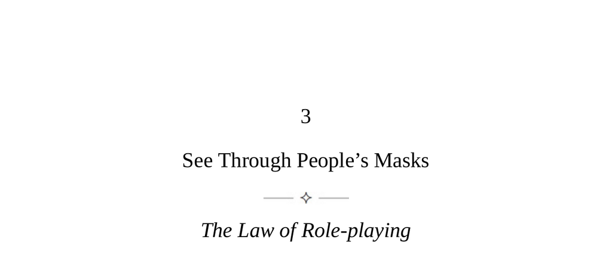

- **See Through People’s Masks**
  - **The Law of Role-playing**
    - People wear masks to show themselves in the best possible light, concealing true feelings like insecurity and envy.  
    - True emotions leak out through nonverbal cues such as facial expressions, vocal tones, and body tension.  
    - Mastering the ability to decode these cues allows proper defensive measures and effective role-playing.  
    - Presenting a strong front is essential since appearances shape others' judgments.  
    - Further reading: [The Presentation of Self in Everyday Life](https://en.wikipedia.org/wiki/The_Presentation_of_Self_in_Everyday_Life)
  - **Keys to Human Nature**
    - Humans develop role-playing skills from early childhood to obtain needs and blend in socially.  
    - Nonverbal communication evolved long before language and is deeply ingrained in human nature.  
    - There is an internal conflict between wanting to communicate feelings and needing to conceal them.  
    - People typically focus too much on words and neglect rich nonverbal signals.  
    - Social success requires both skillful role-playing and keen observation of others' true feelings.  
    - Further reading: [Social Intelligence by Daniel Goleman](https://en.wikipedia.org/wiki/Social_intelligence)
  - **Observational Skills**
    - Developing observational skills requires patient, incremental practice focusing first on facial expressions, then voice, then body language.  
    - Observers should establish a baseline for each individual’s normal behavior to detect deviations.  
    - Biases and personal preferences distort interpretation; objective observation is critical.  
    - Self-observation improves sensitivity to others’ nonverbal cues and enhances control over one’s own signals.  
    - Prolonged practice can give near-psychic sensitivity to others' emotions via nonverbal shifts.  
    - Further reading: [What Every BODY is Saying](https://www.johngottman.net/books/what-every-body-is-saying/)
  - **Decoding Keys**
    - Nonverbal cues reveal true emotions in three main categories: dislike/like, dominance/submission, and deception.  
    - Dislike manifests in squinting, pursed lips, turning away, crossed arms, and microexpressions like fleeting contempt.  
    - Like or positive emotions show relaxed facial muscles, genuine smiles involving eye muscles, rising vocal pitch, and physical closeness.  
    - Dominance cues include talking more, interrupting, tight ironic smiles, and using illness or sympathy to control others.  
    - Deception involves exaggerated facial expressions or gestures, tension in uncontrollable body parts, and inconsistent nonverbal signals.  
    - Effective detection of deception involves encouraging deceivers to reveal more cues before challenging them.  
    - Further reading: [Emotions Revealed by Paul Ekman](https://www.paulekman.com/product/emotions-revealed/)
  - **The Art of Impression Management**
    - Playing social roles skillfully is essential for success; refusal leads to marginalization.  
    - Controlling nonverbal cues consciously can increase likability and effectiveness in social interactions.  
    - Method acting techniques help generate genuine emotions on demand to align behavior with desired impressions.  
    - Tailoring nonverbal style to the audience increases impact and acceptance.  
    - First impressions benefit from neutrality accompanied by relaxed smiles and eye contact.  
    - Employing dramatic effects such as selective absence and unpredictability creates allure and interest.  
    - Projecting saintly qualities, including generosity and humility, builds trust and masks Machiavellian intentions.  
    - Further reading: [Impression Management in the Workplace](https://www.researchgate.net/publication/235349522_Impression_Management_Theory_and_Research)
