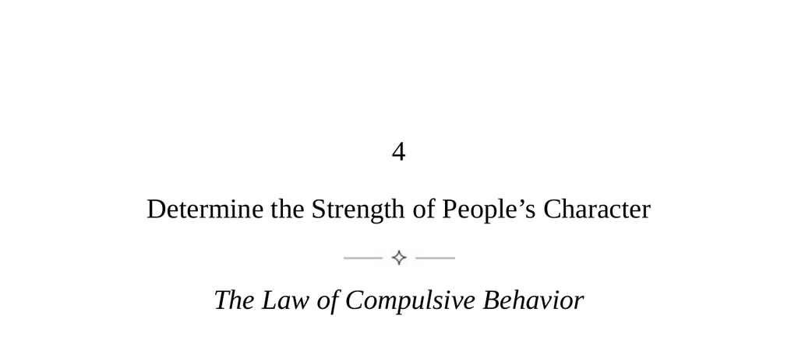

- **The Law of Compulsive Behavior**  
  - People's character is formed early and expressed through repeated actions and habits.  
  - Character strength is gauged by handling adversity, adaptability, patience, and learning ability.  
  - Surface reputation or charm should be disregarded in favor of deeper character evaluation.  
  - Self-awareness of one's own character aids in breaking negative patterns and controlling destiny.  
  - For further reading, see [Character Strength and Leadership](https://www.mindtools.com/pages/article/character.htm).

- **Keys to Human Nature**  
  - Fate-like life patterns are determined by an ingrained character shaped by early experiences.  
  - Character is a deep "stamp" compelling habitual actions beyond conscious control.  
  - Understanding one's character involves recognizing past influences and recurring negative patterns.  
  - Evaluating others’ characters is crucial when choosing collaborators, prioritizing character over charm or reputation.  
  - Human judgments often err due to illusions and facades people create.  
  - For more insights, review [Human Nature and Character](https://www.psychologytoday.com/us/basics/human-nature).

- **Character Signs**  
  - Actions over time reveal character through recurring patterns, not isolated incidents.  
  - People repeat behaviors even against their self-interest, demonstrating compulsive nature.  
  - Strong character manifests as resilience, adaptability, openness to learning, and persistence.  
  - Weak character shows evasion, resistance to criticism, and unreliability.  
  - Testing reactions in stressful or ambiguous situations can reveal true character traits.  
  - Strong character outweighs intelligence or charm in reliability and productivity.  
  - Refer to [Assessing Character Traits](https://greatergood.berkeley.edu/article/item/how_to_assess_character).

- **Toxic Types**  
  - Certain recurring toxic character types include Hyperperfectionist, Relentless Rebel, Personalizer, Drama Magnet, Big Talker, Sexualizer, Pampered Prince/Princess, Pleaser, Savior, and Easy Moralizer.  
  - These types often mask harmful patterns behind appealing or authentic facades.  
  - Toxicities arise from early life experiences such as family dynamics, unmet emotional needs, or trauma.  
  - Early recognition and disengagement from these types prevent long-term harm.  
  - For detailed descriptions, see [Toxic Personality Types](https://www.psychologytoday.com/us/blog/toxic-relationships).

  - **The Hyperperfectionist**  
    - Exhibits compulsive control and inability to delegate despite apparent dedication.  
    - Dependency issues often stem from family background anxieties.  
    - Shows patterns of initial success followed by burnout and failure.

  - **The Relentless Rebel**  
    - Hates authority and shows compulsive need to feel superior.  
    - Childhood experiences likely involved parental disappointment and mistrust of power.  
    - Resistant to criticism and emotionally locked in adolescent behavior.

  - **The Personalizer**  
    - Takes all remarks inward as personal affronts, resulting in perpetual disappointment.  
    - Early feelings of parental neglect fuel this pattern.  
    - Causes others to experience undue guilt.

  - **The Drama Magnet**  
    - Gains attention through ongoing personal conflicts and victim positioning.  
    - Childhood survival strategy involved enmeshing parents emotionally.  
    - Tends to entangle others in their problems for emotional hooks.

  - **The Big Talker**  
    - Charms with ideas but lacks tangible achievements or follow-through.  
    - Avoids criticism due to unstable, inconsistent parental environments.  
    - Blames external forces for failure to realize visions.

  - **The Sexualizer**  
    - Displays compulsive sexual behavior likely rooted in early abuse.  
    - Views almost all relationships through a sexual lens and cannot be helped.  
    - Entanglement with them is harmful; escape is advised.

  - **The Pampered Prince/Princess**  
    - Commands favors through entitlement and childish tantrums when denied.  
    - Raised with indulgence and protection from adversity.  
    - Creates exhausting, one-sided relationships favoring their desires.

  - **The Pleaser**  
    - Exhibits excessive niceness as a defensive mechanism against harsh parenting.  
    - Behind charm lies resentment over their imposed social role.  
    - Caution is needed when interacting with overly polished courtiers.

  - **The Savior**  
    - Gains satisfaction from rescuing others and controlling them.  
    - Typically were caregivers in childhood, reinforcing controlling tendencies.  
    - True saviors allow independence; others seek power through help.

  - **The Easy Moralizer**  
    - Displays eloquent outrage but lacks empathy and conceals personal vices.  
    - Childhood guilt over impulses leads to repression and hypocrisy.  
    - Distance is prudent due to hidden contradictions and condescension.

- **The Superior Character**  
  - Character is fixed from early life but patterns can be mitigated through awareness.  
  - Denial of character’s influence strengthens compulsive behaviors and hinders growth.  
  - Self-examination of primal inclinations, attachments, mistakes, and strengths is essential.  
  - Transformation involves channeling negative traits into productive, socially positive strengths.  
  - Developing habits like resilience, patience, teamwork, and flexibility builds strong character.  
  - Association with strong characters enhances personal growth through habit assimilation.  
  - Active experimentation with new strategies fosters adaptability and strength.  
  - For further development strategies, consult [Building Character](https://www.psychologytoday.com/us/blog/the-mindful-self-express/201212/building-character).
