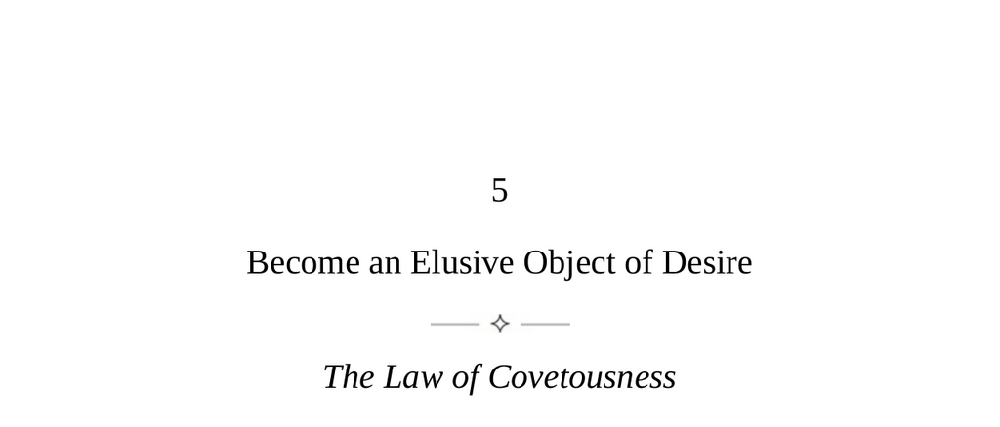

- **Become an Elusive Object of Desire**
  - **The Law of Covetousness**
    - Absence increases desire while too much presence suffocates interest.
    - People desire what is forbidden or missing, which triggers strong covetous feelings.
    - Desire originates more from pursuit than actual fulfillment.
    - For further insight, see [The Psychology of Desire](https://www.psychologytoday.com/us/basics/desire).
  - **Keys to Human Nature**
    - Human minds naturally drift toward desiring unattainable or distant objects.
    - Three brain qualities affect desire: induction (contrast effects), evolutionary negative bias, and the power of imagination.
    - Imagination activates brain areas similarly to real experience, fueling endless desire.
    - The grass-is-always-greener syndrome is a fundamental and beneficial psychological trait.
    - Additional reading: [The Neuroscience of Imagination](https://www.sciencedirect.com/topics/neuroscience/imagination).
  - **Strategies for Stimulating Desire**
    - Know how and when to withdraw to create mystery and increase value.
    - Create rivalries of desire by signaling others' interest to amplify one's own desirability.
    - Use induction by associating objects with illicit or transgressive elements to exploit repressed desires.
    - Employ ambiguity and open-ended presentations to engage imagination.
    - For practical tactics, see [Influence: The Psychology of Persuasion](https://en.wikipedia.org/wiki/Influence:_The_Psychology_of_Persuasion).
  - **The Supreme Desire**
    - Awareness of one's covetous tendencies allows differentiation between productive restlessness and futile boredom.
    - Covetous desires provide motivation but must be consciously controlled to avoid wasteful pursuit.
    - Acceptance and deeper connection to reality and one's environment provide calmness and practical power.
    - Constantly chasing illusions leads away from fulfillment; focus and engagement with one's real world is advised.
    - Further resource: [Mindfulness and the Art of Desire Management](https://www.mindful.org/mindfulness-how-to-manage-desire/).
