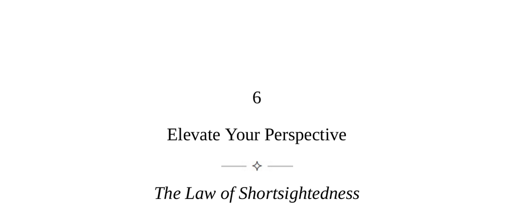

- **Elevate Your Perspective**
  - **The Law of Shortsightedness**
    - Human nature tends to focus on immediate sensory inputs and dramatic present events.
    - Shortsightedness causes susceptibility to quick-result schemes and emotional overreactions.
    - Measuring others by their vision breadth helps avoid reactive mindsets and energy.
    - Maintaining focus on long-term goals and large trends cultivates patience and clarity.
    - See [Thinking, Fast and Slow](https://en.wikipedia.org/wiki/Thinking,_Fast_and_Slow) for insights on decision-making biases.
  - **Keys to Human Nature**
    - Present moment perception lacks perspective, improved over time through added information.
    - Metaphor of ascending a mountain illustrates growing clarity with elevated perspective.
    - Farsighted perspective is cultivated by emotional detachment and considering broader context.
    - Strategic thinking involves anticipating consequences and realigning with long-term priorities.
    - Broadening perspective tools reduce impulsivity and promote calmer decision-making.
    - Explore [Mental Models](https://fs.blog/mental-models/) for expanding cognitive frameworks.
  - **Four Signs of Shortsightedness and Strategies to Overcome Them**
    - **Unintended Consequences**
      - Reactive solutions often ignore complex chains of cause and effect.
      - Belief in good intentions guaranteeing good outcomes ignores complex motivations.
      - Consequential thinking includes forecasting multiple reaction layers and potential fallout.
      - Large organizations benefit from designated skeptics to game out consequences.
      - See [The Cobra Effect](https://en.wikipedia.org/wiki/Cobra_effect) for unintended consequences examples.
    - **Tactical Hell**
      - Multiple ongoing conflicts drain energy and obscure strategic goals.
      - Ego-driven battles lack progress and elevate frustration and pettiness.
      - Detachment and reassessing priorities enable strategic responses or disengagement.
      - Strategic thinking leads to long-term success, not reactive defensive postures.
      - Study [The Art of War by Sun Tzu](https://en.wikipedia.org/wiki/The_Art_of_War) for strategic principles.
    - **Ticker Tape Fever**
      - Addiction to real-time news cycles fosters impatience and diminished attention span.
      - Instantaneous data distort perception of larger, slower-moving trends.
      - Emotional reactions to rapid updates increase volatility in decision-making.
      - Patience, clarity of goals, and faith in time revealing truth counteract this fever.
      - Refer to [The Shallows](https://en.wikipedia.org/wiki/The_Shallows_(book)) for effects of digital media on cognition.
    - **Lost in Trivia**
      - Overwhelm from excessive information impairs priority recognition and mental clarity.
      - Lack of filtering leads to mental fatigue, confusion, and helplessness.
      - Prioritization based on long-term goals streamlines focus and information processing.
      - Delegation helps manage information load and maintain strategic oversight.
      - Consult [Essentialism](https://en.wikipedia.org/wiki/Essentialism_(book)) for focusing on what matters most.
  - **The Farsighted Human**
    - Most people live within a narrow present-focused time frame, avoiding deep reflection on past or future.
    - Aging and death become motivators to maximize the present and appreciate time’s lessons.
    - Strong sense of self arises from connection to past experiences and consistent character traits.
    - Long-term goals are concrete and guide decision-making, fostering calmness and realism.
    - Mastery of time perspective enhances strategic thinking and emotional stability.
    - For further reading, see [Man’s Search for Meaning](https://en.wikipedia.org/wiki/Man%27s_Search_for_Meaning) for perspectives on purpose and time.
