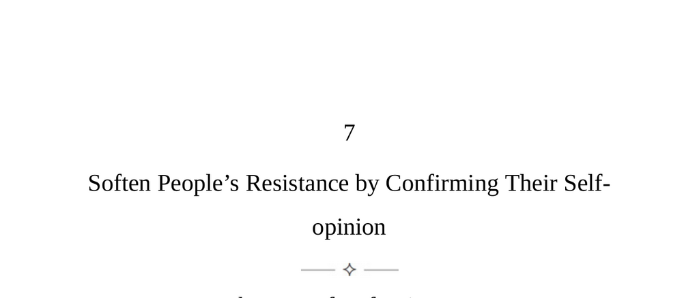

- **The Law of Defensiveness**  
  - Life’s harshness and competition lead to natural defensiveness in people.  
  - People resist persuasion to preserve their autonomy and self-image.  
  - Mutual warmth and non-attack on beliefs reduce resistance and encourage cooperation.  
  - Confirming people’s noble and altruistic self-opinions makes them more open to influence.  
  - Relevant reading: [Understanding Defensiveness in Communication](https://www.psychologytoday.com/us/basics/defensiveness)

- **Keys to Human Nature**  
  - Defensive traits in personality develop from childhood, centered on personal space and dignity.  
  - Group contexts can temporarily lower defenses by creating feelings of belonging and validation.  
  - People have three universal self-opinions: autonomy, intelligence, and basic goodness.  
  - Challenging these self-opinions increases resistance; confirming them opens people to suggestion.  
  - Practicing empathy and mirroring these traits lowers defenses and fosters rapport.  

- **Five Strategies for Becoming a Master Persuader**  
  - **Transform yourself into a deep listener**  
    - People focus more on their own thoughts than others’, making deep listening rare.  
    - Genuine listening involves attention to nonverbal cues and guiding topics to areas of passion or interest.  
    - Mirroring others’ words in one’s own filtered experience signals understanding and encourages openness.  
    - Deep listening reveals insecurities and unmet desires crucial for persuasion.  
    - Recommended: [Active Listening Techniques](https://www.skillsyouneed.com/ips/active-listening.html)  

  - **Infect people with the proper mood**  
    - Emotional contagion allows mood to be transferred nonverbally between people.  
    - Indulging acceptance and nonjudgmental attitudes foster positive rapport.  
    - Physical gestures like gentle touches can strengthen trust without overt verbal communication.  
    - Expectations positively framed in advance influence interactions favorably.  

  - **Confirm their self-opinion**  
    - Autonomy: Influence must appear as voluntary choice or self-desired action to be effective.  
    - Intelligence: Allow targets to refute initial disagreements to affirm their intellect and power of influence.  
    - Goodness: Frame requests in terms of moral or prosocial causes to align with people’s self-image.  
    - Small rewards are more effective than large gifts, which can offend independence.  
    - Asking for forgiveness or highlighting others’ past kindness confirms goodness.  

  - **Ally their insecurities**  
    - Identify insecurities through conversation and avoid triggering them.  
    - Praise uncertain qualities and effort rather than innate talent to reassure and flatter strategically.  
    - Balanced praise mixed with minor criticisms enhances credibility and realism.  
    - For high self-opinion individuals, flattery feels natural; it fails for those with low self-esteem.  

  - **Use people’s resistance and stubbornness**  
    - Resistance stems from fear of change and desire for control.  
    - Mental judo uses opponents’ energy to redirect and achieve influence without direct opposition.  
    - Using a person’s own words back to them creates a hypnotic effect that facilitates compliance.  
    - Reverse psychology works by encouraging stubbornness so people act as desired in rebellion.  

- **The Flexible Mind—Self-Strategies**  
  - Children possess flexible minds motivated by vulnerability and curiosity, enabling rapid learning.  
  - Aging and feelings of superiority cause mental rigidity and resistance to new ideas.  
  - The ideal mind maintains youthful flexibility combined with adult reasoning capacity.  
  - Viewing personal ideas as toys to play with encourages openness and innovation.  
  - Awareness of one’s own self-opinion illusions fosters true independence and empathy.  
  - Further reading: [The Growth Mindset](https://www.mindsetworks.com/science/)
