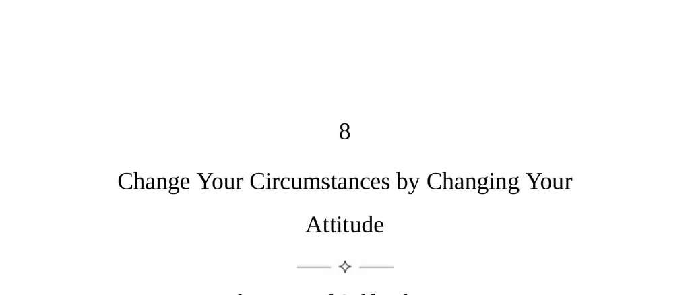

- **The Law of Self-sabotage**  
  - The attitude shapes how individuals interpret events and people in their lives.  
  - Negative attitudes based on fear cause self-limiting behavior and relationship damage.  
  - Positive attitudes foster learning from adversity, opportunity creation, and social connections.  
  - Willpower and attitude adjustments are essential tools for transforming life circumstances.  
  - For related psychological concepts, see [Psychology Today: Attitude](https://www.psychologytoday.com/us/basics/attitude).

- **Keys to Human Nature**  
  - Reality is subjective; each person experiences the world through a unique attitude or lens.  
  - Carl Jung defined attitude as a psyche’s readiness to act in specific ways, often unconsciously.  
  - Attitudes are broadly categorized as negative/narrow and positive/expansive.  
  - Self-awareness of one’s attitude allows intentional positive transformation and improves social dynamics.  
  - Willpower influences mental and physical health, intelligence, and creative capacity throughout life.  
  - Further exploration: [Carl Jung and Attitudes](https://www.britannica.com/biography/Carl-Jung).

- **The Constricted (Negative) Attitude**  
  - Negative attitudes narrow experiences to reduce perceived threats and maintain control.  
  - Negative emotions are interconnected and often appear in combinations reinforcing pessimism.  
  - Recognizing latent negative attitudes in oneself and others is key to managing and overcoming them.  
  - Strategies include increasing self-awareness and applying tailored behavioral experiments or interventions.  
  - Consult [APA on Negative Attitudes](https://www.apa.org/topics/attitudes).

  - **The Hostile Attitude**  
    - Hostile individuals provoke anger to confirm their belief that others dislike them.  
    - They sabotage relationships through accusations, provocations, and defensive interpretations.  
    - Self-awareness and adopting neutral responses can disrupt their antagonistic patterns.  
    - Experimenting with positive internal thoughts can reveal whether hostility stems from oneself or others.  
    - Related reading: [Hostility and Aggression](https://www.ncbi.nlm.nih.gov/pmc/articles/PMC3938366/).

  - **The Anxious Attitude**  
    - Anxious types anticipate criticism and loss of control, narrowing their experiences and demanding control.  
    - They often disguise control needs as love or concern and over-manage environments.  
    - Channeling energy into productive work and gradual exposure to feared situations serves as antidotes.  
    - Responding with calmness can soothe their anxiety and improve interactions.  
    - See also: [Anxiety Treatment Strategies](https://www.nimh.nih.gov/health/topics/anxiety-disorders).

  - **The Avoidant Attitude**  
    - Avoidant individuals doubt their competence and avoid challenges to prevent failure or criticism.  
    - Escape behaviors include quitting projects, developing psychosomatic symptoms, or substance abuse.  
    - They often appear saintly but show no substantive accomplishments or commitment.  
    - Starting and completing small projects helps build confidence and diminish avoidance.  
    - Partnership with avoidant persons is risky; rescue attempts often reinforce negativity.  
    - Additional info: [Avoidant Personality Disorder](https://www.psychiatry.org/patients-families/avoidant-personality-disorder).

  - **The Depressive Attitude**  
    - Depressive types internalize parental criticism and expect abandonment or loss in life.  
    - They may withdraw, self-sabotage successes, and foster confusion through push-pull interactions.  
    - Their sensitivity attracts others who want to help, but they often wound these helpers.  
    - Channeling energy into arts and work externalizes feelings positively and manages withdrawal.  
    - Supporting depressive individuals requires empathy without preaching; gradual positive engagement is effective.  
    - For understanding depression, see [NIMH Depression](https://www.nimh.nih.gov/health/topics/depression).

  - **The Resentful Attitude**  
    - Resentful people feel chronically wronged, scan for disrespect, and brood over injustices.  
    - They covertly seek revenge via sabotage or passive aggression and often lead disaffected groups.  
    - Arrogance and frequent petty conflicts alienate others and perpetuate isolation.  
    - Letting go of grudges and expressing anger promptly helps break the resentful cycle.  
    - Interaction with resentful individuals requires caution due to their potential viciousness.  
    - Related resource: [Understanding Resentment](https://www.psychologytoday.com/us/basics/resentment).

- **The Expansive (Positive) Attitude**  
  - Positive attitudes expand life experiences, creativity, social pleasure, and vitality.  
  - Viewing oneself as an explorer fosters curiosity, openness, and mental pleasure rather than conviction.  
  - Embracing adversity as learning strengthens resilience and fully embraces life’s challenges.  
  - Rejecting self-imposed limits enhances self-belief and unlocks greater potential.  
  - Willpower influences health and energy; positive emotions aid recovery and longevity.  
  - Detachment from others’ negativity allows clearer judgment and social tolerance.  
  - Openness and generosity improve social interactions and attract others.  
  - Suggested reading: [Growth Mindset by Carol Dweck](https://www.mindsetworks.com/science/).
