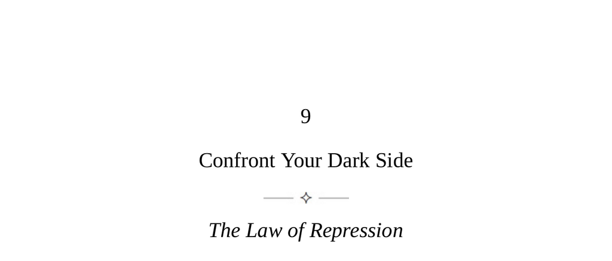

- **The Law of Repression**  
  - People commonly repress a dark, shadow side consisting of insecurities and aggressive impulses.  
  - This Shadow leaks out in baffling or harmful behavior and must be recognized early.  
  - Integrating the Shadow enhances authenticity and channels unconscious creative energy.  
  - For deeper understanding, see [Carl Jung and the Shadow](https://www.psychologytoday.com/us/basics/jungian-psychology/shadow).  

- **Keys to Human Nature**  
  - Most people appear pleasant and responsible but occasionally reveal contradictory behavior.  
  - The Shadow consists of qualities people repress unconsciously and often surfaces under stress or with age.  
  - Key signs of the Shadow include contradictory behavior, emotional outbursts, vehement denial, "accidental" behavior, overidealization, and projection.  
  - Acting as a detective helps anticipate Shadow behavior by observing these signs.  
  - For detailed analysis of human contradictions, consult [Understanding Shadow Projections](https://www.psychologytoday.com/us/blog/hide-and-seek/201302/shadow-projection).  

- **Deciphering the Shadow: Contradictory Behavior**  
  - Emphatic personality traits often conceal opposing, repressed traits beneath a façade.  
  - Seven common emphatic traits are identified: The Tough Guy, The Saint, The Passive-Aggressive Charmer, The Fanatic, The Rigid Rationalist, The Snob, and The Extreme Entrepreneur.  
  - Recognizing these types aids in managing and anticipating their Shadow-driven behaviors.  
  - See [The Archetypes of the Shadow](https://www.jungplatform.com/articles/archetype-shadow/).  

  - **The Tough Guy**  
    - Projects rough masculinity but conceals emotional vulnerability.  
    - Easily irritated by doubts or challenges, prone to overreaction revealing insecurity.  
    - Caution advised to avoid triggering their sensitivity.  

  - **The Saint**  
    - Displays goodness and purity as a cover for hunger for power or sensual appetites.  
    - Genuine saints do not seek publicity or power and are characterized by modest deeds.  
    - Hypocrisy is a key indicator; maintain distance or expose duplicity if adversarial.  

  - **The Passive-Aggressive Charmer**  
    - Initially very nice, later prone to sabotage or betrayal.  
    - Aggression is repressed beneath a charming facade, used to gain social power.  
    - Warning signs include passive-aggressive comments and malicious gossip.  

  - **The Fanatic**  
    - Exhibits strong convictions but often fails under pressure through indecision or collapse.  
    - Beliefs frequently shift, indicating addiction to conviction rather than principle.  
    - High stridency in speech correlates with deep underlying insecurities.  

  - **The Rigid Rationalist**  
    - Represses irrationality and mysticism, often attached dogmatically to science and technology.  
    - Intellectual anger and emotional outbursts reveal underlying primitive impulses.  
    - Prone to bullying behavior masked by intellectual superiority.  

  - **The Snob**  
    - Compensates for insecurity by emphasizing uniqueness and superiority in appearance or knowledge.  
    - Often exaggerates or lies about background and originality.  
    - Truly original individuals do not flaunt their difference.  

  - **The Extreme Entrepreneur**  
    - Projects high standards and control but dislikes delegating and mistrusts others.  
    - Progressively loses control, leading to chaos, dependence, and health issues.  
    - Displays unconscious desire to regress to childhood dependency.  

- **The Integrated Human**  
  - Integrated individuals acknowledge shortcomings with humor and spontaneity.  
  - They combine childlike authenticity with mature awareness, radiating greater energy and presence.  
  - Four practical steps to integration: See the Shadow, Embrace the Shadow, Explore the Shadow, and Show the Shadow.  
  - Conscious engagement with the Shadow leads to creative and authentic living.  
  - See [Carl Jung on Individuation](https://www.psychologytoday.com/us/basics/jungian-psychology/individuation).  

  - **See the Shadow**  
    - Identify one-sided traits and their opposites in oneself and others.  
    - Examine emotional triggers, projections, and suppressed childhood traits.  
    - Analyze dreams for emotional tones signaling the Shadow’s presence.  

  - **Embrace the Shadow**  
    - Move beyond discomfort to full acceptance and desire to integrate the Shadow.  

  - **Explore the Shadow**  
    - Recognize the unconscious as a source of creative energy and primitive thought.  
    - Use dreams, free associations, and journaling to engage dark impulses productively.  

  - **Show the Shadow**  
    - Challenge social codes and express opinions assertively under control.  
    - Accept the necessity of offending harmful others and mocking hypocrisy.  
    - Releasing hidden impulses publicly disarms their negative influence and enhances authenticity.
