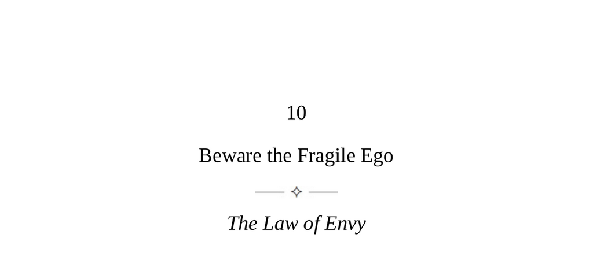

- **Beware the Fragile Ego**
  - **The Law of Envy**
    - Humans have a natural tendency to compare themselves, leading to feelings of envy.
    - Envy manifests subtly, with early signs including excessive praise and disguised hostility.
    - Envy is most common among friends or peers in the same profession.
    - Developing internal self-worth helps deflect envy.
    - Further reading: [Envy - Stanford Encyclopedia of Philosophy](https://plato.stanford.edu/entries/envy/)
  - **Keys to Human Nature**
    - Envy is difficult to detect because it is rarely expressed directly.
    - Passive envy involves minor hurtful comments without damaging relationships.
    - Active envy leads to hostility and covert attacks.
    - Mastering the detection of envy involves recognizing signs, prone personalities, and triggers.
  - **Signs of Envy**
    - Envy leaks through microexpressions mainly involving the eyes and facial gestures.
    - Poisonous praise contains backhanded compliments that damage confidence.
    - Gossip and backbiting often serve as outlets for envy.
    - The push and pull dynamic uses friendship proximity to inflict psychological pain.
    - Detect patterns and repetitions of these signs to identify active envy.
- **Envier Types**
  - **The Leveler**
    - Levelers dismiss excellence and seek to bring others down to mediocrity.
    - They feel guilty about others' success and emphasize low culture.
    - Common in workplaces, they undermine ambition and joy.
  - **The Self-entitled Slacker**
    - They feel undeserved entitlement to rewards without hard work.
    - Insecure about their capabilities, they sabotage high achievers out of envy.
    - Maintain caution around those who rely on charm over competence.
  - **The Status Fiend**
    - Status is the core of their self-worth, leading to envy based on material comparisons.
    - They conceal envy through admiration or idealism but attack peers subtly.
    - They react strongly to perceived inequalities in wealth or privilege.
  - **The Attacher**
    - Attach themselves to successful people to gain attention without merit.
    - Exhibit excessive flattery but harbor underlying hostile envy.
    - They gather and leak damaging information about their targets.
  - **The Insecure Master**
    - Insecurity increases with high positions, leading to envy of more talented subordinates.
    - May demote or fire competent employees to manage their self-doubts.
    - Require careful deference and credit-sharing from those who work under them.
- **Envy Triggers**
  - Rapid changes in status within peer groups often trigger envy.
  - Older individuals with declining careers have fragile egos prone to envy.
  - Natural talents can provoke envy and should be concealed or downplayed strategically.
  - Successful women face unique envy expressed through gendered criticisms.
  - Social media amplifies passive envy by presenting idealized images that foster dissatisfaction.
- **Beyond Envy**
  - Moving closer to those envied reveals hidden challenges and reduces envy.
  - Downward social comparisons build empathy and gratitude.
  - Practicing Mitfreude, or joying with others’ success, counters schadenfreude.
  - Transmuting envy into emulation fosters productive ambition and purpose.
  - Admiring genuine human greatness elevates perspective and calms envy impulses.
  - Further reading: [The Psychology of Envy](https://www.psychologytoday.com/us/basics/envy)
