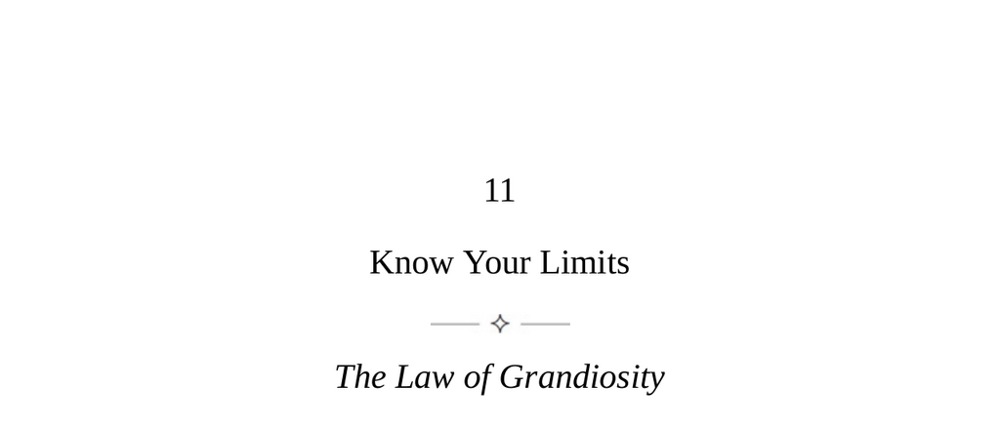

- **Know Your Limits**
  - **The Law of Grandiosity**
    - Humans have a deep need to think highly of themselves, which can distort into grandiosity if disconnected from reality.  
    - Success can intensify grandiosity by confirming inflated self-opinions while ignoring luck or others' contributions.  
    - Grandiosity leads to irrational decisions and short-lived success.  
    - Signs include overbearing certainty, excessive sensitivity to criticism, and disdain for authority.  
    - Maintaining realistic self-assessment and linking greatness to tangible work and contributions counters grandiosity.  
  - **Keys to Human Nature**
    - Human tasks require a realistic sense of proportion and patience, as goals are difficult and people resistant.  
    - Grandiosity distorts perception, minimizing task difficulty and overestimating personal entitlement.  
    - It reflects a godlike self-view surpassing mere narcissism.  
    - Grandiosity roots in early childhood development, especially in the failure to recognize dependency and limits.  
    - Factors increasing grandiosity today include childhood pampering, disrespect for authority, technology encouragement of quick skills, and social media amplification.  
    - Grandiosity manifests in many forms: social prestige seeking, leader worship, grandiose humility, and victimhood.  
    - Signs to measure grandiosity include reactions to criticism, self-promotion, low empathy, poor listening, and dramatic behavior.  
    - Realistic self-awareness about strengths, energy limits, and age-related changes helps manage personal grandiosity.  
  - **The Grandiose Leader**
    - Highly grandiose people with talent and energy may achieve great power, but often make irrational decisions.  
    - Six theatrical illusions are common in grandiose leaders:  
      - Claiming destiny for greatness often based on mythologized early life stories.  
      - Presenting as common people to gain mass identification despite privilege.  
      - Promising to deliver from crisis using simple, emotional slogans to build cult-like followings.  
      - Rewriting rules by rejecting conventions and scientific feedback, which masks madness.  
      - Claiming a "golden touch," ignoring past failures and overestimating skill transferability, often leading to failure.  
      - Displaying false vulnerability that masks bold, risky behavior leading to eventual downfall.  
    - Recognizing and publicizing these illusions helps maintain critical perspective.  
  - **Practical Grandiosity**
    - Grandiosity is primal energy that typically inflates self-perception but can be channeled productively when reality-based.  
    - Five principles to cultivate practical grandiosity:  
      - Admit and accept the natural desire for importance and attention.  
      - Concentrate energy by focusing deeply on a single, manageable project with incremental goals.  
      - Maintain ongoing feedback loops and brutally analyze failures for skill improvement.  
      - Pursue calibrated challenges slightly beyond current skill levels to maintain engagement.  
      - Occasionally allow freer creativity and risk-taking to test and expand capabilities.  
    - Managing grandiosity includes recognizing luck and assistance in success and not resting on past achievements.  
    - Practical grandiosity leads to fulfillment rooted in achievements rather than fantasy.  
- **Further Reading**
  - [Grandiosity and Narcissism](https://www.psychologytoday.com/us/basics/narcissism)  
  - [Flow: The Psychology of Optimal Experience](https://en.wikipedia.org/wiki/Flow_(psychology))  
  - [The Dangers of Charismatic Leadership](https://www.britannica.com/topic/charisma-sociology)  
  - [Xenophon's The Education of Cyrus](https://www.gutenberg.org/ebooks/1176)
