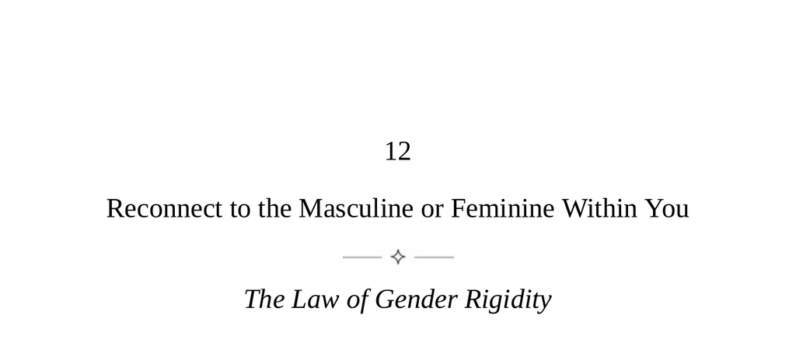

- **Reconnect to the Masculine or Feminine Within You**
  - **The Law of Gender Rigidity**
    - All people have both masculine and feminine qualities influenced by genetics and opposite-sex parents.  
    - Society enforces consistent gender identity, leading to repression of innate traits and rigidity in behavior.  
    - This repression harms relationships and narrows thinking by projecting fantasies onto the opposite sex.  
    - Reconnecting to suppressed masculine or feminine traits unleashes creativity and authentic self-expression.  
    - For further reading, see [Gender and Identity Psychology](https://www.apa.org/topics/gender-identity).
  - **Keys to Human Nature**
    - Falling in love triggers irrational behavior driven by the anima (men) or animus (women) in the unconscious.  
    - Romantic attraction often projects qualities from parental figures onto partners, resulting in disappointment.  
    - Understanding and withdrawing projections allows seeing partners as they truly are and improves relationships.  
    - Developing repressed masculine or feminine qualities within oneself leads to authenticity and healthier interactions.  
    - Refer to Carl Jung’s work on anima and animus for deeper insights.
  - **Gender Projection—Types**
    - Six common gender projection types describe recurring relationship patterns based on parental influence and repressed traits.  
    - The Devilish Romantic: Women project flirtatious attention from their father onto unsuccessful, romantic men.  
    - The Elusive Woman of Perfection: Men idealize uncertain or absent maternal care through vague fantasies.  
    - The Lovable Rebel: Women displace repressed rebellion onto immature, nonconforming men.  
    - The Fallen Woman: Men seek to rescue imperfect women mirroring repressed sensuality and childhood rigidity.  
    - The Superior Man: Women project low self-esteem onto confident men, leading to manipulation and disappointment.  
    - The Woman to Worship Him: Men replicate mother-son dynamics by seeking adoration and comfort from partners.  
    - Awareness of these patterns assists self-understanding and healthier relationship choices.  
    - For more, consult [Psychology Today: Projections in Relationships](https://www.psychologytoday.com/us/basics/projection).
  - **The Original Man/Woman**
    - Midlife crises often signal an identity struggle caused by rigid gender role adherence developed in youth.  
    - Childhood fluidity in gender traits is suppressed to fit social expectations, leading to imbalance in adulthood.  
    - Returning to one’s original nature involves reintegrating repressed masculine or feminine traits for personal power and authenticity.  
    - Masculine and feminine styles differ in thinking (analysis vs. holistic), action (direct vs. contemplative), learning (external vs. internal blame), and leadership (goal-focused vs. relationship-focused).  
    - Balancing these styles enhances cognitive flexibility, emotional regulation, and social effectiveness.  
    - Susan Sontag noted the beauty in the presence of opposite-gender qualities within individuals.  
    - See [Midlife Identity Development](https://www.ncbi.nlm.nih.gov/pmc/articles/PMC2796870/) for more on midlife psychological transitions.
