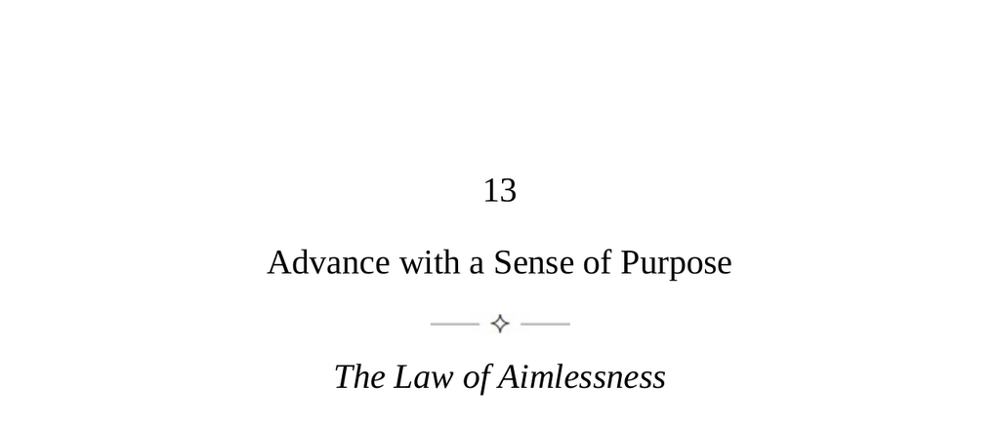

- **Advance with a Sense of Purpose**
  - **The Law of Aimlessness**
    - Humans lack instinctual guidance and must rely on conscious decisions to find purpose.  
    - Aimlessness leads to dead ends; a strong sense of purpose directs decisions and toughens individuals.  
    - Purpose turns doubt and failure into tools for growth and unstoppable action.  
    - Nietzsche emphasizes the power of having a "why" to live through any "how."  
    - For further insight, see [Man’s Search for Meaning by Viktor Frankl](https://en.wikipedia.org/wiki/Man%27s_Search_for_Meaning).
  - **Keys to Human Nature**
    - Past generations had more stable career choices and mentors; modern change creates either exploration or conservative choices.  
    - Aimlessness produces boredom, insecurity, anxiety, and depression due to lack of fulfillment and direction.  
    - Uniqueness in DNA, brain wiring, and experiences forms the basis of individual purpose.  
    - Connecting deeply to personal uniqueness counters negative emotions and fosters self-awareness, skill development, and emotional regulation.  
    - To learn more about human nature and career development, see [Drive by Daniel Pink](https://en.wikipedia.org/wiki/Drive_(Pink_book)).
  - **Strategies for Developing a High Sense of Purpose**
    - Discover primal inclinations from early life to identify natural attractions and the brain’s form of intelligence.  
    - Embrace resistance and negative feedback as necessary for skill growth and to reinforce purpose.  
    - Surround oneself with individuals who possess a high sense of purpose to absorb positive energy.  
    - Create a ladder of small, practical goals to manage anxiety and maintain motivation.  
    - Achieve flow by losing oneself in work through sustained focused effort and minimizing ego distractions.  
    - For practical methods on purpose and motivation, read [Flow by Mihaly Csikszentmihalyi](https://en.wikipedia.org/wiki/Flow_(psychology)).
  - **The Lure of False Purposes**
    - False purposes provide superficial meaning through external motivations like pleasure, cults, money, attention, and cynicism.  
    - Pursuit of pleasure leads to diminishing returns and distracts from depth of experience.  
    - Causes and cults often fill emotional voids but lack clear, personally embraced mission.  
    - Money and success may offer short-term motivation but fail for long-term originality and fulfillment.  
    - Attention-seeking ties self-esteem to external approval and social media dynamics.  
    - Cynicism originates from despair and rejection of purpose, but true purpose embraces the sublime in life.  
    - Nietzsche and Dostoyevsky highlight the human need for awe and immense meaning.  
    - To understand false vs. real purposes further, see [The Road to Character by David Brooks](https://en.wikipedia.org/wiki/The_Road_to_Character).
