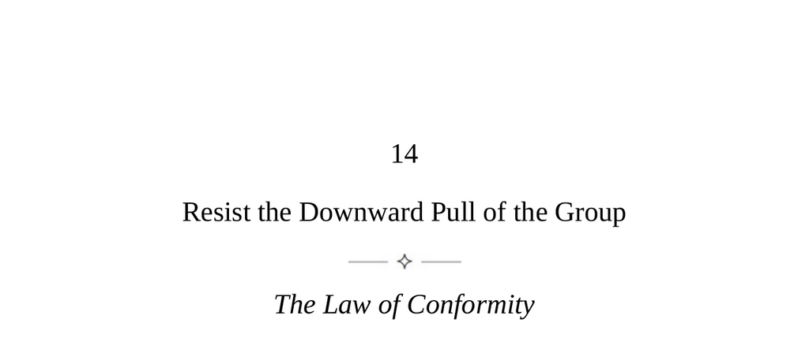

- **The Law of Conformity**
  - The social personality emerges in group settings, causing unconscious imitation of others' behavior.  
  - Group membership affects thoughts, emotions, risk-taking, and rationality, often diminishing individuality.  
  - Developing self-awareness allows maintaining independence while cooperating with the group.  
  - Eric Hoffer's quote highlights the human tendency to imitate when free to act.  
  - Further reading: [The True Believer](https://en.wikipedia.org/wiki/The_True_Believer)

- **Keys to Human Nature**
  - Social force is an intense, often unconscious energy of belonging to a group with shared emotions and sensations.  
  - Larger groups intensify the social force and the communal feeling of connection.  
  - The social force exerts a downward pull when it degrades independent thinking but can also support cooperation and empathy.  
  - Group intelligence is essential to understand and control group effects on individuals.  
  - Further reading: [Social Identity Theory](https://en.wikipedia.org/wiki/Social_identity_theory)

- **The Individual Effect**
  - Desire to fit in manifests through aligning appearances and adopting group ideas and values over time.  
  - Individuals perform within groups, exaggerating conformity to gain acceptance and minimize flaws.  
  - Emotional contagion causes group members to absorb others’ emotions unconsciously.  
  - Hypercertainty pressures group members into premature decisions and risk-taking, threatening rationality.  
  - Awareness of these effects enables better control and resistance to conformity pressures.  
  - Further reading: [Groupthink](https://en.wikipedia.org/wiki/Groupthink)

- **Group Dynamics**
  - Groups develop identifiable cultures often reflecting founders' personalities and ideals.  
  - Unwritten group rules and codes govern conduct, dictating standards of success and failure.  
  - The group court is a dynamic where courtiers vie for leaders’ favor through flattery and strategic behavior.  
  - Groups identify enemies to unify members, but detachment and learning from enemies is advised.  
  - Factions tend to form and may destabilize leadership unless a unified positive culture is maintained.  
  - Observing both self and group dynamics helps maintain reality and effective decision-making.  
  - Further reading: [Social Dynamics](https://en.wikipedia.org/wiki/Social_dynamics)

- **The Court and Its Courtiers**
  - Courtiers fall into seven main types: Intriguer, Stirrer, Gatekeeper, Shadow Enabler, Court Jester, Mirrorer, Favorite and Punching Bag.  
  - Intriguers mask disloyalty with charm and seek power by using others as tools.  
  - Stirrers spread doubt and anxiety to gain attention without showing insecurity.  
  - Gatekeepers monopolize leader access through sycophancy and control information flow.  
  - Shadow Enablers enable leaders’ dark impulses by facilitating repressed desires.  
  - Court Jesters use humor to avoid responsibility but find limited influence.  
  - Mirrorers succeed by reflecting others’ moods and ideas subtly without overt flattery.  
  - Favorites gain power through personal relationships, while Punching Bags are scapegoats often ridiculed.  
  - Navigating court dynamics requires careful observation and strategic behavior.  
  - Further reading: [Power Dynamics in Organizations](https://en.wikipedia.org/wiki/Organizational_behavior)

- **The Reality Group**
  - A reality group focuses on achieving goals, solving problems, and adapting to competitive environments.  
  - It emphasizes productivity and minimizes political games to accomplish more collectively.  
  - Five strategies define reality groups: instilling purpose, assembling competent lieutenants, open communication, productive emotions, and battle-testing resilience.  
  - Collective purpose must be clearly stated, publicized, and consistently practiced, with results tracking.  
  - Leaders must delegate to skilled, diverse lieutenants chosen for competence and character, not charm.  
  - Open communication involves sharing information freely and welcoming criticism while avoiding leader bias.  
  - Infecting groups with confidence and openness reduces defensiveness and promotes independent thinking.  
  - Evaluating members’ responses to stress identifies those with strong inner toughness essential for crises.  
  - Further reading: [Team Dynamics and Leadership](https://en.wikipedia.org/wiki/Team_dynamics)
