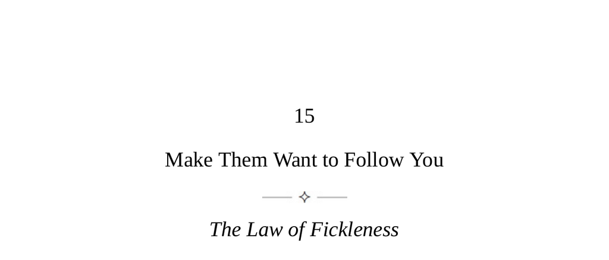

- **The Law of Fickleness**  
  - People are ambivalent toward authority figures, desiring both leadership and freedom.  
  - Loyalty to leaders is easily lost when they show weakness or setbacks.  
  - Successful leaders create an appearance of power, legitimacy, and fairness.  
  - Authority is best maintained by serving others and embodying strength from early on.  
  - For more on leadership dynamics, see [Xenophon's Leadership Insights](https://en.wikipedia.org/wiki/Xenophon).

- **Keys to Human Nature**  
  - Human emotions toward leaders are ambivalent, mixing love and hostility simultaneously.  
  - People intuitively recognize the need for leaders but also fear those in power.  
  - Leaders often mistake outward deference for genuine loyalty and may be surprised by sudden loss of respect.  
  - Authority in ancient Rome derived from embodying wisdom and ideals beyond immediate successes.  
  - Maintaining authority requires vision focused on the greater good and visceral empathy with followers.  
  - Loss of respect follows when leaders fail to establish connection and vision.  
  - Authority must be understood as a dynamic relationship, not a static role.  
  - Analyze leaders in personal and public life to understand sources of authority or its absence.

- **Strategies for Establishing Authority**  
  - *Find your authority style: Authenticity*  
    - Authority must arise naturally from one's character and strengths.  
    - Archetypes include Deliverer, Founder, Visionary Artist, Truth Seeker, Quiet Pragmatist, Healer, and Teacher.  
    - Identifying with an archetype helps convey authority as intrinsic and almost transcendent.  
  - *Focus outwardly: the Attitude*  
    - Develop strong listening skills to detect underlying tensions beyond surface approval.  
    - Earn respect by demonstrating respect and commitment to the group's greater good.  
    - See leadership as a responsibility entangled with the group’s fate.  
  - *Cultivate the third eye: the Vision*  
    - Effective leaders rise above immediate emotions and focus on the bigger picture.  
    - They anticipate future trends and dangers through open-minded analysis.  
    - Developing visionary skills enables accurate foresight and strengthens authority.  
  - *Lead from the front: the Tone*  
    - Leaders must work as hard or harder than followers to set the proper example.  
    - Initial impressions of toughness and high standards establish lasting credibility.  
    - Early tone setting prevents future manipulation by followers.  
  - *Stir conflicting emotions: the Aura*  
    - Leaders cultivate mystery by presenting slightly contradictory traits.  
    - Balancing presence and absence increases fascination and idealization.  
    - Too much familiarity or aloofness diminishes authority.  
  - *Never appear to take, always to give: the Taboo*  
    - Taking away resources or privileges harms authority and creates insecurity.  
    - Leaders must make any sacrifices themselves and keep losses temporary.  
    - Overpromising without delivery erodes trust and authority quickly.  
  - *Rejuvenate your authority: Adaptability*  
    - Authority grows with trust but can become rigid and outdated with time.  
    - Maintaining sensitivity to changing moods and new generations preserves relevance.  
    - Adapt style carefully to appeal to new audiences without losing authenticity.

- **The Inner Authority**  
  - The self contains a higher and lower half, with the lower generally stronger by default.  
  - Cultivating inner authority involves developing conscience and adherence to a personal code.  
  - Responsibility to contribute and serve a higher purpose is central to inner authority.  
  - Focus on unique personal strengths and avoid distractions from low influences.  
  - Excellence requires discipline, attention to detail, urgency, and self-reliance without external motivation.  
  - Excellence means continual service to transcendent standards beyond oneself.  
  - For deeper understanding, consult [José Ortega y Gasset on Excellence](https://plato.stanford.edu/entries/ortega-y-gasset/).
