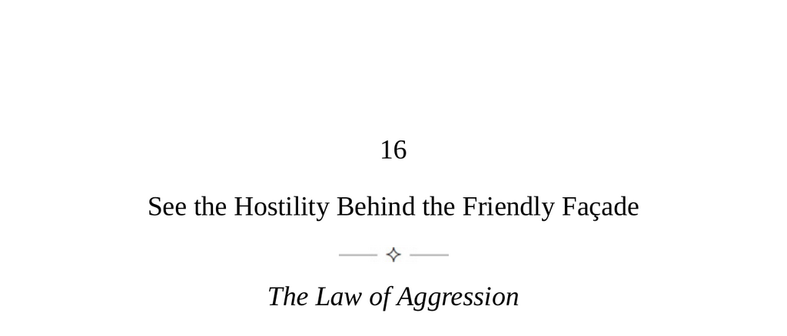

- **See the Hostility Behind the Friendly Façade**
  - **The Law of Aggression**
    - People appear polite but often experience frustration and manipulate to gain power.  
    - Some individuals display greater aggression, intimidating others relentlessly to control situations.  
    - Recognizing chronic and passive aggressors involves observing behavioral patterns and need for control.  
    - Aggressors aim to provoke emotional reactions to weaken rational thinking; emotional immunity is essential.  
    - Channeling personal aggression productively involves standing up for oneself and pursuing ambitions.  
  - **Keys to Human Nature**
    - Aggression exists on a continuum present in all humans, not just the violent or criminal.  
    - Aggression is intertwined with intelligence, used both for problem-solving and antisocial acts.  
    - Denying one’s own aggressive tendencies fosters misunderstanding of personal and others' behavior.  
    - Awareness enables managing aggression and reducing antisocial manifestations.  
    - Further reading: [Human Aggression - Harvard.edu](https://sitn.hms.harvard.edu/flash/2019/human-aggression/)  
  - **The Source of Human Aggression**
    - Human aggression stems from deep insecurity and existential awareness of mortality and unpredictability.  
    - Chronic aggressors experience persistent helplessness and compensatory need for excessive power and control.  
    - Aggressors perceive others as objects and use charm manipulatively while masking emotional detachment.  
    - Understanding this source aids in recognizing and disarming aggressive behaviors in others.  
  - **Your Task as a Student of Human Nature**
    - Accept personal aggressive tendencies existing on a spectrum with three outlets: controlled, aggressive, or inward.  
    - Analyze response patterns to frustration and lack of control to assess personal aggression management.  
    - Become a master observer of others’ aggression through actions, history, and nonverbal cues over words.  
    - Develop mental and emotional detachment skills when engaging with chronic aggressors.  
    - Abandon myths denying persistent human aggression in past and present, supported by archaeological evidence.  
  - **Passive Aggression—Its Strategies and How to Counter Them**
    - Everyday passive aggression is common and generally benign as indirect assertion of control.  
    - Chronic passive aggression employs identifiable strategies: Subtle-Superiority, Sympathy, Dependency, Insinuating-Doubt, Blame-Shifter, and Passive-Tyrant.  
    - Each strategy manipulates others through excuses, victimhood, attention-seeking, doubt induction, blame deflection, or tyrannical demands.  
    - Effective counters involve calm reflection, mirroring behavior, maintaining distance, and selectively disengaging.  
    - Recognizing power dynamics is crucial when passive aggressors hold authority.  
  - **Controlled Aggression**
    - Human aggression must be harnessed in mature, productive, and socially positive ways.  
    - Four elements for discipline are ambition, persistence, fearlessness, and targeted anger.  
    - Ambition involves revisiting and specifying childhood dreams to guide controlled energy.  
    - Persistence is sustained focus on goals despite obstacles and self-doubt.  
    - Fearlessness grows from gradual reassertion of deservedness and assertiveness in everyday interactions.  
    - Anger must be realistic, directed, analyzed for cause, and channeled strategically against specific problems.  
    - Further reading: [The Psychology of Aggression - Verywell Mind](https://www.verywellmind.com/what-is-aggression-2794864)
