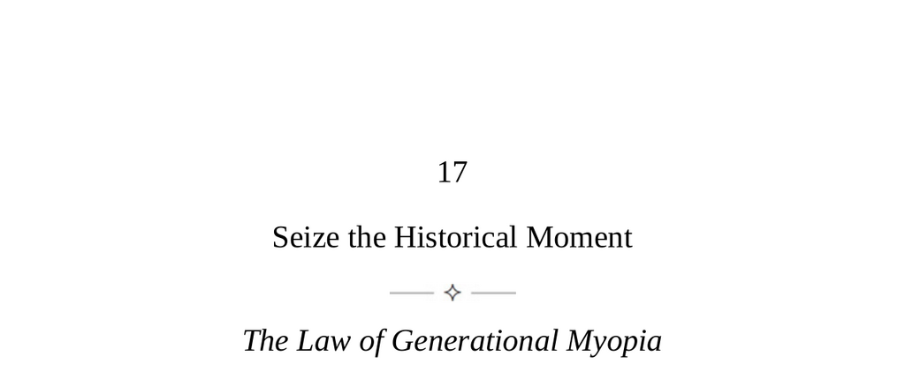

- **Seize the Historical Moment**
  - **The Law of Generational Myopia**
    - Individuals are profoundly shaped by the generation they are born into, which influences their values, tastes, and worldview.  
    - Generational values tend to constrain individuals from other points of view, creating mental limitations.  
    - Deep understanding of one's generation and its spirit enables anticipating trends and becoming freer.  
    - Quote by G.W.F. Hegel emphasizes the transformative nature of the era and the heralds of change.  
    - For further reading, see [The Fourth Turning](https://en.wikipedia.org/wiki/The_Fourth_Turning).  
  - **Keys to Human Nature**
    - Generations embody collective personalities that significantly influence societal changes and history.  
    - Studying generational influence aids in understanding past and current societal shifts and anticipating the future.  
    - Generational awareness requires understanding the generation's effect on perception and historical patterns.  
    - Benefits include social power and emotional equanimity regarding chaotic world events.  
    - For further reading, see [Generations and Collective Behavior](https://www.tandfonline.com/doi/abs/10.1080/00207599108404954).  
  - **The Generational Phenomenon**
    - Early life forms a generational perspective through collective cultural absorption without full awareness.  
    - In young adulthood, individuals seek power and clash with older generations; in midlife, they observe younger ones pushing change.  
    - Most significant social changes stem from the energies of the youthful generation searching for identity.  
    - Generational mindsets dominate from within, making it impossible to step outside the historical context of birth.  
    - The spirit of a generation manifests as an emotional tone and interaction style, contributing to the zeitgeist.  
  - **Generational Patterns**
    - Historical patterns often unfold in four generational phases: revolutionaries, order seekers, builders, and cynics leading to crisis.  
    - Generational values usually react oppositely to preceding generations, perpetuating evolutionary cycles.  
    - The human spirit drives continual generational evolution, preventing historical stagnation.  
    - Awareness of these patterns helps situate one’s generation in a larger historical context.  
    - For further reading, see [Ibn Khaldun's Muqaddimah](https://en.wikipedia.org/wiki/Muqaddimah).  
  - **Tasks for the Student of Human Nature**
    - Understand deeply how one’s generation shapes perception of the world and self.  
    - Profile one’s generation by identifying decisive historical events, parenting styles, and unconscious traits like humor.  
    - Expand awareness to the zeitgeist by analyzing power tensions between dominant generational cohorts.  
    - Overcoming generational myopia involves appreciating perspectives across generations for increased mental flexibility.  
  - **Strategies for Exploiting the Spirit of the Times**
    - Push forcefully against inherited past values to create new expressions aligned with generational needs.  
    - Adapt historical moments and symbols to the present spirit as more advanced iterations.  
    - Resurrect the spirit of childhood experiences to connect broadly, focusing on present relevance rather than nostalgia.  
    - Create new social configurations that resonate with generational desires and induce bonding through rituals and symbols.  
    - Subvert the zeitgeist by working within it while inserting alternative values and points of view subtly.  
    - Continuously modernize one’s generational spirit by integrating values from younger generations.  
  - **The Human Beyond Time and Death**
    - Time is a human construct experienced subjectively, with varying perceptions by age and mood.  
    - The phases of life bring common behavioral changes, but individuals can mitigate associated negatives or retain positives.  
    - Genuine intergenerational engagement fosters a broader and transformed connection with the zeitgeist.  
    - The past must be reanimated empathetically by imaginatively engaging with historical contexts without judgment.  
    - Influence on the future is exercised through mentoring and cultural contributions meant to endure beyond one’s lifespan.  
    - For further reading, see [The Experience of Time](https://plato.stanford.edu/entries/time-experience/).
