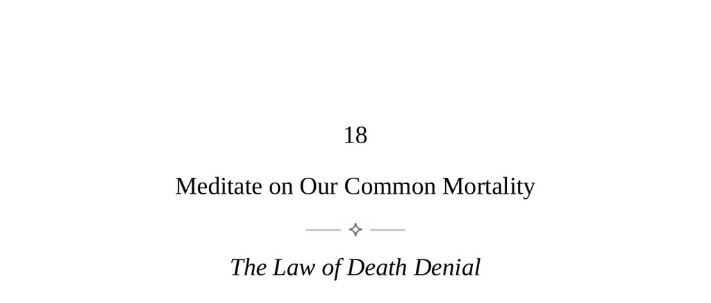

- **Meditate on Our Common Mortality**
  - **The Law of Death Denial**
    - Most people avoid thinking about death, though embracing its inevitability aids in purpose and emotional resilience.  
    - Recognizing mortality connects all people equally and intensifies life experience.  
    - Dostoyevsky's quote illustrates regret for wasted life and commitment to rebirth and hope.  
    - For further insight, see [The Denial of Death by Ernest Becker](https://en.wikipedia.org/wiki/The_Denial_of_Death).
  - **Keys to Human Nature**
    - Humans uniquely recognize their mortality, causing fear, anxiety, and avoidance behaviors.  
    - Repression of death awareness intensifies anxiety and leads to narrow, repetitive thinking and detachment from others.  
    - Life is characterized by movement and connection, contrasting with death’s stillness and isolation.  
    - Facing death awareness paradoxically fosters greater aliveness and vitality.  
    - Explore related themes in [Mortality Salience Theory](https://en.wikipedia.org/wiki/Terror_management_theory).
  - **A Philosophy of Life Through Death**
    - This philosophy encourages deliberately facing death to transform consciousness and enhance living.  
    - Five key strategies are proposed, involving mental exercises to integrate mortality awareness into daily life.  
    - These approaches aim to reduce anxiety, foster empathy, embrace life’s unpredictability, and inspire awe.
    - **Make the awareness visceral**
      - Physical sensations of death awareness focus the mind and deepen emotional responses to life.  
      - Imagining one’s death and viewing the world as if for the last time cultivates acceptance.  
      - Sadness arising from this practice should be welcomed for its enriching effect.  
      - Similar effects can be found in mindfulness practices such as [Memento Mori meditations](https://en.wikipedia.org/wiki/Memento_mori).
    - **Awaken to the shortness of life**
      - Awareness of death creates a continuous deadline enhancing focus and urgency in daily actions.  
      - Human tendency to imagine unlimited time distorts priorities and delays commitments.  
      - Realizing life’s brevity compels full commitment to personal goals and relationships.  
      - Related resource: [Time Perspective and Mortality Awareness](https://link.springer.com/article/10.1007/s12144-018-9927-3).
    - **See the mortality in everyone**
      - Historical example: the 1665 London plague increased empathy by revealing common vulnerability.  
      - Recognizing others’ mortality reduces tribalism and fosters tolerance and grace.  
      - Exercises include meditating on the deaths of people around us and in crowds to cultivate compassion.  
      - For context, see [Empathy and mortality awareness](https://www.sciencedirect.com/science/article/abs/pii/S0092656612000615).
    - **Embrace all pain and diversity**
      - Acceptance of life’s uncontrollable hardships—including death—as necessary and instructive.  
      - Viewing crises and failures as fateful lessons lightens emotional burdens.  
      - This attitude strengthens resilience and affirms the fullness of life.  
      - Compare with Stoic approaches in [Meditations by Marcus Aurelius](https://en.wikisource.org/wiki/Meditations_(Longer_Version)).
    - **Open the mind to the Sublime**
      - Death represents the ultimate unknowable mystery, evoking awe that transcends fear.  
      - Encountering the Sublime reminds humans of their smallness and counters complacency.  
      - Experiences in nature or varied cultures help induce the Sublime and shift perception.  
      - This practice shakes habitual thinking and invigorates life perspective.  
      - Further reading: [The Sublime in Philosophy](https://plato.stanford.edu/entries/sublime/).
  - **Conclusion**
    - Awareness of death has historically driven much human behavior through fear and evasion.  
    - Embracing mortality brings freedom from predictable constraints and opens new possibilities.  
    - Montaigne’s quote emphasizes that premeditation of death frees individuals from all servitude.  
    - For broader understanding, see [Michel de Montaigne’s Essays on Death](https://plato.stanford.edu/entries/montaigne/).
