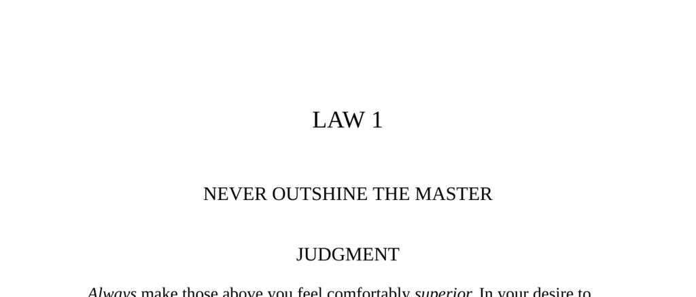

- **Law 1: Never Outshine the Master**
  - **Judgment**
    - Always make superiors feel comfortably superior to avoid inspiring fear or insecurity.  
    - Displaying talents too openly can provoke resentment and lead to downfall.  
    - Success depends on making the master appear more brilliant than they are.  
    - See also [The 48 Laws of Power](https://en.wikipedia.org/wiki/The_48_Laws_of_Power).  
  - **Transgression of the Law**
    - Nicolas Fouquet, finance minister to Louis XIV, threw an extravagant party to impress the king.  
    - The party inadvertently outshone the king, offending his vanity and leading to Fouquet’s arrest and imprisonment.  
    - Louis XIV replaced Fouquet with Jean-Baptiste Colbert, who was frugal and loyal.  
    - The lavishness of Fouquet’s party triggered the king’s insecurity and political move against him.  
  - **Interpretation**
    - Louis XIV felt threatened by Fouquet’s display of wealth and influence.  
    - Masters react negatively when their preeminence is challenged or their vanity poked.  
    - Outshining the master leads to swift and severe consequences.  
  - **Observance of the Law**
    - Galileo strategically dedicated his discovery of Jupiter’s moons to the Medici family, enhancing their prestige.  
    - By linking the Medici name to cosmic phenomena, Galileo secured patronage and a stable position.  
    - Serving masters by enhancing their glory is more effective than overt displays of talent.  
    - Refer to [Galileo and the Medici](https://www.britannica.com/biography/Galileo-Galilei).  
  - **Interpretation (Observance)**
    - Masters prioritize personal glory over truth or invention.  
    - Intellectual talents must be used to magnify the master’s status, not challenge it.  
    - Galileo’s approach protected him from insecurity and secured his advancement.  
  - **Keys to Power**
    - Displaying talents naturally provokes envy and insecurity, especially among superiors.  
    - Some masters are monstrously insecure, requiring subordinates to downplay their qualities.  
    - Trusted favorites can fall if they presume their position or outshine the master.  
    - Flattery should be subtle; acting naive or deferring to the master enhances their sense of superiority.  
    - The example of Cesare Borgia and Sen no Rikyu illustrate deadly consequences of outshining.  
  - **Authority**
    - All superiority is odious, but subject superiority over the master is fatal.  
    - The analogy with stars teaches that others must never obscure the master’s brilliance.  
    - Refer to Baltasar Gracián’s works on prudence and power.  
  - **Reversal**
    - When a master is weak and falling, it is safe and strategic to outshine and hasten their downfall.  
    - Outshining a strong master is dangerous and demands patience until the master’s power diminishes.  
    - The timing of outshining is critical for survival and advancement.
