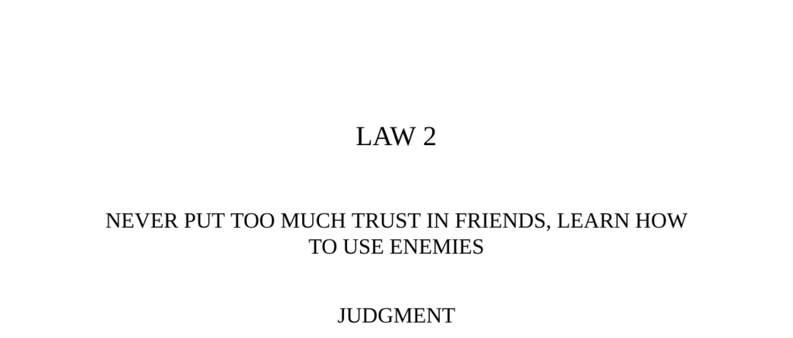

- **Judgment**
  - Friends are more likely to betray due to envy and becoming spoiled or tyrannical.  
  - Former enemies tend to be more loyal because they have more to prove.  
  - It is healthier to have some enemies rather than none at all.  
  - Further reading: [Machiavelli on Friendship and Enmity](https://plato.stanford.edu/entries/machiavelli/)
- **Transgression of the Law**
  - Michael III trusted Basilius, a friend with no political experience, over the competent Bardas.  
  - Basilius exploited his friendship and favor to gain power and ultimately assassinated Michael III.  
  - Favoritism towards friends can lead to overconfidence and eventual betrayal.  
  - Further reading: [Byzantine Empire Political History](https://www.britannica.com/place/Byzantine-Empire)
- **The Snake, The Farmer, and The Heron**
  - The folk tale illustrates the theme of ingratitude among those who receive help.  
  - Even when kindness is repaid, it may be returned with harm or betrayal.  
  - Trust must be carefully managed, as favors can lead to resentment.  
  - Further reading: [African Folktales and Their Morals](https://www.loc.gov/collections/folktales/)
- **Interpretation**
  - Gratitude can blind rulers to betrayal when they rely too heavily on friends.  
  - Power can corrupt friends who begin to see their success as earned, not gifted.  
  - Friends’ betrayal is often unexpected because of emotional attachment.  
  - Further reading: [The Psychology of Betrayal](https://www.psychologytoday.com/us/basics/betrayal)
- **Observance of the Law**
  - Emperor Sung secured loyalty by rewarding and disarming potentially dangerous generals.  
  - Sung transformed enemies into loyal subjects through generosity and strategic pardons.  
  - Using enemies can be more effective than trusting friends prone to envy and betrayal.  
  - Further reading: [History of the Song Dynasty](https://www.ancient.eu/Song_Dynasty/)
- **Profiting by Our Enemies**
  - Enemies provide honest criticism and useful information that friends often conceal.  
  - Working relationships based on self-interest and mutual benefit with enemies are more reliable.  
  - Historical figures like Talleyrand, Kissinger, and Mao used enemies strategically for power.  
  - Further reading: [Diplomacy and Power Politics](https://www.britannica.com/topic/diplomacy)
- **Reversal**
  - Friends can be useful for risky or delicate tasks due to their loyalty and affection.  
  - Using friends as scapegoats is a common strategy but usually ends the friendship.  
  - Maintaining clear boundaries is crucial when mixing friendship and work.  
  - Further reading: [Managing Workplace Relationships](https://hbr.org/2016/01/how-to-manage-friends-at-work)
