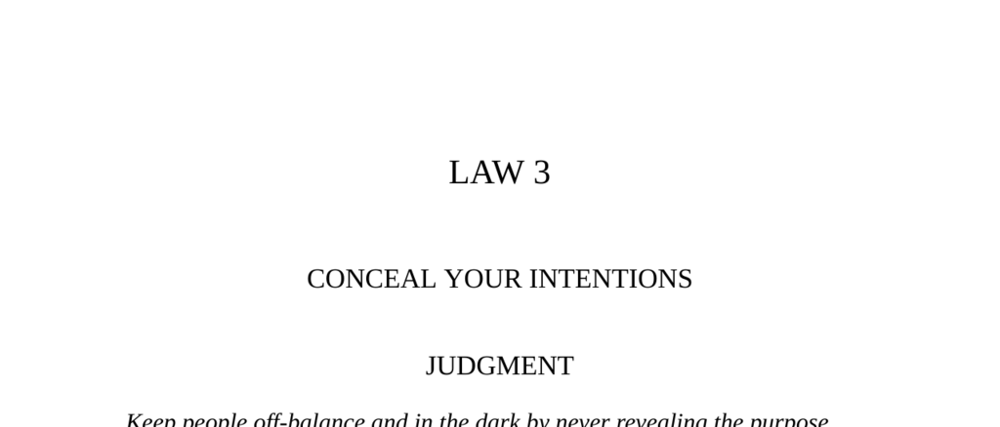

- **Judgment**
  - Keep people off-balance by never revealing the purpose behind your actions.
  - Confusion and misdirection prevent others from preparing a defense.
  - Guide targets far down the wrong path until your true intentions cannot be countered.
  - See [The Art of War](https://en.wikipedia.org/wiki/The_Art_of_War) for related strategic principles.

- **Part I: Use Decoyed Objects of Desire and Red Herrings to Throw People off the Scent**
  - Conceal intentions by throwing red herrings and setting misleading objects of desire.
  - False sincerity and ambiguous signals prevent targets from distinguishing true goals.
  - Example: Ninon de Lenclos’ seduction strategy used confusion, jealousy, and unpredictability.
  - Revealing true intentions prematurely breaks trust and spoils influence.
  - Read more on tactical deception in seduction at [Psychology Today](https://www.psychologytoday.com/us/blog).

- **Transgression of the Law**
  - Marquis de Sevigné ruined his seduction by revealing love too soon, breaking the spell.
  - Premature disclosure ended the emotional intrigue built by skillful misdirection.
  - Emotional confusion is prerequisite for successful seduction.
  - The effectiveness of concealment lies in maintaining a playful, suggestive game.
  - For historical context on courtship strategy, see [The Art of Seduction](https://en.wikipedia.org/wiki/The_Art_of_Seduction).

- **Observance of the Law**
  - Otto von Bismarck opposed war publicly though privately preparing for it.
  - He used false sincerity and misleading speech to gain political power.
  - Concealed true intentions won him favor and time to build military strength.
  - Misdirection was crucial in achieving German unification under Prussia.
  - Study Bismarck’s tactics in [Bismarck and the German Empire](https://www.britannica.com/biography/Otto-von-Bismarck).

- **Keys to Power**
  - Most people reveal intentions due to trust in appearances and desire for honesty.
  - Honesty is a blunt instrument that often alienates rather than convinces.
  - Effective concealment involves talking openly about false desires as decoys.
  - False sincerity amplifies deception but must avoid overpassion to remain credible.
  - Using established social values like honesty as a cover increases trust.
  - See [The 48 Laws of Power](https://en.wikipedia.org/wiki/The_48_Laws_of_Power) for broader tactics.

- **Part II: Use Smoke Screens to Disguise Your Actions**
  - A bland, familiar exterior serves as a smoke screen to hide true intentions.
  - Distraction through ordinary fronts prevents suspicion while deception unfolds.
  - People’s limited attention allows for undetected misdirection behind innocuous facades.
  - Watch examples of effective smoke screens in history and business.

- **Observance of the Law I**
  - Yellow Kid Weil’s boxing match scam distracted Sam Geezil from the main con.
  - The sale of a lodge distracted Geezil enough to miss warning signs.
  - Smoke screen tactics leverage familiar and boring contexts to lower suspicion.
  - The drama of the fake boxer’s death sealed the con’s success.
  - For con artistry and deception techniques, see [The Confidence Game](https://en.wikipedia.org/wiki/The_Confidence_Man).

- **Observance of the Law II**
  - Haile Selassie used charm and deference to lure enemy Balcha into a trap.
  - A banquet created trust while Selassie’s forces disarmed Balcha’s camp unseen.
  - Win trust in one area to create a smoke screen that blinds to action elsewhere.
  - Selassie’s subtle yet effective tactics allowed him to unify Ethiopia without direct conflict.
  - More on Selassie’s political strategy in [Haile Selassie biography](https://www.britannica.com/biography/Haile-Selassie).

- **Keys to Power (Smoke Screens)**
  - Effective smoke screens are bland, inconspicuous, and familiar to the mark.
  - Patterns of behavior create expectations that can mislead opponents strategically.
  - Blending in with a group provides a seamless front ideal for concealment.
  - Facial expressions and noble gestures serve as subtle smoke screens.
  - Historical examples include Roosevelt, Talleyrand, and Jay Gould.
  - Learn more from [The Art of Deception](https://en.wikipedia.org/wiki/Deception).

- **Authority**
  - Conceal designs completely until they are irreversible to ensure victory.
  - Announcing intentions undermines strategic advantage.
  - Example from military history emphasizes silent and unseen progress.
  - Read: [Clausewitz on War](https://en.wikipedia.org/wiki/On_War).

- **Reversal**
  - Maintaining concealment fails if one’s reputation for deception is known.
  - Admitting to being a rogue or an honest deceiver can restore credibility.
  - Publicly acknowledged deception may command respect and preserve influence.
  - Extravagant, colorful diversions work short-term but lose effectiveness over time.
  - Bland, consistent appearances provide durable concealment over a lifetime.
  - See P. T. Barnum’s career for a case study in owning deception: [Barnum's Legacy](https://www.britannica.com/biography/P-T-Barnum).
