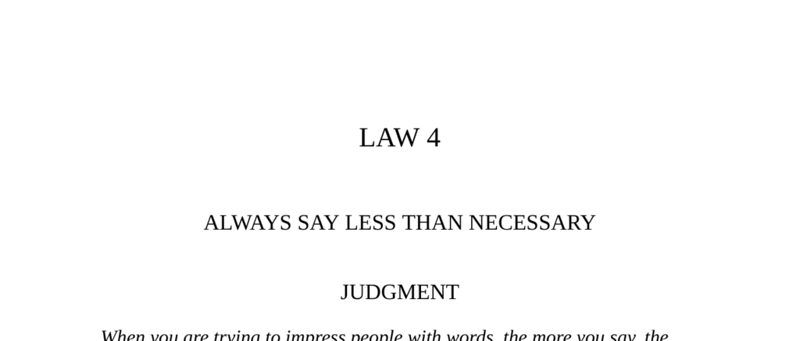

- **Law 4: Always Say Less Than Necessary**
  - **Judgment**
    - Saying more to impress makes one appear common and less in control.
    - Vague and sphinxlike statements seem original even if banal.
    - Powerful people intimidate by speaking less to avoid foolish statements.
    - [The 48 Laws of Power](https://en.wikipedia.org/wiki/The_48_Laws_of_Power)
  - **Transgression of the Law**
    - Coriolanus lost political favor by making arrogant and excessive speeches.
    - His lengthy and insolent words alienated the common people despite his military reputation.
    - Excessive speech exposed his true feelings and undermined his power and respect.
    - Anecdote of Michael Arlen illustrates value of brevity in negotiation.
    - [The Little Brown Book of Anecdotes, Clifton Fadiman, 1985](https://archive.org/details/littlebrownbooko00clif)
  - **Interpretation**
    - Coriolanus’s verbose speech destroyed his legendary image.
    - Speaking too much reveals a lack of self-control and weakens authority.
    - Louis XIV’s example shows the power of silence and cryptic communication.
    - The tongue must be mastered or it will cause grief and lost power.
    - [Louis XIV, Louis Bertrand, 1928]
  - **Observance of the Law**
    - Louis XIV maintained power by speaking only when necessary and staying enigmatic.
    - Ministers argued at length but received only brief responses like “I shall see.”
    - His silence kept courtiers uncertain and fearful, enhancing his authority.
    - Sir Walter Raleigh exemplifies danger of speaking foolishly in power contexts.
    - [Walter Isaacson, 1992]
  - **Keys to Power**
    - Saying less creates an appearance of power and mystery.
    - Silence makes others uncomfortable and provokes them to reveal their intentions.
    - Andy Warhol and Marcel Duchamp exemplify using ambiguity to increase perceived value.
    - Minimizing words reduces risk of foolish or dangerous remarks.
    - Historical account of Czar Nicholas I illustrates dangers of provocative speech.
    - Leonardo da Vinci’s oyster metaphor highlights risks of overexposure.
    - [The 48 Laws of Power](https://en.wikipedia.org/wiki/The_48_Laws_of_Power)
  - **Authority**
    - Authority figures must remain silent to compel subordinates to reveal true intentions.
    - Silence preserves mystery and prevents exploitation by ministers or subordinates.
    - Han-fei-tzu’s philosophy underscores the strategic value of silence in power dynamics.
    - [Han-fei-tzu, 3rd century B.C.]
  - **Reversal**
    - Silence can sometimes provoke suspicion, especially with superiors.
    - Excessive silence may invite unwanted interpretations or insecurity.
    - Speaking excessively can serve as a deceptive strategy by appearing weak and harmless.
    - The court jester’s tactic illustrates how verbosity can disarm suspicion.
    - Practicing silence must be context-sensitive to avoid negative outcomes.
    - [The 48 Laws of Power](https://en.wikipedia.org/wiki/The_48_Laws_of_Power)
