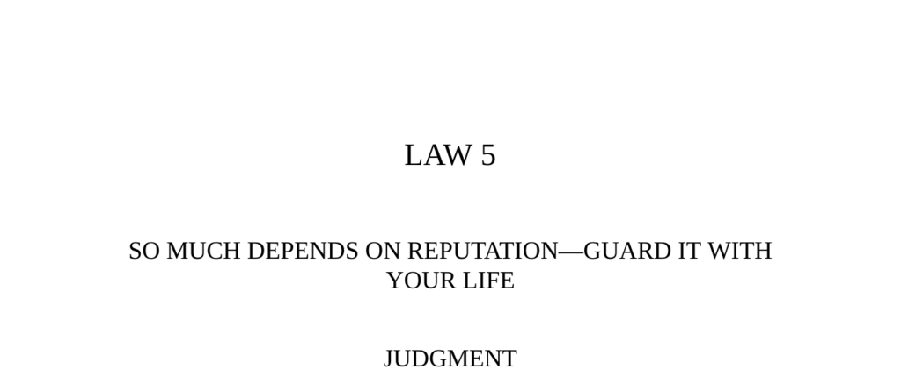

- **Judgment**  
  - Reputation is the cornerstone of power and intimidation.  
  - A strong reputation deters attacks and vulnerabilities.  
  - Destroy enemies by attacking their reputations and allowing public opinion to act.  
  - Example: Chuko Liang’s reputation caused Sima Yi to retreat without combat.  
  - Further reading: [The 48 Laws of Power - Law 5](https://en.wikipedia.org/wiki/The_48_Laws_of_Power)

- **Observance of the Law I**  
  - Chuko Liang used fearsome reputation and psychological tactics to evade a superior enemy force.  
  - Liang’s reputation as a clever strategist was enhanced by deception and psychological warfare.  
  - Reputation alone can influence entire armies and force retreats without battle.  
  - The power of reputation is echoed by Cicero’s reflection on fame and its value.  
  - Further reading: [Three Kingdoms: A Historical Overview](https://www.britannica.com/event/Three-Kingdoms-220-280)

- **The Animals Stricken with the Plague**  
  - La Fontaine’s fable illustrates how reputations influence judgments irrespective of truth.  
  - Leaders are tempted to deflect blame and accuse others to protect themselves.  
  - Reputation dictates social and legal consequences beyond factual guilt.  
  - The fable highlights how public opinion can be manipulated by rhetoric and bias.  
  - Further reading: [La Fontaine’s Fables](https://www.britannica.com/topic/La-Fontaines-Fables)

- **Interpretation**  
  - Chuko Liang cultivated a reputation for cleverness, using deception and espionage successfully.  
  - Sima Yi’s fear of Liang’s reputation led to hesitation and retreat despite military advantage.  
  - Reputation can act as a force multiplier in warfare and politics.  
  - Cicero’s observation confirms human desire for fame, even when denying its value.  
  - Further reading: [The Art of War](https://en.wikipedia.org/wiki/The_Art_of_War)

- **Observance of the Law II**  
  - P. T. Barnum used reputation attacks to regain control of the American Museum.  
  - Barnum’s campaign involved sowing doubt about Peale’s Museum’s stability and ridiculing its performances.  
  - Reputation attacks can weaken rivals economically and socially.  
  - Strong personal reputation allows use of humor and ridicule rather than outright slander.  
  - Further reading: [P.T. Barnum Biography](https://www.britannica.com/biography/P-T-Barnum)

- **Interpretation (Barnum Case)**  
  - Rumors create damaging doubt in opponents’ reputations that are hard to refute completely.  
  - Once established, reputation enables subtler attacks like satire to undermine rivals.  
  - Attackers must avoid petty vengeance to protect their own reputation.  
  - Barnum’s strategy transformed from rumor-spreading to humorous public mockery.  
  - Further reading: [Reputation Management](https://hbr.org/2010/10/defending-your-reputation)

- **Keys to Power**  
  - People judge primarily on appearances and reputation rather than true character.  
  - Establishing a single outstanding quality builds a strong, lasting reputation.  
  - Reputation magnifies strengths, commands respect, and sometimes fear.  
  - Solid reputation allows deceptive or bold actions to succeed more easily.  
  - Partnerships with respected figures can rehabilitate damaged reputations.  
  - Attacks on reputation must be measured to avoid self-damage.  
  - Examples include Mi Tzu-hsia’s changing favor and Edison’s failed campaign against Tesla.  
  - Further reading: [On Reputation Management and Social Perception](https://www.psychologytoday.com/us/blog/cutting-edge-leadership/201201/reputation-and-power)

- **Image**  
  - Reputation is like a treasure of diamonds and rubies that must be guarded carefully.  
  - Constant renewal is necessary as time diminishes reputation’s luster and visibility.  
  - Surrounding yourself with deception risk is equivalent to inviting thieves.  
  - Further reading: [The Role of Image and Perception in Power](https://www.forbes.com/sites/forbescoachescouncil/2021/02/02/the-importance-of-personal-image-in-business/)

- **Authority (Castiglione Quote)**  
  - A good reputation precedes a person and fosters firm belief in their worth.  
  - Reputation enhances one’s inherent abilities with social influence and cunning.  
  - The opinions of many establish a man’s unshakable social standing.  
  - Further reading: [Baldassare Castiglione: The Book of the Courtier](https://www.britannica.com/topic/The-Book-of-the-Courtier)

- **Reversal**  
  - There is no reversal to the importance of reputation; it is universally critical.  
  - Negative reputations such as insolence can be valuable images if managed well.  
  - Neglecting reputation cedes control of public opinion to others.  
  - Mastery of reputation equates to mastery of social fate.  
  - Further reading: [Oscar Wilde and the Use of Reputation](https://www.poetryfoundation.org/poets/oscar-wilde)
