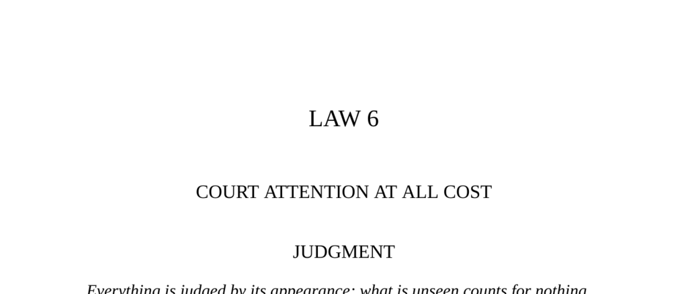

- **LAW 6: COURT ATTENTION AT ALL COST**  
  - **Judgment**  
    - Everything is judged by appearance; the unseen counts for nothing.  
    - Standing out and courting attention, even controversy, is essential for power.  
    - Notoriety of any kind is valuable; being attacked is better than being ignored.  
    - For related concepts, see [The Art of Being Noticed](https://en.wikipedia.org/wiki/Publicity).  

  - **Part I: Surround Your Name with the Sensational and Scandalous**  
    - Create an unforgettable and controversial image to attract attention.  
    - Notoriety, regardless of type, brings power and interest; silence harms influence.  
    - P.T. Barnum exemplified this through publicity stunts and hoaxes that drew crowds.  
    - Historical examples include court artists and figures like Joice Heth and General Tom Thumb.  
    - For more, see [P.T. Barnum Biography](https://www.britannica.com/biography/P-T-Barnum).  

  - **Observance of the Law (Part I)**  
    - Barnum's early lesson: notoriety, even from jokes, ensures success and crowd interest.  
    - Public curiosity can be triggered by mysterious or unusual public acts like bricklaying.  
    - Negative press or controversy often amplified Barnum's fame and success.  
    - Crowds follow curiosity, enabling greater exposure and influence for the subject.  

  - **Interpretation (Part I)**  
    - Attention grants a special legitimacy and is essential for success.  
    - Any curiosity or eccentricity draws crowds, which tend to follow one another.  
    - Maintaining constant innovation in courting attention prevents audience fatigue.  
    - Controversy and scandal amplify fame and power, exemplified by historical figures like Edison and Duc de Lauzun.  

  - **Keys to Power (Part I)**  
    - Establish a distinctive image or style that makes you stand apart.  
    - Do not fear controversy; all types of attention benefit your rise.  
    - Attack or challenge powerful figures strategically to gain notice.  
    - Continually renew your public image to keep attention focused on you.  
    - See Baldassare Castiglione’s advice on spectacle in court society.  

  - **Part II: Create an Air of Mystery**  
    - Mystery draws attention in a banal world by inviting curiosity and anticipation.  
    - Avoid clarity about your plans or identity to maintain fascination and control.  
    - Use ambiguity, inconsistency, and subtle oddities to emanate an aura of mystery.  
    - Examples: Mata Hari’s changing stories and Count Victor Lustig’s enigmatic behavior.  
    - Refer to [Mata Hari Biography](https://www.britannica.com/biography/Mata-Hari).  

  - **Observance of the Law (Part II)**  
    - Mata Hari crafted an exotic, mysterious persona that captivated Parisian society.  
    - Changing her origins and story maintained public interest and excitement.  
    - Mystery excites imagination and sustains attention through endless interpretation.  
    - Count Victor Lustig used mystery to disarm and manipulate environments.  

  - **Interpretation (Part II)**  
    - The modern world’s familiarity creates a craving for the enigmatic and unknowable.  
    - Mystery invites multiple interpretations and prevents consumption of the subject.  
    - Subtle daily behaviors can establish powerful mystery without grand gestures.  
    - Mystery can intimidate and place others in a position of inferiority due to uncertainty.  
    - Hannibal’s feigned supernatural tactics illustrate the power of inexplicable actions.  

  - **Keys to Power (Part II)**  
    - Develop mystery by withholding information, acting inconsistently, and provoking curiosity.  
    - Mystery grants an intimidating presence and controls others’ perceptions.  
    - Unpredictability and puzzling actions create psychological advantage over rivals.  
    - Use mystery to amplify status and inspire both reverence and fear where appropriate.  
    - Read more in [The Psychology of Mystery](https://www.psychologytoday.com/us/blog/mind-my-business/201108/the-psychology-behind-mystery).  

  - **Reversal**  
    - Adapt tactics as you rise; excessive scandal or overexposure can backfire.  
    - An air of mystery must be playful and controlled to avoid suspicion or deceit.  
    - Do not compete with higher authorities for attention; self-restraint confers respect.  
    - Historical examples include Lola Montez’s decline from loss of social tact and Louis XIV’s court manners.  
    - Strategic withdrawal from the spotlight can preserve power and influence over time.
