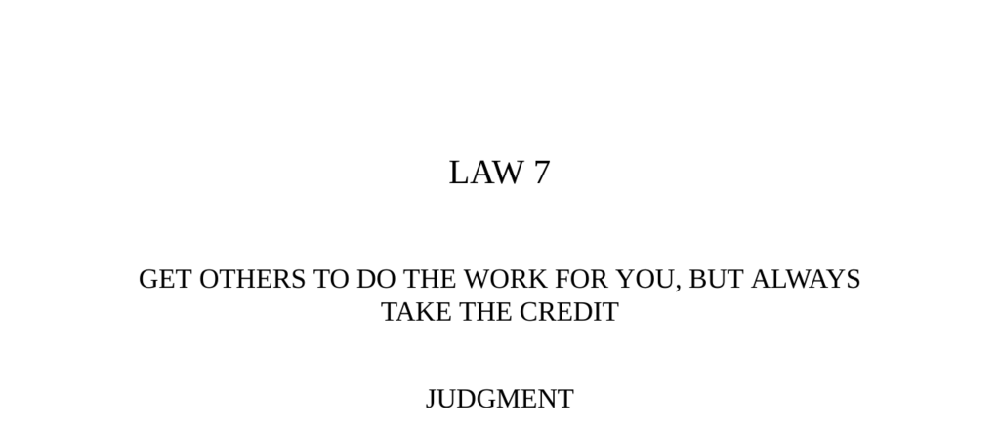

- **LAW 7**
  - **JUDGMENT**
    - Use the wisdom, knowledge, and legwork of others to advance your cause efficiently.
    - Helpers are often forgotten while the credit goes to the one who presents the work.
    - Never do yourself what others can do for you.
    - Further reading: [Robert Greene's 48 Laws of Power](https://en.wikipedia.org/wiki/The_48_Laws_of_Power)
  - **TRANSGRESSION AND OBSERVANCE OF THE LAW**
    - Nikola Tesla’s story exemplifies how failing to take credit for his inventions led to obscurity and poverty.
    - Edison represented the opposite, strategically taking credit and delegating work to others.
    - The Zairean fable illustrates the power of letting others do the work while taking the credit oneself.
  - **THE TORTOISE, THE ELEPHANT, AND THE HIPPOPOTAMUS**
    - The tortoise used the strength of the elephant and hippopotamus to appear as strong as they were.
    - The fable metaphorically supports the law by showing how relying on others’ work is advantageous.
    - Cooperation and strategic delegation are key factors in conserving strength.
  - **TESLA AND EDISON CASE STUDY**
    - Tesla improved Edison’s dynamos and offered innovations but was denied promised payment.
    - Edison sabotaged Tesla’s AC system research, which Tesla then persisted with via Westinghouse.
    - Tesla’s contributions were overshadowed, patents undervalued, and credit often stolen by others.
    - Further reading: [Nikola Tesla Biography](https://www.britannica.com/biography/Nikola-Tesla)
  - **INTERPRETATION**
    - The credit for an invention is as important as the invention itself.
    - Vigilance and ruthlessness are required to prevent others from stealing credit.
    - Conserving energy by using others’ work leads to greater success and longevity.
    - Edison’s business approach involved hiring experts and appropriating credit, contrasting Tesla’s idealism.
  - **HAN-FEI-TZU QUOTE**
    - Effective use of others’ resources (horses, carriage, and driver) allows one to achieve more with less effort.
    - Discarding such advantages results in exhaustion and failure.
    - Further reading: [Han Feizi Philosophy](https://plato.stanford.edu/entries/han-feizi/)
  - **LESSONS FROM FABLES**
    - The Blind Hen fable illustrates how hard work without strategy can be exploited by the vigilant.
    - The Vulture metaphor represents those who benefit from others’ labor without direct effort.
    - Balboa’s fate warns about the danger of revealing valuable information prematurely.
    - Rubens’ studio exemplifies successful delegation and credit management in creative work.
  - **APPLICATION OF THE LAW**
    - Taking credit consolidates power and creates an aura of genius and efficiency.
    - Using the labor or insights of others is preferable to exhausting oneself.
    - Drawing on historical knowledge and past achievements amplifies one’s apparent genius.
    - Politicians and leaders commonly rely on speechwriters and advisors for creditworthy output.
    - Further reading: [Isaac Newton's "Shoulders of Giants"](https://www.nasa.gov/content/goddard/standing-on-the-shoulders-of-giants)
  - **AUTHORITY QUOTE**
    - Knowledge acquired through others’ efforts grants the reputation of wisdom.
    - Baltasar Gracián emphasized leveraging others' labor for personal authority.
  - **REVERSAL**
    - Taking credit prematurely or without a secure power base can backfire and damage credibility.
    - Sharing credit strategically with superiors and subordinates preserves and extends influence.
    - The example of Kissinger and Nixon illustrates successful credit-sharing to maintain political power.
