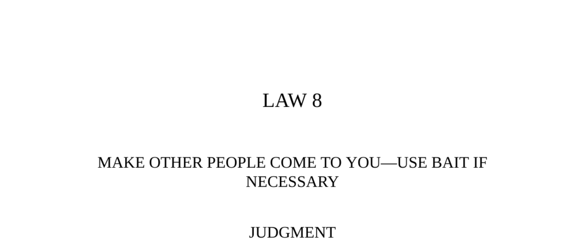

- **Judgment**  
  - This section explains the advantage of forcing opponents to act, giving the initiator control.  
  - It stresses the importance of luring opponents with attractive bait to manipulate the situation.  
  - The essence of power is controlling others' reactions rather than direct aggression.  
  - For further reading, see [The 48 Laws of Power by Robert Greene](https://en.wikipedia.org/wiki/The_48_Laws_of_Power).

- **Observance of the Law**  
  - Describes Napoleon’s exile to Elba and his dramatic escape in 1815.  
  - Details how Talleyrand secretly manipulated European powers to bait Napoleon into returning.  
  - Napoleon’s return was a trap designed to exhaust him and restore stability in Europe.  
  - The strategic baiting relied on knowledge of Napoleon’s character and France’s weakened state.  
  - For further reading, see [Congress of Vienna, 1814–1815](https://www.britannica.com/event/Congress-of-Vienna).

- **Interpretation**  
  - Reveals Talleyrand as the mastermind behind Napoleon’s escape and the European plan.  
  - Highlights the effectiveness of patience, emotional control, and long-term planning in power plays.  
  - Explains that making the opponent come to you wastes their energy and places you in control.  
  - Uses Japan’s baiting of Russia in the Russo-Japanese War as an example of strategic manipulation.  
  - For further reading, see [Russo-Japanese War (1904–1905)](https://www.britannica.com/event/Russo-Japanese-War).

- **Keys to Power**  
  - Aggressive leaders often fail by reacting to opponents rather than controlling the initiative.  
  - Effective power comes from controlling the situation and letting others react to your moves.  
  - Control requires mastering emotions and exploiting others’ impulsiveness.  
  - Details Daniel Drew’s stock market manipulation as an example of indirect control using bait.  
  - Illustrates pickpocket strategy as a metaphor for manipulation by exploiting natural reactions.  
  - For further reading, see [Mastery by Robert Greene](https://en.wikipedia.org/wiki/Mastery_(book)).

- **Authority**  
  - Cites Zhang Yu’s commentary on The Art of War about using opponents’ emptiness against their fullness.  
  - Advocates using the principle of inducing opponents to come forward, maintaining one’s own strength.  
  - Provides a classical strategic foundation aligning with the law of baiting and control.  
  - For further reading, see [Sun Tzu’s The Art of War](https://en.wikipedia.org/wiki/The_Art_of_War).

- **Reversal**  
  - Explains that sometimes attacking quickly and aggressively is necessary to demoralize the enemy.  
  - Fast attacks force opponents to react without planning, causing them to make mistakes.  
  - Advises strategic choice between baiting to exhaust or striking quickly depending on timing and strength.  
  - Uses Cesare Borgia and Napoleon as examples of employing speed to intimidate and control.  
  - For further reading, see [Military Strategy and Tactics](https://www.britannica.com/topic/strategy-military).

- **Image: The Honeyed Bear Trap**  
  - Compares power strategy to baiting bears with honey instead of direct chase.  
  - Emphasizes not exhausting oneself but using patience and traps to capture difficult prey.  
  - Serves as a metaphorical illustration of making others come to you with irresistible bait.  
  - For further reading, see [Game Theory and Strategic Thinking](https://plato.stanford.edu/entries/game-theory/).
