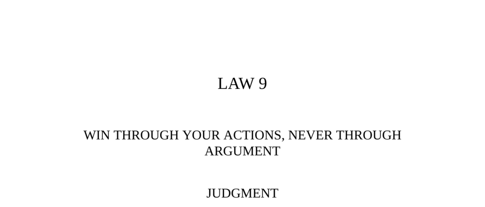

- **Judgment**
  - Momentary victories through argument cause lasting resentment and ill will.  
  - Persuasion through actions is more powerful and avoids verbal conflict.  
  - Demonstrating ideas silently yields stronger agreement than explicit explanation.  
  - For further reading, see [The Art of War](https://en.wikipedia.org/wiki/The_Art_of_War).

- **Transgression of the Law**
  - Roman consul Mucianus ordered the larger mast, but an engineer argued for the smaller mast, believing it superior.  
  - The engineer ignored orders and sent the smaller mast, leading to the consul’s rage and the engineer’s death.  
  - The story highlights the dangers of arguing with superiors and ignoring orders in favor of logic.  
  - For a similar theme, consult [Niccolò Machiavelli’s The Prince](https://en.wikipedia.org/wiki/The_Prince).

- **The Sultan and the Vizier**
  - A loyal vizier, falsely accused, requested ten days to settle affairs before execution and used the time to gain the sultan’s dogs’ trust.  
  - When thrown to the dogs, they showed affection, proving the vizier’s innocence and loyalty.  
  - The sultan pardoned him and punished the accusers.  
  - The tale illustrates the power of action and patience over verbal defense.  
  - See also [The Book of Arabic Wisdom and Guile](https://archive.org/details/bookofarabicwisd00) for related wisdom.

- **Interpretation (Engineer and Sultan Stories)**
  - The engineer symbolizes the futile arguer who believes reasoning will convince others despite power dynamics.  
  - Arguees rarely change opinions due to personal biases and insecurities.  
  - Demonstration and indirect persuasion succeed where direct argument fails.  
  - For psychological insights, see [Influence: The Psychology of Persuasion](https://en.wikipedia.org/wiki/Influence:_The_Psychology_of_Persuasion).

- **Observance of the Law**
  - Michelangelo conserved a flawed marble block by adapting the sculpture to the damage and placating patron criticism via silent demonstration.  
  - The story displays how indirect action and clever manipulation of perspective avoids offending powerful patrons.  
  - The patron believed an unexecuted change improved the art, preserving Michelangelo’s design.  
  - For art history context, see [Michelangelo’s Biography](https://www.britannica.com/biography/Michelangelo).

- **The Works of Amasis**
  - Egyptian Pharaoh Amasis transformed a gold footbath into a revered god’s statue.  
  - He related the transformation to his own rise from humble origins to inspire respect and obedience.  
  - The tactic illustrates indirect persuasion via symbolic transformation.  
  - Reference [Herodotus’ The Histories](https://sourcebooks.fordham.edu/ancient/herodotus-book3.asp) for original text.

- **Keys to Power**
  - Arguments often breed hidden resentment, making them unreliable for lasting influence.  
  - Words are easy to dispute and misinterpret, but visible action commands respect and understanding.  
  - Examples include Sir Christopher Wren’s dummy columns and Khrushchev’s silent rebuke to a heckler.  
  - Symbols and indirect messages carry emotional power beyond logical argument.  
  - Important lesson: choose battles wisely and favor indirect routes to persuasion.  
  - For further reading, see [The 48 Laws of Power](https://en.wikipedia.org/wiki/The_48_Laws_of_Power).

- **God and Abraham**
  - God sent a debilitated old man to Abraham, symbolizing the approach of death to show Abraham the fate he wished to avoid.  
  - Abraham’s reaction led God to take his soul before he reached the old man’s pitiable state.  
  - The story underscores demonstration of inevitable truths rather than verbal explanation.  
  - See [The Bible, Genesis 18](https://www.biblegateway.com/passage/?search=Genesis+18) for theological background.

- **Authority: Never Argue (Benjamin Disraeli)**
  - Disraeli states that true authority never engages in argument but provides only results.  
  - Social discourse is framed as unproductive; action supersedes discussion.  
  - This reflects the core law of winning through action, not words.  
  - For political context, see [Benjamin Disraeli Biography](https://www.britannica.com/biography/Benjamin-Disraeli).

- **Reversal**
  - Argument is useful defensively to distract or cover deception or lies.  
  - Con artists, like Count Victor Lustig, use forceful argumentation to confuse and outmaneuver critics.  
  - Demonstrated by Lustig’s encounter with Sheriff Richards, argument can be a tactic of misdirection.  
  - Emotional certainty protects liars by undermining challengers’ confidence.  
  - For related strategies see [The Art of Deception](https://en.wikipedia.org/wiki/The_Art_of_Deception).
