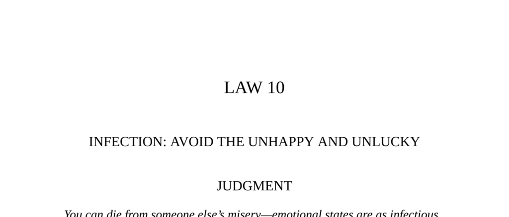

- **Judgment**  
  - Emotional states are as infectious as diseases and can cause your own disaster.  
  - Trying to help the unhappy often precipitates your own misfortune.  
  - Unfortunate people can draw misfortune onto others by association.  
  - Associating with the happy and fortunate is the advised strategy to avoid infection.  
  - Relevant reading: [Emotional Contagion](https://en.wikipedia.org/wiki/Emotional_contagion)

- **Transgression of the Law**  
  - Lola Montez used manipulation and wiles to gain power over men, leading to their downfall.  
  - Alexandre Dujarier, after becoming involved with Lola, lost his social standing and was killed in a duel.  
  - King Ludwig of Bavaria was "bewitched" by Lola, causing political chaos and his abdication.  
  - Lola’s relationships repeatedly caused ruin and misfortune to her lovers and associates.  
  - Relevant reading: [Lola Montez Biography](https://en.wikipedia.org/wiki/Lola_Montez)

- **The Nut and the Campanile**  
  - The nut escaped a crow only to lodge in a wall crevice and grow roots that destroyed the wall.  
  - The story illustrates how something seemingly harmless can cause profound destruction over time.  
  - This parable relates to the hidden dangers of infection affecting structures from within.  
  - Relevant reading: [Parable Analysis](https://www.britannica.com/topic/parable)

- **Interpretation**  
  - Lola Montez’s power stemmed from a forceful character that emotionally overwhelmed her lovers.  
  - Infectors possess inward instability that radiates outward, attracting disaster.  
  - Emotional attachment makes it difficult to resist becoming enmeshed in an infector’s problems.  
  - The category of infectors is not gender-specific but defined by emotional instability and destructiveness.  
  - Relevant reading: [Psychological Manipulation](https://en.wikipedia.org/wiki/Psychological_manipulation)

- **Keys to Power**  
  - Misfortune caused by self-destructive people is contagious and can drain your time and energy.  
  - Association with chronic dissatisfaction and envy, exemplified by Cassius, leads to widespread misfortune.  
  - The only solution is strict avoidance or "quarantine" from infecting individuals.  
  - Positive traits like generosity and cheerfulness also spread by association and should be cultivated.  
  - Historical examples show powerful leaders influenced by their social circles’ emotional states.  
  - Relevant reading: [Emotional Intelligence](https://en.wikipedia.org/wiki/Emotional_intelligence)

- **Reversal**  
  - This law has no reversal; contact with infectors leads only to harm.  
  - Associating with the fortunate is necessary for power and good fortune.  
  - Ignoring this law results in inevitable negative consequences.  
  - Relevant reading: [Social Contagion](https://en.wikipedia.org/wiki/Social_contagion)
