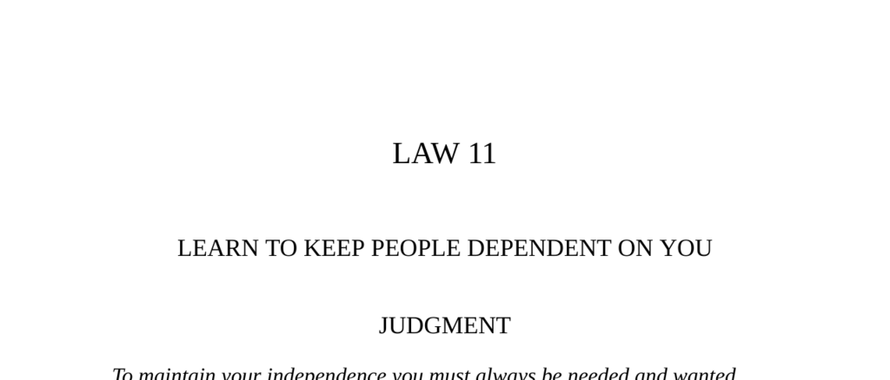

- **Judgment**
  -  
    - Independence requires others always to need and want you.
    - Being relied on provides freedom and security.
    - Avoid teaching others so much that they can function without you.
    - See [Dependence Theory](https://en.wikipedia.org/wiki/Interdependence_theory) for related social dynamics.

- **Transgression of the Law**
  -  
    - Condottieri like the unnamed mercenary in Siena and the Count of Carmagnola were ultimately betrayed or executed.
    - They were replaceable despite their skills, leading to their downfall.
    - Acting independently without ensuring indispensability caused loss of favor.
    - Refer to [Condottieri History](https://www.britannica.com/topic/condottiere) for historical context.

- **The Two Horses**
  -  
    - The hardworking horse suffers under a lazy companion until the lazy one survives at the other's expense.
    - The owner eliminates the lazy horse to reduce costs.
    - Illustrates the danger of being indispensable while others depend on you.
    - See fables by [Leo Tolstoy](https://en.wikipedia.org/wiki/Leo_Tolstoy#Fables_and_short_stories).

- **Interpretation**
  -  
    - Many skilled condottieri failed because they were replaceable and took power for granted.
    - Being irreplaceable ensures survival and power.
    - Younger, cheaper, or less threatening competitors pose constant risk.
    - Consult Machiavelli’s writings for further insights on indispensability.

- **Observance of the Law**
  -  
    - Otto von Bismarck allied with weak rulers to create dependency and gain power.
    - Bismarck restored royal authority by becoming indispensable to the kings.
    - Dependency of powerful rulers on Bismarck ensured his influence.
    - See [Bismarck Biography](https://www.britannica.com/biography/Otto-von-Bismarck).

- **The Cat That Walked by Himself**
  -  
    - The Cat secures benefits by making a practical bargain but stays independent.
    - Independence is valued through fulfilling roles without reliance on others.
    - Illustrates balancing cooperation and autonomy.
    - Refer to [Rudyard Kipling's Just So Stories](https://en.wikipedia.org/wiki/Just_So_Stories).

- **Interpretation (Bismarck)**
  -  
    - Aligning with a weak master creates mutual dependency useful for power.
    - Strong masters rarely depend on others, risking being swallowed up.
    - Necessity compels actions; creating dependency is key to survival.
    - Read Niccolò Machiavelli’s *The Prince* for similar strategies.

- **The Elm-Tree and the Vine**
  -  
    - The vine’s pursuit of independence without support leads to downfall.
    - True independence requires a strong foundation, like the elm’s steady growth.
    - Vanity and waste undermine sustainable power.
    - See [Robert Dodsley’s Fables](https://en.wikipedia.org/wiki/Robert_Dodsley).

- **Keys to Power**
  -  
    - Power comes from making others willingly grant what you desire without force.
    - Creating relationships of dependence traps masters who cannot replace you easily.
    - Specialized talent or savvy deception can establish indispensability.
    - Historical figures like Michelangelo, Kissinger, and Harry Cohn exemplify this.
    - Understand power dynamics via [Robert Greene’s The 48 Laws of Power](https://www.powerplaysbook.com/48-laws-of-power-summary/).

- **Reversal**
  -  
    - Dependency means some reliance on others, limiting total independence.
    - Monopolies seeking complete control isolate themselves and stir resentment.
    - Mutual dependence is more stable and less risky than total autonomy.
    - Strive for interdependence rather than sole dominance.
    - Explore theories of interdependence in [Management Science](https://en.wikipedia.org/wiki/Interdependence).
