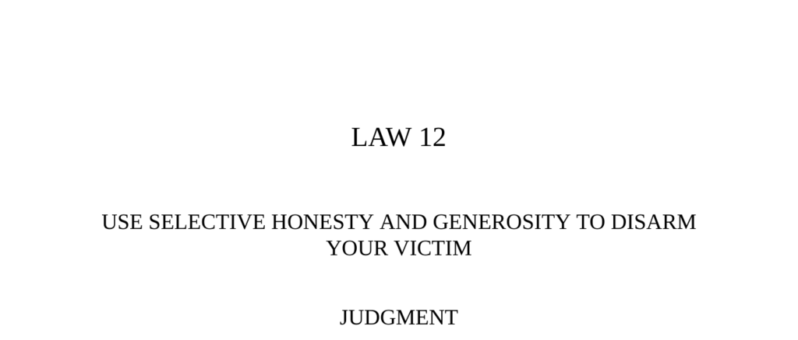

- **Judgment**  
  - One sincere and honest act can overshadow numerous dishonest actions.  
  - Open-hearted honesty and generosity lower even the most suspicious people’s defenses.  
  - A timely gift can function like a Trojan horse, opening a path to manipulation.  
  - The example of Count Victor Lustig convincing Al Capone illustrates the power of selective honesty.  
  - Further reading: [The 48 Laws of Power](https://en.wikipedia.org/wiki/The_48_Laws_of_Power)  

- **Observance of the Law**  
  - Count Victor Lustig’s interaction with Al Capone demonstrates how selective honesty disarms suspicion.  
  - Francesco Borri used apparent generosity and honesty to gain trust while secretly deceiving.  
  - Con artists target emotional weaknesses, using honesty to confuse and manipulate even the wary.  
  - Well-timed honesty and generosity can turn cynical opponents into compliant allies.  
  - Further reading: [The Power of the Charlatan, Grete de Francesco (1939)](https://archive.org/details/powerofcharlatan00fran)  

- **Interpretation**  
  - Selective honesty exploits human psychology by breaking down defenses through unexpected sincerity.  
  - Capone’s mistrust was disarmed by Lustig’s unexpected honesty, showing the value of emotional manipulation.  
  - Distracting targets with kindness or honesty creates openings for deception.  
  - Jay Gould’s trust in Lord John Gordon-Gordon highlights the danger of initial honesty masking deceit.  
  - Further reading: [Psychology of Deception](https://www.apa.org/topics/deception)  

- **Keys to Power**  
  - Distraction is key in deception, with acts of kindness, generosity, or honesty serving as powerful distractions.  
  - The ancient Chinese principle “giving before you take” softens future requests or conceal theft.  
  - Establishing a reputation for honesty requires repeated acts but makes deception easier later.  
  - Historical examples: Duke Wu of Chêng’s political marriage and Roman general Camillus’s selective kindness as military strategy.  
  - Selective kindness lowers resistance by targeting emotions, but must appear sincere or it backfires.  
  - Gifts can disguise ulterior motives, as exemplified by the Trojan Horse in ancient Greece.  
  - Further reading: [Strategies of Deception](https://www.britannica.com/topic/deception)  

- **Reversal**  
  - A history of deceit makes new honest gestures suspicious and ineffective.  
  - Embracing a reputation for dishonesty can preserve the ability to deceive, as Talleyrand demonstrates.  
  - Count Lustig’s act of feigning dishonesty restored trust with a suspicious mark.  
  - Sometimes overt deceptiveness is the best strategy for maintaining power and avoiding detection.  
  - Further reading: [Talleyrand and Political Deception](https://www.britannica.com/biography/Charles-Maurice-Talleyrand)
