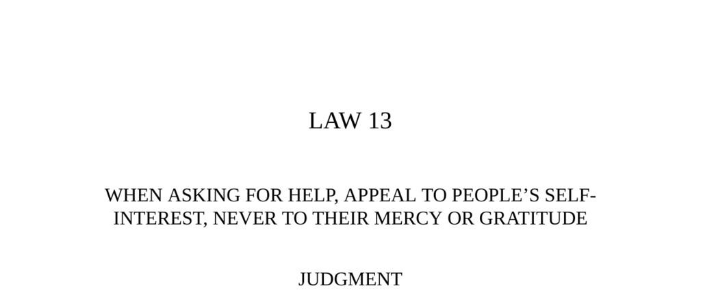

- **Law 13: When Asking for Help, Appeal to People’s Self-Interest, Never to Their Mercy or Gratitude**
  - **Judgment**
    - Do not remind allies of past assistance or good deeds when asking for help.  
    - Emphasize benefits your request or alliance offers to them, often exaggerating these.  
    - People respond enthusiastically when they perceive a gain for themselves.  
    - See [The 48 Laws of Power](https://en.wikipedia.org/wiki/The_48_Laws_of_Power) for context.
  - **Transgression of the Law**
    - Castruccio Castracani rose to power through treachery, forgetting the Poggios who aided him.  
    - The Poggios rebelled while Castruccio was away, but were suppressed by his forces.  
    - Stefano di Poggio sought mercy appealing to justice, past favors, and gratitude.  
    - Castruccio imprisoned and executed the entire Poggio family despite Stefano’s pleas.  
    - Appeals to justice and gratitude often fail against ruthless, self-interested leaders.  
  - **The Peasant and the Apple-Tree (Fable)**
    - A peasant intended to cut a useless apple tree sheltering pests.  
    - The pests begged for mercy, promising benefits, but he ignored them until he found honey inside.  
    - Self-interest motivates actions more reliably than appeals to mercy.  
    - Source: Aesop’s Fables, Sixth Century B.C.
  - **Observance of the Law**
    - In 433 B.C., Corcyra and Corinth both sought Athens’ alliance before the Peloponnesian War.  
    - Corcyra appealed pragmatically through mutual interests and future benefits.  
    - Corinth appealed emotionally through past deeds and loyalty, asking for gratitude.  
    - Athens chose Corcyra, demonstrating preference for self-interest and pragmatic arguments.  
    - History shows pragmatism outweighs emotional appeals in power struggles.  
    - Refer to [The Peloponnesian War by Thucydides](https://en.wikipedia.org/wiki/The_Peloponnesian_War).
  - **Keys to Power**
    - Most fail to persuade because they assume appeals to mercy or gratitude will succeed.  
    - Understanding the other’s self-interest and psychology (vanity, power, money) is key.  
    - Example: Genghis Khan spared China’s skilled workers only after being shown the financial benefits.  
    - Self-interest is a universal language that bypasses cultural differences and emotional appeals.  
    - Mastering this art enables unlimited power acquisition.  
  - **Reversal**
    - Some people prefer to help to feel superior via charity, mercy, or justice rather than for self-interest.  
    - For these individuals, public displays of generosity are important; appeals to greed repel them.  
    - Distinguish which motivation drives a person before making an appeal.  
    - The law does not recommend insincerity but adapting to the helper’s psychological needs.
