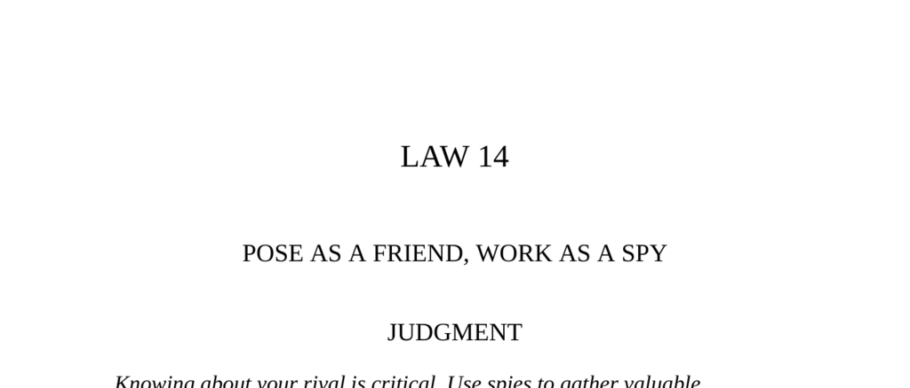

- **Law 14: Pose as a Friend, Work as a Spy**
  - **Judgment**
    - Knowing rivals is critical for gaining an advantage in power struggles.
    - Use spies to gather valuable information, or play the spy yourself.
    - Polite social encounters should be used to probe others indirectly for their weaknesses and intentions.
    - Every social occasion is an opportunity for artful spying.
    - For further reading: [The Art of War - Sun-tzu](https://suntzusaid.com/book/1)
  - **Observance of the Law**
    - Joseph Duveen monopolized America’s millionaire art market by spying on clients and their staff.
    - Duveen placed staff from Andrew Mellon's household on his payroll to gather detailed intelligence.
    - Duveen used proximity and social charm to disarm Mellon and secure his patronage.
    - His knowledge made him seem omnipresent and unbeatable to rivals, discouraging competition.
    - For further reading: [Duveen: A Life in Art](https://www.britannica.com/biography/Joseph-Duveen)
  - **Interpretation**
    - Success in power requires leaving nothing to chance and acquiring detailed knowledge of competitors or clients.
    - Secretly recruiting people close to targets provides ongoing, valuable intelligence.
    - Personal spying creates an aura of omniscience and charm.
    - Revealing the source of power makes it vulnerable to challenge.
    - For further reading: [Power - Robert Greene](https://powerseductionandwarfare.com/)
  - **Keys to Power**
    - Control over future events depends on uncovering others’ hidden thoughts and intentions.
    - Friendly demeanor allows information gathering without suspicion.
    - Using others to spy is common but risky due to lack of control.
    - Acting as the spy yourself via conversation is more effective and safer.
    - For further reading: [Spy the Lie](https://www.nyjournalofbooks.com/book-review/spy-lie)
    - **Methods of Spying**
      - Suppress your own personality to encourage others to talk about themselves.
      - Use indirect questions and insinuations, as Talleyrand did, to extract secrets.
      - Feigning belief or disbelief manipulates targets to reveal more truth.
      - Sincere confessions can be used as ruses to draw out others' confessions.
      - Testing loyalty through traps reveals character and predicts future actions.
      - For further reading: [Talleyrand: The Art of the Spy](https://www.historytoday.com/archive/talleyrand)
  - **Authority**
    - Foreknowledge of enemy situation is key for victories, as per Sun-tzu.
    - Such foreknowledge cannot come from supernatural means but from human spies.
    - Reliable intelligence shapes a brilliant sovereign and general’s success.
    - For further reading: [The Art of War - Sun-tzu](https://suntzusaid.com/book/1)
  - **Reversal**
    - Information gathering must be balanced with protecting oneself from being spied upon.
    - Disinformation works as a weapon by planting false information to mislead enemies.
    - Example: English agents fed false data to Nazi spies during WWII, causing misplaced bomb attacks.
    - Disinformation blinds enemies like a cyclops missing its target.
    - For further reading: [Disinformation: Former Spy Reveals Secrets](https://www.goodreads.com/book/show/432199.Disinformation)
