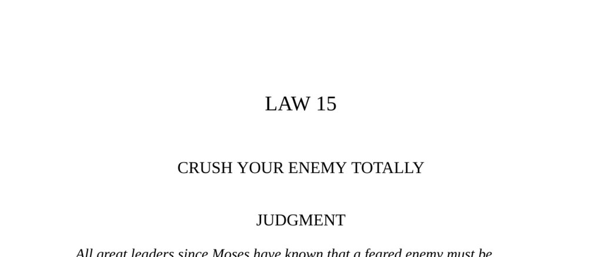

- **Judgment**  
  - All great leaders historically have known to crush a feared enemy completely to prevent future revenge.  
  - Stopping halfway in defeating an enemy results in greater loss as the enemy recovers and seeks retaliation.  
  - Total annihilation must target both the body and spirit of the enemy.  
  - Further reading: [The Art of War by Sun Tzu](https://suntzusaid.com/book/1)  

- **Transgression of the Law**  
  - The rivalry between Hsiang Yu and Liu Pang exemplifies the danger of incomplete defeat of an enemy.  
  - Hsiang Yu’s hesitations and mercy allowed Liu Pang to survive and ultimately defeat him.  
  - Kautilya’s philosophy warns that ignoring weak enemies invites future danger like a spark in a haystack.  
  - Further reading: [The Art of War - Insights on Strategy](https://suntzusaid.com/book/1)  

- **The Trap at Sinigaglia**  
  - Cesare Borgia used deception and overwhelming force to eliminate his former generals and enemies in one decisive action.  
  - He turned a planned trap against the condottieri by arriving with a large force and arresting them during a banquet.  
  - This event illustrates ruthless and strategic total annihilation of rivals to secure power.  
  - Further reading: [The Borgias (Ivan Cloulas, 1989)](https://en.wikipedia.org/wiki/The_Borgias_(TV_series))  

- **Interpretation (Hsiang Yu and Liu Pang)**  
  - Hsiang Yu’s respect and pity for Liu Pang prevented him from totally destroying his rival.  
  - Hesitation and mercy toward dangerous enemies lead to one’s own downfall.  
  - Liu Pang’s ruthless approach to crushing enemies secured his rise to power as Han Kao-tsu.  
  - Napoleon Bonaparte and Kautilya emphasize ruthlessness as essential for ultimate victory.  
  - Further reading: [Napoleon on War and Strategy](https://www.napoleon.org/en/history-of-the-two-empires/articles/napoleon-on-war-strategy/)  

- **Observance of the Law**  
  - Empress Wu’s rise to power was marked by calculated ruthlessness, eliminating rivals permanently to secure her rule.  
  - She strategically used deception, murder, and political manipulation to become the only ruler left standing.  
  - Wu’s decades-long reign exemplifies the necessity of total destruction of enemies for lasting authority.  
  - Ramón Maria Narváez’s quote underscores the practice of eliminating enemies rather than forgiving.  
  - Further reading: [Empress Wu Zetian Biography](https://www.britannica.com/biography/Wu-Zetian)  

- **Keys to Power**  
  - Chinese history teaches that leniency toward defeated enemies invites future revenge.  
  - Sun-tzu’s strategic tenet requires crushing enemies completely to ensure peace and security.  
  - Mao Tse-tung’s successful tactics contrasted with Chiang Kai-shek’s failure to crush Communist enemies.  
  - Biblical and Clausewitzian examples reinforce the importance of total victory and pursuit after triumph.  
  - Negotiation with partially defeated enemies cedes ground and risks resurgence.  
  - Total annihilation or permanent banishment ensures enemies cannot recover or plot against you.  
  - Further reading: [Clausewitz on War](https://www.clausewitz.com/readings/OnWar1873/index.htm)  

- **Reversal**  
  - Sometimes it is better to let enemies destroy themselves rather than attack them outright.  
  - Allowing a retreat can demoralize and wear down an enemy more than a direct attack.  
  - Overly harsh defeat may embitter enemies and prolong enmity, but leniency risks emboldening them.  
  - Crushing enemies remains generally wiser to avoid giving them room to recover and retaliate.  
  - The risk of future revenge requires constant vigilance and readiness to crush enemies again if necessary.  
  - Further reading: [The Treaty of Versailles and its Consequences](https://www.britannica.com/event/Treaty-of-Versailles-1919)
