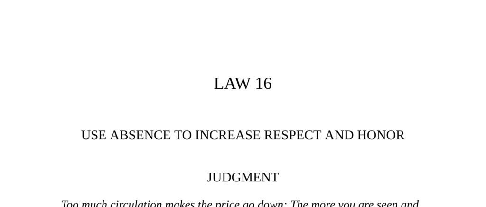

- **Judgment**  
  - Too much presence makes a person appear common and lose value.  
  - Temporary withdrawal creates scarcity, increasing admiration and respect.  
  - Effective use of absence heightens one's perceived value through rarity.  
  - See [The 48 Laws of Power](https://en.wikipedia.org/wiki/The_48_Laws_of_Power) for related strategies on presence and absence.

- **Transgression and Observance of the Law**  
  - Sir Guillaume de Balaun’s feigned absence initially provoked pursuit, but excess presence diminished his lover’s respect.  
  - Genuine absence ignited profound passion, culminating in a meaningful reconciliation.  
  - The story illustrates absence inflaming love, while overfamiliarity extinguishes desire.  
  - Consult [Jean de La Fontaine’s Fables](https://en.wikipedia.org/wiki/Jean_de_La_Fontaine) for thematic sources on human nature and perception.

- **The Camel and the Floating Sticks**  
  - Familiarity lessens fear; objects or people initially feared lose impact with closeness.  
  - Distance magnifies importance, while proximity reveals ordinariness.  
  - This parable underlines how absence enhances perceived value and awe.  
  - Refer to [Selected Fables of Jean de La Fontaine](https://www.gutenberg.org/ebooks/21339) for original anecdotes.

- **Five Virtues of the Cock**  
  - The cock embodies civility, strength, courage, benevolence, and punctuality.  
  - Despite virtues, it is commonly destroyed because it is always present.  
  - The snow goose, prized for its rarity, symbolizes value derived from scarcity.  
  - See [Ancient Chinese Parables](https://archive.org/details/ancientchinesepar00yuhs) for cultural context.

- **Interpretation**  
  - Absence after emotional engagement inflames passion via stimulated imagination.  
  - Continuous presence leads to suffocation of feelings and diminished respect.  
  - Patterned presence and absence create desirable tension and increase esteem.  
  - The law is summarized by La Rochefoucauld: absence diminishes minor passions and inflames great ones.

- **Observance of the Law**  
  - Deioces gained respect through judicious presence and strategic withdrawal.  
  - Retreat from frequent public access elevated his mystique and authority.  
  - His reign built the foundation for the later Persian Empire through respected absence.  
  - Refer to Herodotus’ *Histories* for historical validation of Deioces’ governance style.

- **Interpretation (Deioces)**  
  - Power requires balance of presence and withdrawal to maintain respect.  
  - Controlled inaccessibility fosters awe and prevents resentment and jealousy.  
  - Elevating one’s perceived status involves deliberate scarcity of presence.  
  - Parallel drawn with the Dervish’s preferential absence creating desirability.

- **Keys to Power**  
  - Excessive presence causes value and respect to degrade through familiarity.  
  - Love and seduction exemplify the law via the necessity of imaginative absence.  
  - Scarcity in material things (e.g., tulipomania) creates inflated value through limited availability.  
  - Examples include Charles V and Greta Garbo, who increased esteem through timely retirements.  
  - See [Scarcity Principle in Economics](https://en.wikipedia.org/wiki/Scarcity) for theoretical background.

- **Authority**  
  - Withdrawal generates respect by making talents rare and treasured.  
  - Overexposure diminishes even exceptional genius by revealing superficial layers.  
  - Retirement and limited appearances preserve honor and create yearning.  
  - Baltasar Gracián’s writings emphasize strategic retirement as a tool for esteem.

- **Reversal**  
  - The law applies only after sufficient presence and recognition are established.  
  - Premature absence leads to being forgotten, negating any respect gained.  
  - Initial omnipresence cements image, enabling effective later withdrawal.  
  - Absence enriches value only when the other party is already emotionally engaged.  
  - Reference [Ninon de Lenclos’ Letters](https://en.wikipedia.org/wiki/Ninon_de_Lenclos) for practical applications in love.
