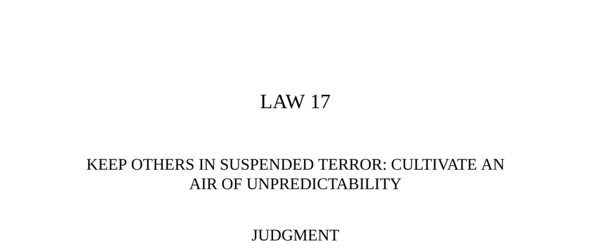

- **Judgment**  
  - Humans seek familiarity and predictability in others’ actions to gain a sense of control.  
  - Deliberate unpredictability keeps others off-balance and uncertain, leading them to expend mental energy trying to explain your behavior.  
  - Extreme unpredictability can intimidate and terrorize others.  
  - Relevant external resource: [Psychology of Unpredictability](https://www.psychologytoday.com/us/basics/unpredictability)  

- **Observance of the Law**  
  - Bobby Fischer used deliberate lateness, complaints, and apparent blunders to unsettle Boris Spassky during the 1972 World Chess Championship.  
  - Fischer’s unpredictable moves unnerved Spassky, who was known for psychological resilience, leading to Spassky’s mental unraveling and defeat.  
  - The uncertainty caused by Fischer’s behavior was so intense it led to conspiracy accusations and deteriorated Spassky’s performance.  
  - Chess exemplifies life’s reliance on predictable patterns, which Fischer disrupted strategically.  
  - Relevant external resource: [1972 Fischer-Spassky Match Analysis](https://www.chesshistory.com/winter/extra/fischer-spassky.html)  

- **Interpretation**  
  - Spassky’s success was based on exploiting opponents’ predictable patterns and psychological control.  
  - Fischer reversed this dynamic by adopting erratic behavior to keep Spassky off-balance, sacrificing short-term advantages for long-term gains.  
  - In life and chess, disrupting expected patterns creates fear and confusion, granting psychological advantage.  
  - The quotation from Jean de La Bruyère emphasizes the power of unpredictable moves in serious games like court politics.  
  - Relevant external resource: [The Art of War by Sun Tzu](https://suntzusaid.com/)  

- **Keys to Power**  
  - Sudden, unpredictable actions induce fear comparable to natural disasters because they deny foresight.  
  - Human capacity to change behavior consciously differentiates them from animals and enables strategic unpredictability.  
  - Historical example: Filippo Maria, Duke of Milan, manipulates feelings and expectations unpredictably to maintain authority.  
  - Another historical example: General Stonewall Jackson’s erratic troop movements during the Civil War confused superior forces and prevented their advance.  
  - Unpredictability unsettles opponents and forces errors in multiple contexts, including warfare and daily life.  
  - Pablo Picasso advocates acting capriciously rather than over-planning, illustrating unpredictability in art and commerce.  
  - Unpredictability boosts attention and respect by stimulating interest and keeping others guessing.  
  - Relevant external resource: [Psychological Effects of Unpredictability](https://www.apa.org/news/press/releases/2019/02/unpredictability-stress)  

- **Authority**  
  - The enlightened ruler remains mysterious and inexplicable, creating fear and obedience through inscrutability.  
  - Ministers tremble due to their inability to predict or understand the ruler’s intentions, reinforcing power.  
  - Relevant external resource: [Han-fei-tzu and Legalist Philosophy](https://plato.stanford.edu/entries/legalism/)  

- **Reversal**  
  - Predictability can be strategically employed to lull others into false security and prepare deceptive actions behind a familiar front.  
  - Muhammad Ali used predictability in his typical fighting style to mislead George Foreman before switching unexpectedly to a direct fighting strategy.  
  - Ali’s unexpected style change confused Foreman, leading to Ali’s victory despite public smoking of plans.  
  - Excessive unpredictability can backfire, especially in subordinate positions, by signaling indecisiveness or mental instability.  
  - Patterns have power and unpredictability must be wielded judiciously.  
  - Relevant external resource: [Muhammad Ali vs George Foreman Fight Analysis](https://www.britannica.com/event/Rumble-in-the-Jungle)
